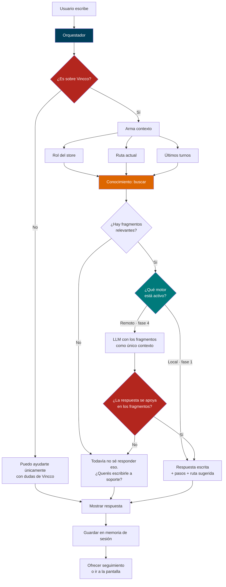

# Análisis de arquitectura — Asistente de IA para Vincco

> Documento de análisis previo a la implementación. **No contiene código.**
> Fecha del análisis: agosto 2026 · Basado en el estado real del repositorio, no en `ESTRUCTURA.md`.

---

## 0. Advertencia previa: `ESTRUCTURA.md` está desactualizado

Antes de nada, esto es importante porque el chatbot va a alimentarse de la documentación del proyecto: **el archivo `ESTRUCTURA.md` describe la Fase 6 y el proyecto ya va bastante más adelante.** Si el asistente lee ese documento como fuente de verdad, va a mentirle al usuario.

| `ESTRUCTURA.md` dice | Realidad hoy |
|---|---|
| 13 rutas | **17 rutas** |
| No existen Perfil, Config, Ayuda, Redes, Favoritos, NegociosAsociados | Las seis existen y están en el router |
| `data_falso.js` = 56 líneas | **526 líneas**, 31 exports |
| `publicaciones_falso.js` | Ya no existe; ahora es `publicationTypes.js` |
| `Icon.jsx` = 43 iconos | **~70 iconos** |
| `store` = 136 líneas, sin configuraciones | **411 líneas**, incluye `configuraciones`, `perfiles`, `permisosVitrina` |
| No menciona `utils/` ni `hooks/` | Ambas existen y tienen contenido |
| `/favoritos` es un placeholder | Es una página completa |

**Acción recomendada antes de programar el bot:** actualizar `ESTRUCTURA.md`. Es barato ahora y es la diferencia entre un asistente que guía bien y uno que manda a la gente a pantallas que no existen.

---

## 1. Resumen de la arquitectura actual

### Qué es, técnicamente

Una **SPA de React sin backend**, generada con Create React App y publicada como sitio estático en GitHub Pages (`homepage: https://Les450.github.io/Vincco-digital`, deploy con `gh-pages`).

| Capa | Tecnología | Nota |
|---|---|---|
| UI | React 19 | Componentes funcionales, sin clases |
| Ruteo | react-router-dom 7 · **HashRouter** | Las URLs llevan `#` porque GitHub Pages no reescribe rutas |
| Estado global | Zustand 5 | Un solo store: `store/puntos_usestore.js` |
| Estilos | Sistema triple (ver abajo) | Tailwind 3 + CSS por página + CSS legacy |
| Animación | framer-motion 12 | Transiciones, modales, carruseles |
| Datos | **Mock estático** | `data/data_falso.js` — no hay API |
| Persistencia | `localStorage` | Solo configuraciones y foto de perfil |

### Cómo está dividido

```
src/
├── components/     Piezas reutilizables
│   ├── config/     Piezas de la pantalla de configuración
│   ├── perfil/     Piezas compartidas por los tres perfiles
│   ├── panel/      Piezas del panel de negocio
│   └── icons/      Librería SVG propia (~70 iconos)
├── pages/          Una pantalla completa por archivo + su .css
├── sections/       Bloques del landing de marketing
├── store/          Zustand — la única fuente de verdad mutable
├── data/           Mock data + esquemas declarativos
├── utils/          Lógica pura sin React (moneda, filtro de notificaciones)
└── styles/         Design System del landing (prefijo vc-*)
```

### El patrón dominante del proyecto

Hay un patrón que se repite y que **el chatbot debe respetar**, porque es lo que hace mantenible el código:

> **Los datos se declaran, la UI los dibuja.**

Se ve en tres lugares:

- `camposPerfil` → `BloqueDatos` dibuja los campos del perfil
- `configPorRol` → `Config.jsx` dibuja las 29 opciones de configuración
- `preguntasFrecuentes` → `Ayuda.jsx` dibuja el acordeón de FAQ

Ningún componente sabe qué contenido existe: recorre un arreglo. **El módulo de IA debe seguir exactamente esta forma** — la base de conocimiento como datos, el chat como un renderizador tonto.

### Segundo patrón: una ruta, tres pantallas

`/perfil` y `/config` son **una sola ruta** que despacha según `userType` del store:

```
/perfil  → PerfilUsuario | PerfilNegocio | PerfilProveedor
/config  → mismo componente, distinta lista de ajustes
```

El chatbot debería usar el mismo modelo: **una ruta, una interfaz, tres bases de conocimiento**.

### Cómo se comunican los módulos

No hay eventos, ni contexto de React, ni props drilling profundo. La comunicación es siempre la misma:

```
Página  ──lee/escribe──►  Zustand store  ──notifica──►  Otras páginas
   │
   └──lee──►  data/*.js  (estático, nunca se escribe)
```

El store es el único canal transversal. Un módulo nuevo que necesite hablar con el resto de la app **debe pasar por el store**, no inventar otro mecanismo.

### Flujo de la aplicación

```
index.js → App.js (aplica preferencias de accesibilidad al <body>)
         → AppRouter (HashRouter)
         → SHELL_ROUTES → <Shell> página </Shell> + <BottomNav/>
         → la página lee userType del store y se adapta
```

### Estructura del backend

**No hay backend.** Es el hallazgo más importante de este análisis.

Lo único que existe es `flujo de registro_1.sql`, que es un borrador temprano:

- Base `seguridad` con 4 tablas (`usuarios`, `proveedores`, `negocios`, `clientes`)
- Sin llaves foráneas, sin relación entre `usuarios` y los tres tipos
- Contraseñas en `VARCHAR` sin indicación de hash
- El archivo tiene **fragmentos de PHP pegados dentro del `.sql`**, o sea que es un apunte, no un esquema ejecutable

No hay servidor, no hay API, no hay autenticación real. `isLoggedIn` es un booleano en memoria.

---

## 2. Cómo entendí el funcionamiento de Vincco

### El modelo de negocio

Vincco es un **ciclo de tres actores**, no tres productos separados:

```
Cliente compra local  →  gana puntos  →  vuelve a comprar
        ↓
Negocio vende más  →  necesita reponer  →  cotiza a proveedores
        ↓
Proveedor recibe pedidos  →  gana visibilidad en el directorio
        ↓
Más reputación  →  más formalización  →  más confianza del ecosistema
        ↓
                    (vuelve al inicio)
```

Vincco no vende ni distribuye nada. **Es el intermediario que hace que los otros tres se encuentren.** Eso define qué debe y qué no debe hacer el asistente.

### Lo que aprendí leyendo el código, no la documentación

- **El nivel** (Bronce, Plata, Oro, VIP) es interno de Vincco y se mide por puntos, que vienen de comprar usando la plataforma. No es antigüedad.
- **Toda la moneda es córdobas nicaragüenses.** Hay un helper `utils/moneda.js` que centraliza el formato justamente para que no se cuele otra moneda.
- **El permiso de vitrina** (`permisosVitrina`) es la pieza más particular del modelo: un proveedor puede mostrar públicamente a qué negocios abastece, pero solo con consentimiento de cada negocio. Es la misma relación vista desde dos lados.
- **El piloto es Nueva Guinea**, RACCS. Los datos mock son todos de ahí.
- El público objetivo son **emprendedores con poca experiencia digital**. Esto no es un detalle de marketing: define el tono del asistente y por qué las instrucciones tienen que ser paso a paso.

### Qué puede y qué no puede saber el asistente

| Puede responder | No puede responder |
|---|---|
| Cómo funcionan los puntos | Cuántos puntos tengo *realmente* |
| Cómo hacer una cotización | El estado real de mi cotización |
| Qué significa cada opción del menú | Si mi negocio fue verificado |
| Dónde está cada pantalla | Cualquier dato que venga de un backend |

**Todo el dato de la app es mock.** El asistente debe limitarse a explicar *cómo funciona*, nunca a afirmar *cuál es tu dato*. Esto coincide exactamente con el alcance que pediste, así que no es una limitación: es la definición correcta del producto.

---

## 3. Cambios que propongo para integrar el chatbot

### Principio rector

> El chat es una **capa encima** de la app. Ninguna pantalla existente debe enterarse de que existe.

Concretamente: cero modificaciones a `Home.jsx`, `Register.jsx`, `PanelNegocio.jsx` ni a ninguna página. Solo tres puntos de contacto, todos aditivos.

### Los tres puntos de contacto

**1. Montaje global.** El botón flotante se monta una sola vez en `AppRouter.jsx`, al lado de `<BottomNav/>`. Así el chat vive en todas las pantallas sin tocar ninguna.

**2. Estado en el store.** Se agrega un bloque `chat` al store existente (mensajes, abierto/cerrado, estado de carga). No se crea un segundo store: rompería el patrón del proyecto.

**3. Entrada desde el menú.** Un ítem en `Sidebar.jsx` que abre el chat en vez de navegar.

### Dónde ubicar el chat en la interfaz

Mi recomendación es **botón flotante global + entradas contextuales**, en ese orden de prioridad:

| Ubicación | Por qué |
|---|---|
| Botón flotante, esquina inferior derecha | El patrón que todo el mundo reconoce. Sube por encima del `BottomNav` para no taparlo |
| Ítem en el menú hamburguesa | Para quien lo busca donde está "Ayuda y Soporte" |
| Botón dentro de `/ayuda` | La página de ayuda es el lugar natural: "¿No encontraste tu respuesta? Preguntale al asistente" |
| *(Fase 3)* Botones contextuales | En el panel de inventario, en cotizaciones — donde la gente de verdad se traba |

**Cuidado con el `BottomNav`:** ocupa la franja inferior con `safe-area-inset`. El botón flotante tiene que posicionarse arriba de él (`bottom: calc(84px + safe-area)`), igual que ya hace el aviso de guardado de `/config`.

### Lo que NO propongo hacer

- **No una ruta `/chat`.** Sacar al usuario de la pantalla donde tiene la duda es exactamente lo contrario de lo que necesita. El chat debe ser un panel encima.
- **No un segundo store.** Zustand con un solo store es el patrón del proyecto.
- **No una librería de chat de terceros.** Ninguna va a respetar el sistema visual, y el peso no se justifica para una lista de mensajes.

---

## 4. Arquitectura recomendada para el módulo de IA

### Cuatro capas con una regla: cada capa solo conoce a la de abajo

```
┌─ 1. PRESENTACIÓN ─────────────────────────────────────────┐
│  React. Dibuja mensajes. No sabe de dónde salen.          │
│  BotonChat · VentanaChat · Mensaje · Sugerencias          │
└────────────────────────┬──────────────────────────────────┘
                         ▼
┌─ 2. ORQUESTADOR ──────────────────────────────────────────┐
│  Lógica pura, sin React. Decide si la pregunta es de      │
│  Vincco, arma el contexto (rol + ruta actual) y llama     │
│  al motor. Es donde vive la restricción de alcance.       │
└────────────┬────────────────────────────┬─────────────────┘
             ▼                            ▼
┌─ 3. CONOCIMIENTO ──────────┐  ┌─ 4. MOTOR ────────────────┐
│  La única fuente de verdad │  │  Intercambiable.          │
│  FAQ · guías · mapa de     │  │  motorLocal (fase 1)      │
│  rutas · glosario          │  │  motorRemoto (fase 2)     │
└────────────────────────────┘  └───────────────────────────┘
```

### Por qué el motor va separado y por qué arranca local

**El problema bloqueante:** no hay backend y el deploy es estático. Una llave de API de OpenAI o Anthropic puesta en el frontend **es pública** — cualquiera abre las herramientas del navegador y la copia. Ni las variables de entorno de CRA salvan esto: `REACT_APP_*` se compila dentro del bundle. Con la llave robada te facturan a vos.

Por eso el motor es una **interfaz con dos implementaciones**:

| | `motorLocal` | `motorRemoto` |
|---|---|---|
| Requiere backend | No | Sí |
| Costo | Cero | Por consulta |
| Funciona sin internet | Sí | No |
| Puede alucinar | **No** | Sí, hay que contenerlo |
| Responde lo no previsto | No | Sí |
| Velocidad | Instantánea | 1–3 segundos |

El orquestador llama a `motor.responder(pregunta, contexto)` sin saber cuál está enchufado. Cambiar de uno a otro es cambiar un import.

### Por qué el motor local no es un parche

De las 15 preguntas de ejemplo que planteaste, **las 15 tienen respuesta fija**. "¿Cómo creo una cuenta?" no necesita un modelo de lenguaje: necesita la respuesta correcta, siempre igual, al instante. Un motor local bien hecho:

- responde en milisegundos, gratis, sin internet
- **no puede inventar funciones que no existen** — el problema que más te preocupa se resuelve solo
- deja toda la interfaz lista y probada para cuando enchufes el LLM

Y ya tenés el 60% del conocimiento escrito: `preguntasFrecuentes` (18 preguntas, 3 roles, 12 categorías), `articulosAyuda`, `pasosComoFunciona`, `pasosNegocios`, `pasosProveedores`, `consejosPuntos`. La página `/ayuda` incluso ya tiene un buscador que normaliza tildes.

### Cómo funciona el motor local

No es un `if` gigante. Es una tabla de intenciones, con la misma forma declarativa del resto del proyecto:

```
intencion = {
  id, rol, disparadores[], respuesta,
  pasos[], rutaSugerida, seguimiento[]
}
```

El orquestador normaliza la pregunta (minúsculas, sin tildes — reusando la función que ya existe en `Ayuda.jsx`), la puntúa contra los disparadores de cada intención y devuelve la mejor. Si ninguna pasa el umbral, cae en la respuesta de "no lo sé todavía" en vez de inventar.

### Cómo se aplica la restricción de alcance

En tres capas, no una:

1. **Lista blanca de temas.** El orquestador clasifica la pregunta. Si no cae en ningún tema de Vincco, corta ahí. Nunca llega al motor.
2. **La base de conocimiento es cerrada.** El motor local literalmente no tiene de dónde sacar una respuesta sobre otra cosa.
3. **Instrucción de sistema** *(solo aplica al motor remoto)*. Necesaria pero **no suficiente** — se puede burlar con el prompt correcto. Por eso el filtro va antes, en el código.

### Cómo queda preparado para RAG sin implementarlo hoy

La capa de conocimiento expone una función `buscar(pregunta) → fragmentos[]`. Hoy adentro hace una búsqueda por palabras clave sobre datos locales. Mañana, la misma función consulta un índice vectorial y devuelve la misma forma de fragmento. **Ni el orquestador ni la interfaz cambian.**

El fragmento tiene su fuente adentro (`{ texto, fuente, ruta }`), así que citar de dónde salió la respuesta ya está soportado desde el día uno.

---

## 5. Plan de implementación por fases

### Fase 0 — Antes de escribir el chat *(medio día)*

Deuda que hay que pagar primero, porque el bot va a guiar hacia estas cosas:

- Actualizar `ESTRUCTURA.md` al estado real
- **Arreglar las dos rutas rotas del `Sidebar`**: `/mi-negocio` y `/proveedores` están en el menú pero no existen en el router
- Borrar `_check.js` de la raíz (archivo temporal)
- Decidir el nombre visible del asistente

### Fase 1 — Chat funcional, sin IA *(el grueso del trabajo)*

Interfaz completa + motor local + base de conocimiento a partir de las FAQ existentes. Al terminar esta fase el asistente **ya es útil**: responde las 15 preguntas del alcance, guía paso a paso, sugiere la pantalla y no inventa nada.

Entregable: chat abierto, cerrado, con historial, respondiendo, en móvil y escritorio.

### Fase 2 — Enriquecimiento del conocimiento

- Cobertura de las 17 rutas y las 29 opciones de configuración
- Guías paso a paso por rol
- Preguntas sugeridas según la pantalla donde estás
- Glosario ("¿qué es una cotización?", "¿qué es un permiso de vitrina?")

### Fase 3 — Contexto y entradas inteligentes

- El asistente sabe en qué pantalla estás y qué rol tenés
- Botón de ayuda dentro de inventario y cotizaciones
- Enlaces que llevan directo a la pantalla mencionada
- Memoria dentro de la conversación (últimos N turnos)

### Fase 4 — Backend y modelo real *(depende de infraestructura)*

**No se puede hacer sin backend.** Requiere:

1. Un servidor mínimo (una función serverless alcanza) que guarde la llave
2. Límite de uso por sesión, para que nadie te vacíe la cuenta
3. El motor local se queda como **respaldo**: si la API falla o no hay internet, el chat sigue respondiendo lo básico

### Fase 5 — RAG y métricas

Índice vectorial sobre Markdown y PDF, y registro de qué se pregunta y qué queda sin responder. Esa métrica es la que te dice qué documentar después.

---

## 6. Archivos a crear

```
src/features/chat/                      ← módulo aislado, todo el chat vive acá
│
├── ui/
│   ├── BotonChat.jsx                   Botón flotante + insignia
│   ├── VentanaChat.jsx                 Panel: encabezado, lista, entrada
│   ├── Mensaje.jsx                     Burbuja (usuario / asistente / pasos)
│   ├── Sugerencias.jsx                 Preguntas rápidas
│   └── Chat.css                        Estilos del módulo
│
├── orquestador/
│   ├── orquestador.js                  Entrada única: preguntar()
│   ├── alcance.js                      Filtro: ¿esto es de Vincco?
│   ├── contexto.js                     Rol + ruta actual + memoria
│   └── normalizar.js                   Minúsculas y tildes (extraído de Ayuda.jsx)
│
├── motores/
│   ├── tipos.js                        Contrato que todo motor cumple
│   ├── motorLocal.js                   Coincidencia por intención
│   └── motorRemoto.js                  Vacío en fase 1, listo para fase 4
│
└── conocimiento/
    ├── index.js                        buscar() — la puerta a RAG
    ├── intenciones.js                  Tabla de intenciones por rol
    ├── mapaRutas.js                    Las 17 rutas: nombre, qué hace, quién la ve
    ├── guias.js                         Procedimientos paso a paso
    └── glosario.js                     Términos de Vincco
```

**Por qué `src/features/` y no `src/components/`:** el chat no es un componente, es un subsistema con lógica, datos e interfaz propios. Meterlo en `components/` lo mezcla con `BottomNav` y `Sidebar`, que son piezas visuales sueltas. Una carpeta propia también permite borrarlo entero si se decide que no va.

## 7. Archivos a modificar

| Archivo | Cambio | Riesgo |
|---|---|---|
| `components/AppRouter.jsx` | Montar `<BotonChat/>` junto a `<BottomNav/>` | Bajo — 2 líneas |
| `store/puntos_usestore.js` | Agregar bloque `chat` y sus acciones | Bajo — aditivo |
| `components/Sidebar.jsx` | Ítem "Asistente" que abre el chat | Bajo |
| `pages/Ayuda.jsx` | Botón "Preguntale al asistente" | Bajo |
| `components/icons/Icon.jsx` | 2–3 iconos nuevos | Ninguno |
| `ESTRUCTURA.md` | Actualizar al estado real | Ninguno |

**Ningún archivo existente cambia de comportamiento.** Todo es agregar.

### Rutas afectadas

Ninguna ruta se modifica ni se rompe. El chat se monta **por encima** del router, así que aparece en las 17 rutas sin registrar ninguna nueva. Si más adelante querés un historial completo, ahí sí convendría `/asistente` como pantalla aparte.

---

## 8. Diagrama de flujo



---

## 9. Riesgos al integrar la IA

Ordenados por gravedad real, no por probabilidad.

### Bloqueantes

**1. La llave de API no puede vivir en el frontend.**
Es el riesgo número uno y es de plata, no técnico. `REACT_APP_*` se compila **dentro del bundle**: cualquiera la extrae en dos minutos. Con la llave robada te facturan a vos. La fase 4 no se puede hacer sin un backend, punto. No hay forma de "hacerlo con cuidado".

**2. El asistente inventa funciones que no existen.**
Es lo que más pediste evitar, y con un LLM suelto es inevitable. La única defensa sólida es que el modelo **no tenga de dónde inventar**: contexto cerrado, y verificar que la respuesta se apoye en los fragmentos recuperados. Por eso el motor local va primero: no puede alucinar porque no genera texto.

### Serios

**3. La documentación se desincroniza del producto.**
Ya está pasando: `ESTRUCTURA.md` describe una app de hace varias fases. Un asistente que enseñe pantallas que ya cambiaron es peor que no tener asistente — destruye la confianza justo en el público que menos experiencia digital tiene. **Mitigación:** el conocimiento vive en `src/`, versionado junto al código, no en un documento aparte.

**4. Enseñar cosas que no funcionan.**
Hoy el `Sidebar` ofrece "Mi Negocio" y "Proveedores Guardados", y **ninguna de las dos rutas existe**. Si el bot dice "andá a Mi Negocio", el usuario llega a una pantalla en blanco y concluye que la app está rota. Hay que arreglar esas rutas o excluirlas explícitamente del mapa.

**5. El bot promete datos que no puede tener.**
Todo el dato es mock. Si alguien pregunta "¿cuántos puntos tengo?", el asistente debe explicar *dónde verlos*, no decir un número. La frontera es: **explica el cómo, nunca afirma el cuánto.**

### Moderados

**6. Peso del bundle.** El bundle ya pesa ~590 KB. El módulo de chat debe entrar con `lazy()`, igual que las demás páginas: quien no abre el chat no lo descarga.

**7. Conflicto visual con el `BottomNav`.** La franja inferior ya está ocupada. El botón flotante tiene que ir por encima, respetando `safe-area-inset-bottom`.

**8. Enlaces rotos por el `HashRouter`.** Las URLs llevan `#`. Si el asistente arma enlaces con `<a href="/perfil">` recarga la página entera y pierde el estado. Debe usar `navigate()` de react-router.

**9. Rendimiento en gama baja.** El público objetivo usa celulares modestos con datos móviles. La lista de mensajes no debe re-renderizar completa en cada tecla, y las animaciones de framer-motion en el chat deben ser mínimas.

### Bajos, pero a tener en cuenta

**10. Privacidad.** Cuando haya motor remoto, lo que el usuario escriba sale del dispositivo. Si escribe su teléfono o su cédula, eso viaja a un tercero. Hace falta un aviso claro y, mejor aún, un filtro que detecte y no envíe datos personales.

**11. Costo sin techo.** Sin límite por sesión, un script puede generar miles de consultas. El límite va en el backend, nunca en el cliente.

---

## 10. Recomendaciones para que escale

**Que el conocimiento sea dato, nunca código.** Agregar una respuesta debe ser agregar un objeto a un arreglo. Si hay que tocar un `if`, el diseño falló. Es el mismo patrón de `configPorRol` y `camposPerfil`.

**Una sola puerta a la información.** Todo pasa por `conocimiento.buscar()`. Ese es el punto donde mañana se enchufa RAG sin que nada más se entere.

**El motor detrás de un contrato.** `responder(pregunta, contexto) → respuesta`. Local, remoto o híbrido cumplen la misma firma. Cambiar de motor es cambiar un import.

**El motor local nunca se borra.** Cuando llegue el LLM, el local se queda como respaldo: si la API cae o el usuario está sin señal, el chat sigue respondiendo lo básico. Un asistente que a veces no funciona es peor que uno limitado que siempre responde.

**Reusar lo que ya existe.** La función de normalizar tildes de `Ayuda.jsx`, la librería `Icon.jsx`, el patrón de modal de `ConfigUI.jsx`, la paleta de `styles/colores.js`. Nada nuevo que ya esté resuelto.

**Registrar lo que no supo responder.** Es la métrica más valiosa del sistema: la lista de preguntas sin respuesta es exactamente el orden en que hay que escribir la documentación.

**Versionar el conocimiento junto al código.** Si el conocimiento vive en `src/`, un cambio de pantalla y el cambio de la explicación entran en el mismo commit. Es la única defensa real contra la desincronización.

---

## Decisiones pendientes antes de programar

1. **Nombre visible del asistente** — hoy "Chat Bot" es provisional
2. **¿Se arreglan las rutas `/mi-negocio` y `/proveedores`, o se excluyen del mapa?**
3. **¿Hay presupuesto e infraestructura para backend?** Define si la fase 4 existe o el proyecto se queda en motor local
4. **Alcance de la fase 1**: ¿solo cliente, o los tres roles desde el arranque?
