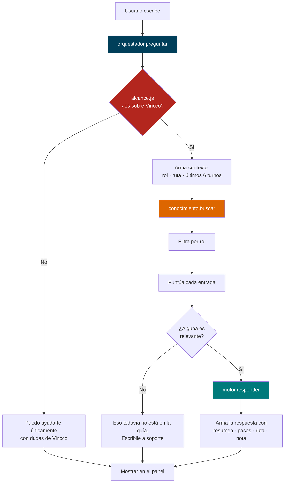

# Estructura del Proyecto Vincco Digital

> **Última actualización**: 25 de agosto de 2026 — Fase 11: módulo Premios rehecho (el hero y la progresión de niveles ahora comparten un mismo cálculo en `pages/premios/nivelesUI.ts`), `Mispuntos.jsx` corregido en el cálculo de "próximo nivel", y limpieza de los artefactos que traía Create React App (`favicon.ico`, `manifest.json`, `robots.txt`, `logo192/512.png`, `reportWebVitals.js`).
> Vincco Digital es una aplicación web móvil (React) que conecta **clientes**, **negocios** y **proveedores** mediante un sistema de puntos, recompensas, directorio comercial y paneles de administración.

## Cómo moverse con este archivo

| Si querés... | Andá a |
|---|---|
| Ver qué es cada carpeta y cada archivo | [1. Árbol de carpetas](#1-arbol-de-carpetas) |
| Saber qué archivo abrir para una pantalla (URL) | [1.1 Mapa de rutas](#11-mapa-de-rutas-url--archivo) |
| Entender los colores y las clases CSS | [2. Design System](#2-design-system--srcstyleshomecss) |
| Ver quién depende de quién | [3. Conexiones](#3-conexiones-y-dependencias-entre-carpetas) · [4. Diagrama](#4-diagrama-mermaid) |
| Leer qué hace cada carpeta en detalle | [5. Descripción por carpeta](#5-descripcion-detallada-por-carpeta) |
| Saber qué librerías usa el proyecto | [6. Tecnologías](#6-tecnologias) |
| **Cambiar algo y no saber dónde** | [7. Si necesito modificar X](#7-si-necesito-modificar-x-donde-tengo-que-ir) |
| Ver qué archivos son grandes (y por qué) | [8. Tamaño de archivos](#8-tamano-de-archivos-lineas) |
| Conectar el backend | [9. Mapa de persistencia](#9-mapa-de-persistencia-localstorage--futuro-backend) |
| Tocar la asistente Kiara o el manual | [10. Kiara](#10-kiara--la-asistente-de-ia-de-vincco) |

> ⚠️ **Nota sobre el repositorio**: hay muchos cambios sin commitear y varias carpetas de respaldo manual en la raíz (`_originales-imagenes/`, `_respaldo-antes-flujo-compra/`, `_respaldo-antes-perfil/`, `_sin-usar/`, `_to_delete/`). **No son parte de la app**: son copias que el propio autor dejó fuera de `src/`/`public/` y se pueden borrar cuando se confirme que ya no hacen falta. Lo mismo vale para `src/pages/PerfilProveedor copy.jsx` y `PerfilProveedor copy 2.jsx` (157 líneas cada una, copias viejas dentro de `src/` que nadie importa).

---

## 1. Arbol de Carpetas

```
vincco-digital/
│
├── public/                               # Estaticos que el navegador sirve tal cual (no pasan por webpack)
│   ├── index.html                        # HTML base donde se monta React (carga la fuente Inter)
│   ├── guiausuario.md                    # Copia publicada de la guia — GENERADA por `npm run guia`
│   ├── assets/
│   │   ├── images/
│   │   │   └── kiara.png                 # Avatar de la asistente Kiara
│   │   ├── icons/
│   │   │   └── socio-vincco.png          # Icono del item "Socio de Vincco" (Sidebar, solo cliente)
│   │   └── logos/
│   │       ├── vincco-logo.png           # Logo principal (Sidebar, perfil, paneles, registro)
│   │       └── vincco-logo-nav.png       # Logo de barra (landing y cabecera de Premios)
│   └── images/
│       ├── register-bg.jpg               # Fondo del registro
│       ├── register-negocio.jpg          # Paso visual para negocio
│       └── register-provedores.jpg       # Paso visual para proveedor
│
├── src/                                  # Codigo fuente completo
│   ├── index.js                          # Arranca React en #root (11 lineas)
│   ├── App.js                            # Aplica accesibilidad/tema/idioma al <body> y monta AppRouter
│   ├── App.css                           # Estilos globales + BottomNav + accesibilidad + hoja de promo (4143)
│   ├── index.css                         # Directivas Tailwind + variables CSS estilo shadcn (98)
│   ├── App.test.js                       # Smoke test basico
│   ├── setupTests.js                     # Configuracion de tests (jest-dom)
│   ├── logo.svg                          # Logo de React que dejo Create React App — sin uso
│   │
│   ├── components/                       # Componentes reutilizables
│   │   ├── AppRouter.jsx                 # LAS RUTAS: HashRouter, lazy loading, Shell + Suspense (181)
│   │   ├── BottomNav.jsx                 # Barra inferior fija; 5 tabs distintos por rol (120)
│   │   ├── BotonVolver.jsx               # Boton "volver" unico y reutilizable (navigate(-1) o destino fijo)
│   │   ├── Navbar.jsx                    # Barra superior del landing (glassmorphism)
│   │   ├── Sidebar.jsx                   # Menu hamburguesa; items por rol; logo real en el header
│   │   ├── HeroBanner.jsx                # Banner principal de Home (incluye Sidebar + DotGrid) (529)
│   │   ├── HeroBannerRedes.jsx           # Hero de la pantalla de Redes Sociales
│   │   ├── CarouselAnuncios.jsx          # Carrusel automatico de anuncios (recibe `slides`)
│   │   ├── NegociosCarousel.jsx          # Carrusel chips + tarjeta (negocios asociados, cotizar) (351)
│   │   ├── DotGridBackground.jsx         # Canvas animado de puntos que reacciona al cursor
│   │   ├── Monto.jsx                     # Montos en cordobas con translate="no" (envuelve utils/moneda)
│   │   │
│   │   ├── icons/
│   │   │   ├── Icon.jsx                  # Libreria SVG propia, ~80 iconos estilo Lucide (536)
│   │   │   └── IconRed.jsx               # Iconos de 6 redes (WhatsApp, FB, IG, TikTok, YT, Threads)
│   │   │
│   │   ├── panel/                        # Piezas internas de los paneles de negocio/proveedor
│   │   │   ├── PublicacionesPanel.jsx    # CRUD de publicaciones POR SUCURSAL (localStorage) (493)
│   │   │   ├── CotizacionesPanel.jsx     # Bandeja de cotizaciones RECIBIDAS (negocio) (599)
│   │   │   ├── CotizacionesEnviadas.jsx  # Drawer de cotizaciones ENVIADAS (proveedor) (476)
│   │   │   ├── FormularioCotizacion.jsx  # El proveedor cotiza a un negocio asociado
│   │   │   ├── PapeleriaPanel.jsx        # Papelera + reenviar codigo de verificacion
│   │   │   ├── ResenasPanel.jsx          # Reseñas y ranking del negocio
│   │   │   ├── SucursalSelector.jsx      # Selector de sucursal activa (vive dentro del perfil)
│   │   │   ├── AvisoSucursal.jsx         # Banner: cada sucursal tiene su propio inventario
│   │   │   └── SolicitarAsociacion.jsx   # Modal 3 pasos: solicitar asociarse a un negocio/proveedor
│   │   │
│   │   ├── promocion/                    # Detalle de una publicacion, compartido Home <-> pantalla propia
│   │   │   ├── DetallePromocion.jsx      # Vista completa: negocio, formulario de consulta/cotizar (360)
│   │   │   └── HojaPromocion.jsx         # Bottom-sheet (portal + arrastrar para cerrar) que lo envuelve
│   │   │
│   │   ├── verificacion/                 # Solicitud, bloqueo y verificacion KYC de la cuenta
│   │   │   ├── VerificacionKYC.jsx       # Flujo KYC completo; se monta FUERA de <Routes> (337)
│   │   │   ├── AccionBloqueada.jsx       # Aviso generico de accion bloqueada
│   │   │   ├── ModalAccionBloqueada.jsx  # Modal: pide verificarse para publicar/cotizar
│   │   │   ├── FormularioRUC.jsx         # Captura de RUC (flujo corto, previo al KYC)
│   │   │   ├── kyc/
│   │   │   │   ├── RoleSelector.jsx      # Elegir el rol a verificar
│   │   │   │   ├── FormStep.jsx          # Envoltorio de un paso del formulario
│   │   │   │   ├── ProgressBar.jsx       # Barra de progreso del flujo
│   │   │   │   ├── ValidationInput.jsx   # Input con validacion en linea
│   │   │   │   └── FileUploader.jsx      # Carga de documentos (comprime con utils/imagenes.js)
│   │   │   ├── kyc.css                   # Estilos del flujo KYC (897)
│   │   │   └── verificacion.css          # Estilos de avisos/bloqueos (prefijo .vf-*)
│   │   │
│   │   ├── config/
│   │   │   └── ConfigUI.jsx              # Piezas de /config: topbar, grupos, permisos de vitrina (588)
│   │   ├── perfil/
│   │   │   └── PerfilUI.jsx              # Piezas de /perfil: ficha, secciones, privacidad (993)
│   │   │
│   │   └── ui/                           # Shadcn/Radix + piezas visuales de plantilla
│   │       ├── event-manager.tsx         # EL CALENDARIO COMPLETO; Calendario.jsx solo lo envuelve (1496)
│   │       ├── carousel-cards.tsx        # CarruselProductos/GrillaProductos (los usa InventarioNegocio)
│   │       ├── autoscroll-slider.tsx     # Carrusel con auto-scroll (Embla) — lo usa premios/DondeGanas
│   │       ├── autoscroll-slider-utils/
│   │       │   └── carousel.tsx          # Primitivas Embla base del autoscroll-slider
│   │       ├── button.tsx  input.tsx  textarea.tsx  label.tsx  select.tsx
│   │       ├── dropdown-menu.tsx  dialog.tsx  badge.tsx  card.tsx
│   │       ├── avatar.tsx                # Avatar/AvatarImage/AvatarFallback (Notificaciones, Premios)
│   │       ├── tabs.tsx                  # Tabs/TabsList/TabsTrigger/TabsContent (Notificaciones)
│   │       ├── card-5.tsx                # HighlightCard: tarjeta de metrica — sin usar fuera de su demo
│   │       └── card-5-demo.tsx           # Demo de HighlightCard, no forma parte del flujo real
│   │
│   ├── pages/                            # Pantallas completas (una por ruta)
│   │   ├── Home.jsx                      # Pantalla principal autenticada: el feed (1068)
│   │   ├── Landing.jsx                   # Login con canvas animado (Framer Motion) — ruta /login
│   │   ├── Register.jsx                  # Registro multi-paso (cliente 8 / socios 10; modo sucursal) (1419)
│   │   ├── Bienvenida.jsx                # Pantalla breve tras registrarse
│   │   ├── Directorio.jsx                # Directorio de negocios y proveedores
│   │   ├── Mispuntos.jsx                 # Puntos, niveles y recompensas — ruta ACTIVA /puntos (837)
│   │   ├── Dashboard.jsx                 # Estadisticas del negocio (datos hardcodeados)
│   │   ├── Favoritos.tsx                 # Negocios favoritos (solo cliente)
│   │   ├── InventarioNegocio.tsx         # Catalogo publico de UN negocio, solo lectura (565)
│   │   ├── Promocion.jsx                 # Pantalla completa de una publicacion (/promocion/:id)
│   │   ├── PanelNegocio.jsx              # Panel del negocio: 5 tabs, soporta ?tab= (524)
│   │   ├── PanelSocio.jsx                # Panel compartido negocio/proveedor; secciones filtradas por rol
│   │   ├── NegociosAsociados.jsx         # Proveedor: sus negocios + cotizaciones enviadas
│   │   ├── ProveedoresAsociados.jsx      # Negocio: sus proveedores asociados
│   │   ├── Proveedores.tsx               # Directorio bidireccional (negocio ve proveedores y viceversa)
│   │   ├── Ayuda.jsx                     # Centro de ayuda: FAQ, articulos, contacto
│   │   ├── Redes.jsx                     # Conexion de redes sociales del negocio
│   │   ├── Notificaciones.tsx            # Centro de notificaciones con pestañas + modal de cotizar (634)
│   │   ├── Calendario.jsx                # Envoltorio liviano (la UI real es ui/event-manager.tsx)
│   │   ├── SocioVincco.jsx               # Conversion cliente -> negocio/proveedor (solo cliente)
│   │   ├── Perfil.jsx                    # Enrutador: una ruta /perfil, tres pantallas segun rol
│   │   ├── PerfilUsuario.jsx             # Perfil del cliente (ficha, actividad, insignias)
│   │   ├── PerfilNegocio.jsx             # Perfil del negocio + SucursalSelector
│   │   ├── PerfilProveedor.jsx           # Perfil del proveedor + SucursalSelector
│   │   ├── Config.jsx                    # Configuraciones: una ruta, tres roles
│   │   ├── Premios.tsx                   # Modulo de puntos/recompensas nuevo — CONSTRUIDO, SIN RUTA
│   │   │
│   │   ├── premios/                      # Piezas de Premios.tsx (aun no enlazado en AppRouter/nav)
│   │   │   ├── MisPremios.tsx            # Hero: saldo, nivel, mostrar/ocultar saldo
│   │   │   ├── SubirNivel.tsx            # Progresion de niveles + anuncios para subir
│   │   │   ├── CanjeaPuntos.tsx          # Grilla de recompensas canjeables
│   │   │   ├── DondeGanas.tsx            # Red de negocios afiliados (usa ui/autoscroll-slider.tsx)
│   │   │   ├── ActividadReciente.tsx     # Lista de movimientos recientes de puntos
│   │   │   └── nivelesUI.ts              # NUEVO: fuente unica de nivel/icono/color; la usan hero y progresion
│   │   │
│   │   ├── proveedores/                  # Submodulo de Proveedores.tsx / ProveedoresAsociados.jsx
│   │   │   ├── Header.tsx                # Cabecera: logo, volver, tabs de seccion
│   │   │   ├── Catalogo.tsx              # Grilla/lista filtrable (busqueda, categoria, tipo, ubicacion)
│   │   │   ├── TarjetaProveedor.tsx      # Tarjeta individual (grid/lista), avatar, disponibilidad
│   │   │   ├── ModalProveedor.tsx        # Detalle/perfil + formulario de contacto (388)
│   │   │   ├── Solicitudes.tsx           # Bandeja de solicitudes (enviadas/recibidas/historico)
│   │   │   ├── TrustRing.tsx             # Anillo SVG de "score de confianza"
│   │   │   ├── Toasts.tsx                # Sistema de toasts propio del modulo (contexto React)
│   │   │   └── data.ts                   # Mock + tipos + CLAVES de localStorage del modulo (605)
│   │   │
│   │   └── *.css                         # Estilos por pantalla:
│   │       ├── Panel.css                 #   PanelNegocio + PanelSocio + piezas panel/* (4315)
│   │       ├── NegociosAsociados.css     #   NegociosAsociados + drawer .na-cot-* (1804)
│   │       ├── Perfil.css                #   Los tres perfiles (1492)
│   │       ├── Config.css                #   Configuraciones (1506)
│   │       ├── Register.css              #   Registro (951)
│   │       ├── Ayuda.css                 #   Centro de ayuda (717)
│   │       ├── SocioVincco.css           #   Socio Vincco, prefijo .sv-* (665)
│   │       ├── Redes.css                 #   Redes sociales (580)
│   │       ├── Calendario-tema.css       #   Tema claro/oscuro del calendario (328)
│   │       └── Calendario.css            #   Envoltorio del calendario (48)
│   │
│   ├── sections/                         # Secciones del landing (marketing) — solo las usa Landing.jsx
│   │   ├── HeroSection.jsx  BenefitsSection.jsx  HowItWorks.jsx  StatsSection.jsx
│   │   └── DashboardPreview.jsx  TestimonialsSection.jsx  CTASection.jsx  FooterSection.jsx
│   │
│   ├── store/
│   │   └── puntos_usestore.js            # EL CEREBRO: estado global Zustand + persistencia (1375)
│   │
│   ├── data/                             # Datos de prueba + piso de persistencia
│   │   ├── data_falso.js                 # Perfiles, cotizaciones, asociados, ranking, FAQ... (768)
│   │   ├── config_opciones.js            # Definicion declarativa de los ajustes de /config (674)
│   │   ├── kyc_options.js                # Catalogos del formulario de verificacion KYC (478)
│   │   ├── premios.ts                    # Tipos + mocks del modulo Premios (niveles, recompensas)
│   │   ├── catalogoNegocios.js           # Deriva el catalogo PUBLICO de un negocio de su inventario real
│   │   ├── inventario.js                 # Helpers de inventario POR SUCURSAL (claveInventario)
│   │   ├── departamentos_ciudades.ts     # 15 departamentos + 2 regiones autonomas de Nicaragua
│   │   ├── categoriasInventario.js       # Categorias de inventario (localStorage)
│   │   ├── papelera.js                   # Papelera de publicaciones (localStorage)
│   │   └── publicationTypes.js           # Tipos de publicacion con su storageKey
│   │
│   ├── Chatbot/                          # MODULO AISLADO de la asistente Kiara (ver seccion 10)
│   │   ├── guiausuario.md                # LA FUENTE DE VERDAD: el manual se escribe aca (775)
│   │   ├── generar-guia.mjs              # Compila la guia a JS + copia publica
│   │   ├── conocimiento/
│   │   │   ├── guia_generada.js          # GENERADO — no editar a mano (1452)
│   │   │   ├── parsearGuia.mjs           # Markdown -> estructura (Node y navegador)
│   │   │   ├── index.js                  # buscar() — la puerta al conocimiento (RAG futuro)
│   │   │   └── cargarGuia.js             # Guia incorporada + version en vivo
│   │   ├── motores/
│   │   │   ├── tipos.js                  # CONTRATO que todo motor debe cumplir
│   │   │   └── motorLocal.js             # Motor actual, sin IA
│   │   ├── orquestador/
│   │   │   ├── orquestador.js            # preguntar() — la unica entrada
│   │   │   ├── alcance.js                # ¿esto es tema de Vincco?
│   │   │   └── normalizar.js             # minusculas, tildes, palabras vacias
│   │   ├── ui/
│   │   │   ├── PanelChat.jsx  KiaraFlotante.jsx  Mensaje.jsx
│   │   │   └── Chat.css  KiaraFlotante.css
│   │   ├── pagina-guia/
│   │   │   ├── Guia.jsx                  # Pantalla /guia (el manual leible)
│   │   │   └── Guia.css
│   │   └── CLAUDE.md                     # Notas del modulo para agentes
│   │
│   ├── hooks/
│   │   └── useLikes.js                   # Likes de destacadas (localStorage)
│   │
│   ├── lib/
│   │   └── utils.ts                      # cn(): merge de clases Tailwind (shadcn)
│   │
│   ├── utils/                            # Helpers puros, sin React
│   │   ├── promociones.js                # Traduce lo publicado por socios a lo que ve el cliente (481)
│   │   ├── moneda.js                     # cordobas(), numero(), cordobasTexto(), TIPO_CAMBIO_USD
│   │   ├── filtroNotificaciones.js       # Config del usuario -> que notificacion se ve
│   │   └── imagenes.js                   # comprimirImagen(): reduce a JPEG antes de guardar
│   │
│   └── styles/
│       ├── home.css                      # Design System del landing (1204, prefijo vc-*)
│       └── colores.js                    # Fuente unica de hex para JS (TOKENS, COLORES_HOME, COLORES_PUNTOS)
│
├── build/                                # Compilado de produccion (`npm run build`) — ignorado por git
├── node_modules/                         # Dependencias
├── .claude/                              # Config del asistente de codigo (settings, launch, skills)
├── CLAUDE.md                             # Instrucciones del proyecto para agentes (hoy vacio)
├── ESTRUCTURA.md                         # Este archivo
├── ANALISIS-CHATBOT.md                   # Analisis escrito del asistente Kiara
├── README.md                             # Presentacion del proyecto
├── diseño-guia/
│   └── colores y botones.md              # Notas de diseño de la guia
├── package.json                          # Scripts y dependencias (start/build via craco, guia)
├── craco.config.js                       # CRACO: agrega el alias `@` -> src/ sobre react-scripts
├── tailwind.config.js                    # Paleta de marca (naranja/dorado/turquesa/tinta/hueso) y animaciones
├── postcss.config.js                     # Tailwind + autoprefixer
├── tsconfig.json                          # TS con baseUrl src y paths `@/*`
├── flujo de registro_1.sql               # Script SQL de referencia para definir el backend
├── start.bat                             # Atajo de Windows: npm start
├── cleanup.ps1                           # Script PowerShell para limpiar App.css
├── _check.js                             # Script suelto de comprobacion
├── Doctor                                # Volcado de consola guardado por error — no es parte de la app
├── _originales-imagenes/  _sin-usar/     # Respaldos manuales (ver nota del principio)
├── _respaldo-antes-flujo-compra/         #   idem
├── _respaldo-antes-perfil/  _to_delete/  #   idem
└── .venv/                                # Entorno Python suelto, no lo usa la app
```

> **Artefactos de Create React App ya borrados** (por si los buscás y no aparecen): `public/favicon.ico`, `public/manifest.json`, `public/robots.txt`, `public/logo192.png`, `public/logo512.png`, `public/.nojekyll` y `src/reportWebVitals.js`. `index.html` ya no los referencia. `src/logo.svg` sigue en disco pero nadie lo importa. Ojo con `.nojekyll`: el deploy es a GitHub Pages (`npm run deploy` usa `gh-pages -d build --dotfiles`); si algún archivo del build empieza con `_`, hay que volver a crearlo.

---

## 1.1 Mapa de Rutas: URL → Archivo

Todas las rutas viven en [`src/components/AppRouter.jsx`](src/components/AppRouter.jsx). Las de la primera tabla se dibujan dentro del `Shell` (llevan `BottomNav` abajo).

| URL | Archivo que abrir | Quien la ve | Estilos |
|---|---|---|---|
| `/` · `/inicio` · `/home` | `pages/Home.jsx` | todos | `App.css` + `styles/colores.js` |
| `/directorio` | `pages/Directorio.jsx` | todos | `App.css` |
| `/puntos` | `pages/Mispuntos.jsx` | cliente (tab "Premios") | inline + `App.css` |
| `/favoritos` | `pages/Favoritos.tsx` | cliente | Tailwind directo |
| `/negocio/:id/inventario` | `pages/InventarioNegocio.tsx` | cliente | Tailwind directo |
| `/promocion/:id` | `pages/Promocion.jsx` → `components/promocion/DetallePromocion.jsx` | todos | `App.css` (`.vc-promo-*`) |
| `/socio-vincco` | `pages/SocioVincco.jsx` | cliente | `SocioVincco.css` |
| `/panel-negocio` | `pages/PanelNegocio.jsx` | negocio | `Panel.css` |
| `/recompensas` · `/publicaciones` | `pages/PanelSocio.jsx` | negocio y proveedor | `Panel.css` |
| `/proveedores` | `pages/Proveedores.tsx` + `pages/proveedores/*` | negocio y proveedor | Tailwind directo |
| `/proveedores-asociados` | `pages/ProveedoresAsociados.jsx` | negocio | Tailwind directo |
| `/negocios-asociados` | `pages/NegociosAsociados.jsx` | proveedor | `NegociosAsociados.css` |
| `/dashboard` | `pages/Dashboard.jsx` | negocio | `App.css` |
| `/calendario` | `pages/Calendario.jsx` → `components/ui/event-manager.tsx` | todos | `Calendario.css` + `Calendario-tema.css` |
| `/notificaciones` | `pages/Notificaciones.tsx` | todos | Tailwind + `NegociosAsociados.css` |
| `/perfil` | `pages/Perfil.jsx` → `PerfilUsuario` / `PerfilNegocio` / `PerfilProveedor` | todos (segun rol) | `Perfil.css` |
| `/config` | `pages/Config.jsx` + `components/config/ConfigUI.jsx` | todos | `Config.css` |
| `/ayuda` | `pages/Ayuda.jsx` | todos | `Ayuda.css` |
| `/redes` | `pages/Redes.jsx` | todos (conectar: negocio) | `Redes.css` |
| `/guia` | `Chatbot/pagina-guia/Guia.jsx` | todos | `Guia.css` |

**Fuera del Shell** (sin barra inferior): `/login` → `pages/Landing.jsx` · `/register` → `pages/Register.jsx` · `/bienvenida` → `pages/Bienvenida.jsx`.

**Montado por encima del router** (aparece en cualquier pantalla, no tiene URL):

| Que | Archivo | Como se abre |
|---|---|---|
| Verificacion KYC | `components/verificacion/VerificacionKYC.jsx` | `store.kyc.abierto` (lazy + precarga en idle) |
| Asistente Kiara | `Chatbot/ui/PanelChat.jsx` + `KiaraFlotante.jsx` | `store.chat.abierto`, si `mostrarAsistente` esta en on |
| Barra inferior | `components/BottomNav.jsx` | Siempre, salvo en login/register/bienvenida |

**Sin ruta todavia**: `pages/Premios.tsx` y todo `pages/premios/*` compilan pero no estan en `AppRouter.jsx` ni enlazados desde `BottomNav`/`Sidebar`. El tab "Premios" del cliente sigue apuntando a `/puntos` (`Mispuntos.jsx`).

**Tabs del BottomNav** (`components/BottomNav.jsx`):
- Cliente: Inicio · Favoritos · **Premios** (`/puntos`) · Calendario · Avisos
- Negocio: Inicio · **Panel** (`/panel-negocio`) · Conectar (`/proveedores`) · Calendario · Avisos
- Proveedor: Inicio · **Panel** (`/recompensas`) · Conectar (`/proveedores`) · Calendario · Avisos

**Items del Sidebar** (`components/Sidebar.jsx`): Perfil, Inicio, *Socio de Vincco* (solo cliente), *Proveedores* (solo negocio), *Negocios Asociados / Mi Negocio* (segun rol), Guia de Usuario, Ayuda y Soporte, Configuraciones, Redes Sociales.

---

### Nota sobre CSS: Sistema Dual (+ Tailwind puro en los modulos nuevos)

| Sistema | Archivo | Lineas | Estado |
|---|---|---|---|
| **Global** | `src/App.css` | 4143 | Base, BottomNav, accesibilidad, `vincco--asistente-abierto` y la hoja de detalle de promocion (`.vc-promo-*`) |
| **Design System** | `src/styles/home.css` | 1204 | Landing page (prefijo `vc-*`) |
| **Por pagina** | `src/pages/*.css` | var | Estilos especificos de cada pantalla |
| **KYC** | `src/components/verificacion/kyc.css` | 897 | Flujo de verificacion (formulario multi-paso) |
| **Tailwind** | `tailwind.config.js` | — | Paleta de marca `naranja/dorado/turquesa/tinta/hueso` en escalas 50-900 |
| **JS** | `src/styles/colores.js` | 101 | Hex desde JavaScript (Home, Mis Puntos) |

Prefijos de clases por pantalla: `.cfg-*` (Config), `.pf-*` (Perfil), `.ayu-*` (Ayuda), `.rds-*` (Redes), `.na-*` (Negocios Asociados, incl. `.na-cot-*` del drawer de cotizaciones), `.panel-*` (Panel.css, compartida por los dos paneles), `.rk-*` (Register), `.chat-*` (asistente), `.vf-*` (verificacion), `.sv-*` (Socio Vincco), `.vc-promo-*` (hoja/detalle de promocion, vive en `App.css`).

**Los modulos mas nuevos (`Proveedores.tsx`, `ProveedoresAsociados.jsx`, `InventarioNegocio.tsx`, `Notificaciones.tsx`, `Favoritos.tsx`, `Premios.tsx` y todo `pages/premios/` y `pages/proveedores/`) no tienen `.css` propio**: estan escritos con clases utilitarias de Tailwind directo en el JSX/TSX. Es un cambio de convencion respecto al resto de la app — tenerlo en cuenta al tocarlos. Esos modulos usan la paleta de marca de `tailwind.config.js` (`bg-hueso-100`, `text-tinta-900`, `text-naranja-500`...), no los tokens de `App.css`.

---

## 2. Design System — `src/styles/home.css`

El Design System es el corazon visual del proyecto rediseñado. Inspirado en Stripe, Linear y noCRM.

### Paleta de Colores

```css
:root {
  --navy-950: #001d2a;
  --navy-900: #002e43;
  --navy-800: #003f5a;
  --orange-500: #dd6600;
  --orange-600: #c05900;
  --gold-400: #feb862;
  --gold-500: #fea02f;
  --teal-500: #3f9c9c;
  --teal-600: #007a7b;
  --ink-900: #0b1b26;
  --surface: #ffffff;
  --surface-alt: #f4f8fb;
}
```

| Token | Valor | Uso |
|---|---|---|
| `--navy-900` | `#002e43` | Fondo principal oscuro |
| `--navy-800` | `#003f5a` | Fondo de barras y headers |
| `--orange-500` | `#dd6600` | Acento naranja (CTAs, badges) |
| `--gold-500` | `#fea02f` | Dorado (premium, recompensas) |
| `--teal-600` | `#007a7b` | Teal (exito, confirmacion) |
| `--ink-900` | `#0b1b26` | Texto principal |
| `--slate-600` | `#4d6273` | Texto secundario |

**Los mismos colores desde JavaScript** viven en `src/styles/colores.js` (`TOKENS`), con dos mapas derivados:
- `COLORES_HOME` — usado por `Home.jsx` (`orange: #c05900`)
- `COLORES_PUNTOS` — usado por `Mispuntos.jsx` (`orange: #dd6600`)

> ⚠️ Ojo: Home y Mis Puntos usan la misma palabra para colores distintos. Por eso se exportan dos mapas separados en vez de uno solo. No fusionarlos sin cambiar el aspecto de una pantalla.

### Arquitectura de home.css

```
home.css (~1204 lineas)
│
├── Custom Properties — Tokens de diseno (navy/orange/gold/teal palette)
├── vc-navbar — Barra de navegacion superior (glassmorphism + mobile menu)
├── vc-hero — Hero section del landing
├── Section Shared — Utilidades compartidas entre secciones
├── vc-benefits — Grid de beneficios
├── vc-how-it-works — Timeline/scrolling
├── vc-dashboard-preview — Mockup visual
├── vc-stats — Contadores animados
├── vc-testimonials — Carrusel de testimonios
├── vc-cta — Call to action
├── vc-footer — Footer completo
└── Animations — Keyframes y media queries responsive
```

### Convenciones de Clases CSS

| Convencion | Ejemplo | Uso |
|---|---|---|
| Prefijo `vc-` | `vc-hero`, `vc-navbar` | Identidad Vincco |
| Modificador BEM | `vc-navbar-btn--primary` | Variantes de boton |
| Estados | `--active`, `--open` | Estados de UI |
| Mobile menu | `vc-navbar-mobile-menu.open` | Menu responsivo |

### Reglas del Design System

- **Glassmorphism** en navbar: `backdrop-filter: blur(12px)`
- **Gradientes** y glows en hero section
- **Animaciones** con Framer Motion y keyframes CSS
- **Tipografia**: Inter + Sora (display)
- **Responsive**: 768px (tablet), 1024px (desktop)
- `!important` solo en overrides inline de componentes legacy

---

## 3. Conexiones y Dependencias entre Carpetas

### Flujo General de Datos

```
┌──────────────────────────────────────────────────────────────────┐
│                       FLUJO DE LA APLICACION                      │
│                                                                   │
│  index.js  ->  App.js  ->  AppRouter.jsx (HashRouter)            │
│                              |                                    │
│                  Define las rutas (URLs), el Shell con           │
│                  BottomNav y las cargas perezosas (lazy)         │
│                              |                                    │
│                   Carga la pagina correspondiente                 │
│                              |                                    │
│                  Las paginas leen y escriben el Store             │
│                  (Zustand) = estado global + persistencia        │
│                              |                                    │
│                  El Store persiste en localStorage               │
│                  (todavia no hay backend) — ver seccion 9        │
│                              |                                    │
│                  Los componentes reutilizables                    │
│                  (BottomNav, Sidebar, HeroBanner, panel/*,       │
│                   promocion/*, verificacion/*, verificacion/kyc/,│
│                   perfil/*) se insertan dentro de las paginas    │
│                              |                                    │
│                  Los estilos vienen de:                           │
│                  - App.css (global + hoja de promocion)          │
│                  - home.css (landing, prefijo vc-*)               │
│                  - pages/*.css (por pagina, salvo modulos nuevos)│
│                  - Tailwind directo (Proveedores, Premios,       │
│                    InventarioNegocio)                             │
│                  - styles/colores.js (colores inline en JS)       │
└──────────────────────────────────────────────────────────────────┘
```

### Diagrama de Dependencias por Carpeta

| Carpeta | De quien depende | Quien la usa |
|---|---|---|
| `src/index.js` | `App.js` | Nadie (punto de entrada) |
| `src/App.js` | `AppRouter`, `store/`, `App.css` | `index.js` |
| `src/App.css` | Ninguno (tokens en `:root`) | `App.js`, `promocion/*` |
| `src/styles/home.css` | Ninguno | Landing, `Navbar.jsx` |
| `src/styles/colores.js` | Ninguno | `Home.jsx`, `Mispuntos.jsx` |
| `src/utils/` | Ninguna (funciones puras) | Store, paneles, KYC, promociones |
| `src/components/` | `pages/`, `store/`, `App.css` | `AppRouter.jsx`, varias paginas |
| `src/sections/` | `home.css`, `components/icons/` | `Landing.jsx` |
| `src/pages/` | `components/`, `store/`, `data/`, `App.css`, `*.css` | `AppRouter.jsx` |
| `src/pages/premios/` | `data/premios.ts`, `premios/nivelesUI.ts`, `components/ui/*`, `store/` (saldo) | `Premios.tsx` (sin ruta todavia) |
| `src/pages/proveedores/` | `data/departamentos_ciudades.ts`, `components/ui/*`, localStorage propio | `Proveedores.tsx`, `ProveedoresAsociados.jsx` |
| `src/store/` | `data/data_falso.js`, `utils/`, localStorage | Casi todas las paginas |
| `src/data/` | `utils/moneda.js`, localStorage | Paneles, Home, Perfil, Config, catalogo publico |
| `src/Chatbot/` | `data/` (guia), `store/` (chat), `utils/` | `AppRouter.jsx` (monta el panel) |
| `public/` | Ninguna | Referenciados por `/assets/...` |

### Flujo de Datos Especifico

```
Landing (/login) / Register  ->  Store (setLoggedIn, setUserType)  ->  Navega a Home
                                                                          |
Home.jsx  <-  HeroBanner (abre Sidebar)  <-  DotGridBackground (canvas)
   |            |                                  |
   |-- data/data_falso.js (categorias, promociones, recompensas, destacadas)
   |-- utils/promociones.js (normaliza publicaciones -> tarjetas)
   |-- store/puntos_usestore.js (usuario, puntos, rol, configuraciones)
   |-- hooks/useLikes.js (likes de destacadas, localStorage)
   |-- styles/colores.js (COLORES_HOME)
   |-- components/icons/Icon.jsx (iconos SVG)
   |-- click en una tarjeta -> components/promocion/HojaPromocion.jsx
             |                    -> components/promocion/DetallePromocion.jsx
             |                    -> store.enviarConsultaPromocion()
             |
BottomNav  <-  store/puntos_usestore.js (notificaciones para badge)
             |
Panel del negocio (PanelNegocio.jsx)
   |-- panel/PublicacionesPanel.jsx   (CRUD por sucursal)
   |-- panel/CotizacionesPanel.jsx    (cotizaciones recibidas)
   |-- panel/ResenasPanel.jsx         (reseñas y ranking)
   |-- panel/PapeleriaPanel.jsx       (papelera / reenviar codigo)
   |-- panel/AvisoSucursal.jsx        (banner al cambiar de sucursal)
   |-- data/inventario.js             (stock por sucursal)
Panel del socio (PanelSocio.jsx) — con secciones filtradas por rol
   |-- proveedor NO ve: Proveedores, Cotizaciones, Directorio
   |-- negocio ve todo
Perfil -> SucursalSelector  ->  cambiarSucursal() / agregarSucursal()
   |-- "Agregar sucursal" lleva a /register en modoSucursal (paso 5+)
   |-- pedir verificacion -> components/verificacion/VerificacionKYC.jsx (flujo multi-paso)
NegociosAsociados (proveedor) / ProveedoresAsociados (negocio)
   |-- NegociosCarousel  ->  FormularioCotizacion  ->  vn_cotizaciones_recibidas
   |-- CotizacionesEnviadas (drawer profesional de las enviadas)
   |-- panel/SolicitarAsociacion.jsx (modal 3 pasos: buscar -> perfil -> formulario)
Proveedores.tsx (directorio bidireccional)
   |-- pages/proveedores/Catalogo.tsx + Header + TarjetaProveedor + ModalProveedor
   |-- pages/proveedores/Solicitudes.tsx (localStorage propio, ver seccion 9)
   |-- data/departamentos_ciudades.ts (filtro geografico)
InventarioNegocio.tsx (cliente ve UN negocio, solo lectura)
   |-- data/catalogoNegocios.js (lee pn_inventario:<sucursalId> real, o cae a un ejemplo)
   |-- components/ui/carousel-cards.tsx
Premios.tsx (sin ruta) — pages/premios/* + data/premios.ts
   |-- premios/nivelesUI.ts (nivel actual/siguiente: lo comparten hero y progresion)
             |
Navega entre: /home, /favoritos, /puntos, /panel-negocio, /recompensas,
             /publicaciones, /calendario, /notificaciones, /negocios-asociados,
             /proveedores, /proveedores-asociados, /negocio/:id/inventario,
             /promocion/:id, /socio-vincco, /ayuda, /redes, /perfil, /config, /guia
```

---

## 4. Diagrama Mermaid

```mermaid
flowchart TD
    subgraph Entrada
        A[index.js] --> B[App.js]
        B --> C[AppRouter.jsx]
    end

    subgraph Navegacion
        C -->|"/login"| D[Landing.jsx]
        C -->|"/register"| E[Register.jsx]
        C -->|"/bienvenida"| BI[Bienvenida.jsx]
        C -->|"/home, /inicio, /"| F[Home.jsx]
        C -->|"/directorio"| G[Directorio.jsx]
        C -->|"/puntos"| H[Mispuntos.jsx]
        C -->|"/dashboard"| I[Dashboard.jsx]
        C -->|"/favoritos"| FAV[Favoritos.tsx]
        C -->|"/negocio/:id/inventario"| INVN[InventarioNegocio.tsx]
        C -->|"/promocion/:id"| PROMO[Promocion.jsx]
        C -->|"/panel-negocio"| J[PanelNegocio.jsx]
        C -->|"/recompensas, /publicaciones"| K[PanelSocio.jsx]
        C -->|"/negocios-asociados"| NA[NegociosAsociados.jsx]
        C -->|"/proveedores"| PROV[Proveedores.tsx]
        C -->|"/proveedores-asociados"| PROVA[ProveedoresAsociados.jsx]
        C -->|"/ayuda"| AYU[Ayuda.jsx]
        C -->|"/redes"| RDS[Redes.jsx]
        C -->|"/perfil"| PF[Perfil.jsx]
        C -->|"/config"| CF[Config.jsx]
        C -->|"/notificaciones"| L[Notificaciones.tsx]
        C -->|"/calendario"| M[Calendario.jsx]
        C -->|"/socio-vincco"| SV[SocioVincco.jsx]
        C -->|"/guia"| GUIA[Chatbot/pagina-guia/Guia.jsx]
        C -.->|"sin ruta todavia"| PREM[Premios.tsx]
    end

    subgraph Componentes
        F --> P[HeroBanner.jsx]
        F --> Q[CarouselAnuncios.jsx]
        F --> HP[promocion/HojaPromocion.jsx]
        HP --> DP[promocion/DetallePromocion.jsx]
        PROMO --> DP
        P --> R[Sidebar.jsx]
        P --> DG[DotGridBackground.jsx]
        NA --> NC[NegociosCarousel.jsx]
        NC --> FC[panel/FormularioCotizacion.jsx]
        NA --> CE[panel/CotizacionesEnviadas.jsx]
        NA --> SA[panel/SolicitarAsociacion.jsx]
        PROVA --> SA
        J --> PNP[panel/PublicacionesPanel.jsx]
        J --> COT[panel/CotizacionesPanel.jsx]
        J --> RSP[panel/ResenasPanel.jsx]
        J --> PPL[panel/PapeleriaPanel.jsx]
        J --> AVS[panel/AvisoSucursal.jsx]
        J --> INV[data/inventario.js]
        INVN --> CN[data/catalogoNegocios.js]
        INVN --> CC[ui/carousel-cards.tsx]
        PROV --> PCat[proveedores/Catalogo.tsx]
        PROV --> PSol[proveedores/Solicitudes.tsx]
        PF --> PE1[PerfilUsuario.jsx]
        PF --> PE2[PerfilNegocio.jsx]
        PF --> PE3[PerfilProveedor.jsx]
        PE2 --> SS[panel/SucursalSelector.jsx]
        PE3 --> SS
        PE1 --> VK[verificacion/VerificacionKYC.jsx]
        RDS --> HR[HeroBannerRedes.jsx]
        RDS --> DG
        D --> S[Navbar.jsx]
        D --> T[HeroSection.jsx]
        D --> U[BenefitsSection.jsx]
        D --> V[HowItWorks.jsx]
        D --> W[StatsSection.jsx]
        D --> X[DashboardPreview.jsx]
        D --> Y[TestimonialsSection.jsx]
        D --> Z[CTASection.jsx]
        D --> AA[FooterSection.jsx]
    end

    subgraph NavegacionInferior
        C --> AB[BottomNav.jsx]
        C --> BV[BotonVolver.jsx]
    end

    subgraph LibreriaIconos
        F --> AC[components/icons/Icon.jsx]
        E --> AC
        J --> AC
        K --> AC
        L --> AC
        M --> AC
        CF --> AC
        AYU --> AC
        RDS --> AC
        RDS --> ICR[components/icons/IconRed.jsx]
    end

    subgraph EstadoGlobal
        D --> AD[store/puntos_usestore.js]
        E --> AD
        F --> AD
        H --> AD
        J --> AD
        K --> AD
        L --> AD
        M --> AD
        NA --> AD
        PF --> AD
        CF --> AD
        RDS --> AD
        AB --> AD
        R --> AD
        DP --> AD
        VK --> AD
        PREM --> AD
    end

    subgraph DatosMock
        F --> AE[data/data_falso.js]
        G --> AE
        J --> AE
        NA --> AE
        AYU --> AE
        RDS --> AE
        PF --> AE
        CF --> AF[data/config_opciones.js]
        J --> AG[data/publicationTypes.js]
        J --> INV2[data/inventario.js / papelera.js]
        PF --> CAM[data/data_falso.js camposPerfil]
        VK --> KYCO[data/kyc_options.js]
        PROV --> DEP[data/departamentos_ciudades.ts]
        PREM --> PREMD[data/premios.ts]
        PREM --> NUI[premios/nivelesUI.ts]
    end

    subgraph Utilidades
        AD --> U1[utils/filtroNotificaciones.js]
        L --> U1
        AD --> U2[utils/moneda.js]
        AE --> U2
        F --> LK[hooks/useLikes.js]
        VK --> IMG[utils/imagenes.js]
        F --> U3[utils/promociones.js]
        CN --> U3
    end

    subgraph DesignSystem
        D -.-> AS[styles/home.css]
        S -.-> AS
        F -.-> CO[styles/colores.js]
        H -.-> CO
        E -.-> AH[pages/Register.css]
        M -.-> AJ[Calendario.css + Calendario-tema.css]
        J -.-> AK[pages/Panel.css]
        K -.-> AK
        CF -.-> AL[pages/Config.css]
        PF -.-> AM[pages/Perfil.css]
        AYU -.-> AN[pages/Ayuda.css]
        RDS -.-> AO[pages/Redes.css]
        NA -.-> AQ[pages/NegociosAsociados.css]
        CE -.-> AQ
        SV -.-> SVC[pages/SocioVincco.css]
        VK -.-> KYCC[verificacion/kyc.css]
        HP -.-> AR[App.css: vc-promo-*]
        DP -.-> AR
        AB -.-> AR
        B -.-> AR
        L -.-> TW[Tailwind directo, sin .css propio]
        PROV -.-> TW
        PROVA -.-> TW
        INVN -.-> TW
        PREM -.-> TW
        FAV -.-> TW
    end

    subgraph AssetsEstaticos
        P --> AST[public/assets/]
        D --> ASI[public/images/]
        E --> ASI
        SV --> ASTI[public/assets/icons/socio-vincco.png]
    end

    style AD fill:#f59e0b,stroke:#d97706,color:#000
    style AE fill:#10b981,stroke:#059669,color:#fff
    style C fill:#2563EB,stroke:#1D4ED8,color:#fff
    style AS fill:#0D9488,stroke:#0F766E,color:#fff
    style AC fill:#8B5CF6,stroke:#7C3AED,color:#fff
    style PREM fill:#94a3b8,stroke:#64748b,color:#000
```



---

## 5. Descripcion Detallada por Carpeta

### Los tres archivos de arranque

| Archivo | Que hace |
|---|---|
| `src/index.js` (11) | Monta React en `#root` con `<React.StrictMode>`. No tiene logica |
| `src/App.js` (50) | Lee las preferencias del rol activo en el store y las aplica como clases del `<body>` (`vincco--alto-contraste`, `vincco--texto-grande`, `vincco--sin-animaciones`, `dark`) y el `lang` del documento. Despues devuelve `<AppRouter />` |
| `src/components/AppRouter.jsx` (181) | Define TODAS las rutas (`SHELL_ROUTES`), envuelve las pantallas en el `Shell` con `BottomNav`, carga cada pantalla con `lazy` (solo `Home` va directo) y monta por encima el KYC y a Kiara |

### `src/App.css` — Estilos Globales (4143 lineas)

**Responsabilidad**: hoja global de la app. Crecio mucho porque absorbio los estilos de la hoja de detalle de promocion.

**Secciones actuales**:
- Estilos base (`.page-shell`, `.route-fallback`, layout responsive)
- Bottom Navigation (`bottom-nav-*`)
- Carrusel de Negocios Asociados (chips, tarjetas — prefijo `.ncar-*`)
- Detalle/hoja de promocion (`.vc-promo-*`): tarjeta del negocio, formulario de consulta, bottom-sheet
- Accesibilidad: `vincco--texto-grande`, `vincco--alto-contraste` (clases que pone `App.js` en el `<body>`)
- `vincco--asistente-abierto`: corre el contenido para dejarle lugar al panel de Kiara en escritorio

### `src/styles/home.css` — Design System del Landing (1204 lineas)

Design System del rediseño con paleta navy/orange/gold/teal. Clases `vc-*`. Importa las fuentes Old Standard TT y Plus Jakarta Sans desde Google Fonts.

**Secciones**: Custom Properties, Navbar, Hero, Section Shared, Benefits, How It Works, Dashboard Preview, Stats, Testimonials, CTA, Footer, Animations + responsive.

### `src/styles/colores.js` — Colores desde JavaScript (101 lineas)

Fuente unica de los hex que se usan en estilos inline. Exporta `TOKENS`, `COLORES_HOME` y `COLORES_PUNTOS` (dos mapas porque Home y Puntos usan un `orange` distinto).

### `src/pages/*.css` — Estilos por Pagina

| Archivo | Lineas | Pagina |
|---|---|---|
| `Panel.css` | 4315 | `PanelNegocio.jsx`, `PanelSocio.jsx`, `PublicacionesPanel` y las piezas `panel/*` |
| `NegociosAsociados.css` | 1804 | `NegociosAsociados.jsx` + drawer `CotizacionesEnviadas` (`.na-cot-*`) y el modal de `Notificaciones.tsx` |
| `Config.css` | 1506 | `Config.jsx` + `components/config/ConfigUI.jsx` |
| `Perfil.css` | 1492 | `Perfil.jsx`, `PerfilUsuario.jsx`, `PerfilNegocio.jsx`, `PerfilProveedor.jsx` |
| `Register.css` | 951 | `Register.jsx` |
| `Ayuda.css` | 717 | `Ayuda.jsx` |
| `SocioVincco.css` | 665 | `SocioVincco.jsx` (prefijo `.sv-*`) |
| `Redes.css` | 580 | `Redes.jsx` + `HeroBannerRedes.jsx` |
| `Calendario-tema.css` | 328 | Tema claro/oscuro del calendario |
| `Calendario.css` | 48 | `Calendario.jsx` (el grueso vive en `ui/event-manager.tsx`) |

> `Proveedores.tsx`, `ProveedoresAsociados.jsx`, `InventarioNegocio.tsx`, `Favoritos.tsx`, `Notificaciones.tsx`, `Premios.tsx` y sus submodulos NO tienen `.css` propio — usan Tailwind directo. `Notificaciones.tsx` reutiliza clases de `NegociosAsociados.css` solo para su modal de cotizacion.

### `src/store/` — Estado Global (el "cerebro")

**Archivo**: `puntos_usestore.js` (1375 lineas) — store con Zustand. **Es la frontera con la persistencia**: las pantallas no leen `localStorage`, le piden al store.

**Estado**:
- `usuario` (nombre, puntos, nivel) y `negocio` (nombre, categoria, telefono, direccion)
- `isLoggedIn`, `userType` (`usuario | negocio | proveedor`)
- `negociosAsociados[]`, `permisosVitrina[]` (arrancan de `data_falso.js`, solo en memoria)
- `configuraciones`: un bloque por rol (`vincco:configuraciones`)
- `perfiles`: ficha editable por rol, foto como dataURL (`vincco:perfiles`)
- `estadosVerificacion`: `sin_solicitar | pendiente | aprobada` por rol (`vincco:verificacion`)
- `kyc`: borrador del formulario de verificacion (`vincco:kyc`) — rol, paso, formulario; independiente de `estadosVerificacion`
- `sucursales` + `sucursalActiva` por rol (`vincco:sucursales`, `vincco:sucursal-activa`, `vincco:sucursales-eliminadas`)
- `notificaciones[]` y `eventosCalendario[]`
- `consultasPromocion[]`: consultas que un cliente manda sobre una publicacion (`vincco:consultas-promocion`)
- `solicitudesCotizacion[]`: pedidos de precio de un negocio a un proveedor (`vincco:solicitudes-cotizacion`)
- `redesNegocio{}`, `codigoInvitacion`, `chat` (Kiara: abierto, mensajes, pensando — a proposito NO se persiste)

**Acciones, agrupadas**:

| Tema | Acciones |
|---|---|
| Sesion y puntos | `agregarPuntos()` (frena si el cliente no esta aprobado), `setLoggedIn()`, `setUserType()`, `setNegocio()` |
| Sucursales | `cambiarSucursal()`, `agregarSucursal()`, `editarSucursal()`, `eliminarSucursal()` |
| Perfil | `guardarPerfil()`, `guardarPerfilConSucursal()` (el que usan negocio y proveedor), `guardarFoto()`, `quitarFoto()` |
| Verificacion | `solicitarVerificacion()`, `continuarSinVerificar()`, `marcarVerificadoDemo()` |
| KYC | `abrirKYC()`, `cerrarKYC()`, `guardarKYC()`, `guardarPasoKYC()`, `cambiarRolKYC()`, `enviarKYC()` |
| Asociaciones | `solicitarAsociacionNegocio()`, `responderAsociacionNegocio()`, `quitarAsociacionNegocio()`, `editarNegocioAsociado()` |
| Promociones y cotizaciones | `enviarConsultaPromocion()`, `responderConsultaPromocion()`, `enviarSolicitudCotizacion()`, `marcarSolicitudCotizada()`, `rechazarSolicitudCotizacion()` |
| Avisos | `marcarNotificacionLeida()`, `marcarTodasLeidas()`, `eliminarNotificaciones()`, `enviarNotificacionCompra()` |
| Config y redes | `guardarConfig()`, `restablecerConfig()`, `guardarRed()`, `quitarRed()`, `responderPermisoVitrina()` |
| Kiara | `alternarChat()`, `abrirChat()`, `cerrarChat()`, `agregarMensajeChat()`, `setChatPensando()`, `limpiarChat()` |

> **No estan en el store**: el modulo `pages/proveedores/*` guarda favoritos y solicitudes en `localStorage` directo desde `pages/Proveedores.tsx` (con las claves declaradas en `pages/proveedores/data.ts`), fuera de Zustand. Y `Premios.tsx` lee `usuario.puntos` y `configuraciones.usuario.ocultarSaldo` del store, pero el resto (niveles, recompensas, afiliados) son mocks estaticos de `data/premios.ts`.

> Para el backend: todo lo que aca se persiste con una funcion `escribir*()` pasara a ser una llamada a API. La pantalla no deberia enterarse: el cambio se hace **dentro del store**.

### `src/data/` — Datos de Prueba + Piso de Persistencia

- `data_falso.js` (768) — `usuario`, `negocios`, `proveedores`, `cotizacionesRecibidas`, `categorias`, `promociones`, `recompensas`, `niveles`, `consejosPuntos`, `categoriasFavoritos`, `negociosFavoritos`, `promocionesLimitadas`, `negociosAsociados`, `canalesSoporte`, `preguntasFrecuentes`, `articulosAyuda`, `redesVincco`, `destacadas`, `camposPerfil`, `metricasPerfil`, `insigniasPerfil`, `resenasPerfil`, `permisosVitrina`, `rankingNegocio`, `lineasProveedor`, entre otros
- `config_opciones.js` (674) — Ajustes de `/config` por rol (grupos y ajustes con `tipo`, `icono`, `depende`, `peligro`). Agregar un ajuste = agregarlo aca, la pantalla se dibuja sola
- `kyc_options.js` (478) — Catalogos y listas desplegables del formulario `VerificacionKYC.jsx`
- `premios.ts` (222) — Tipos y mocks del modulo Premios: `NIVELES`, `RECOMPENSAS`, `RECOMPENSAS_VISIBLES`, `ANUNCIOS_SUBIR_NIVEL`, `ACTIVIDAD_RECIENTE`, `NEGOCIOS_AFILIADOS`, `UsuarioPremios`. Es el "contrato" a reemplazar por API el dia que el modulo se conecte
- `catalogoNegocios.js` (189) — `CATALOGO_EJEMPLO`, `getNegocioPublico(id)`, `getCatalogoNegocio(negocio)`: arma el catalogo PUBLICO leyendo primero el inventario real que dejo el panel en `localStorage`, y si no existe cae a una vitrina de ejemplo
- `inventario.js` (99) — `INVENTARIO_KEY` + `claveInventario(sucursalId)` (claves por sucursal, `pn_inventario:n1`), `cargarInventario`, `guardarInventario`, `agregarInventarioDesdePublicacion`, `eliminarInventarioDePublicacion`
- `departamentos_ciudades.ts` (87) — `DEPARTAMENTOS` (15 departamentos + 2 regiones autonomas, ~153 municipios) y `ciudadesDeDepartamento()`. Lo usan los filtros geograficos del modulo Proveedores y el registro
- `categoriasInventario.js` (41) — Categorias de inventario del negocio (`pn_categorias_inventario`)
- `papelera.js` (27) — Papelera de publicaciones eliminadas (`pn_papelera`)
- `publicationTypes.js` (23) — Tipos de publicacion (`promocion`, `producto`, `limitada`, `destacada`) con su `storageKey`

### `src/utils/` — Helpers Puros

| Archivo | Funcion |
|---|---|
| `promociones.js` (481) | Capa de traduccion entre lo que publican negocios/proveedores (`pn_promociones`, `pn_productos`, `pn_destacadas`) y lo que ve el cliente: `leerPublicaciones`, normalizadores por tipo, `promocionesVisibles/productosVisibles/destacadasVisibles`, `buscarPublicacion` y helpers de texto (`textoPuntos`, `textoPrecio`, `textoVigencia`, `linkWhatsApp`, `mensajeWhatsApp`) |
| `moneda.js` (80) | `numero()`, `cordobas()` (C$), `cordobasTexto()`, `MONEDA`, `TIPO_CAMBIO_USD = 36.6` (solo para MOSTRAR en USD; todo se guarda en NIO). `components/Monto.jsx` lo envuelve con `translate="no"` |
| `filtroNotificaciones.js` (55) | `notificacionPermitida()`, `filtrarPorConfig()` — las reglas de visibilidad que el backend va a reusar para el push |
| `imagenes.js` (38) | `comprimirImagen(archivo, maxLado=900, calidad=0.72)`: redimensiona y comprime a JPEG con `<canvas>` antes de guardar en `localStorage`, para no reventar la cuota (~5MB). La usa `kyc/FileUploader.jsx` |

### `src/hooks/` — Hooks Personalizados

- `useLikes.js` (37) — Likes de destacadas, persistidos en `pn_destacadas_likes`. Expone `getLikes`, `isLikedByMe`, `toggleLike`.

### `src/lib/utils.ts`

- `cn()` (6 lineas): junta clases con `clsx` + `tailwind-merge`. Lo usan los componentes shadcn y todos los modulos escritos con Tailwind directo.

### `src/components/icons/`

- `Icon.jsx` (536) — Iconos SVG estilo Lucide en un solo objeto `PATHS`. Props: `name`, `size`, `color`, `filled`, `className`, `style`.
- `IconRed.jsx` (94) — Configuracion y SVG de 6 redes (`REDES`): WhatsApp, Facebook, Instagram, TikTok, YouTube y Threads, con `prefijo` de URL y color. Lo usan `Redes.jsx` y `HeroBannerRedes.jsx`.

### `src/components/panel/` — Piezas de los Paneles (clave)

| Componente | Lineas | Responsabilidad |
|---|---|---|
| **CotizacionesPanel.jsx** | 599 | Bandeja "Mis Cotizaciones" del negocio: recibidas, estados (pendiente/aceptada/rechazada/vencida), aceptar/rechazar con motivo |
| **PublicacionesPanel.jsx** | 493 | CRUD de publicaciones POR SUCURSAL; clave `pn_<tipo>:<sucursalId>`; al publicar/eliminar sincroniza el inventario |
| **CotizacionesEnviadas.jsx** | 476 | Drawer del proveedor: cotizaciones que envio, filtros por estado, detalle con productos/totales/WhatsApp |
| **SolicitarAsociacion.jsx** | 286 | Modal de 3 pasos (buscar → ver perfil → formulario) para pedir asociarse; generico via prop `objetivo` (`'negocio' \| 'proveedor'`) |
| **FormularioCotizacion.jsx** | 280 | El proveedor cotiza (productos, descuento, envio, condiciones). Guarda `negocio`/`negocioId` en la cotizacion |
| **SucursalSelector.jsx** | 225 | Cambiar sucursal activa desde el perfil; "Agregar sucursal" navega a `/register` con `modoSucursal` (arranca en el paso 5) |
| **PapeleriaPanel.jsx** | 211 | Papelera de publicaciones eliminadas + reenviar codigo de verificacion |
| **ResenasPanel.jsx** | 101 | Reseñas y ranking del negocio |
| **AvisoSucursal.jsx** | 67 | Banner que avisa que cada sucursal tiene inventario y publicaciones propias; se silencia por rol (`vincco:aviso-sucursal`) |

### `src/components/promocion/` — Detalle de una Publicacion

| Componente | Lineas | Responsabilidad |
|---|---|---|
| **DetallePromocion.jsx** | 360 | Vista de detalle de una publicacion, compartida entre la hoja del Home y la pantalla `/promocion/:id`: tarjeta del negocio, formulario de consulta/cotizacion y estado "enviado" |
| **HojaPromocion.jsx** | 99 | Bottom-sheet (portal sobre `document.body`, con arrastrar para cerrar) que envuelve al anterior; se abre desde el Home sin perder el scroll del carrusel |

### `src/components/perfil/PerfilUI.jsx` (993 lineas)

Ficha editable, secciones, insignias, boton de verificar y privacidad de datos (`vincco:perfil:datos-ocultos`). Es la pieza mas grande de `components/` despues del calendario, y la comparten los tres perfiles.

### `src/components/config/ConfigUI.jsx` (588 lineas)

Piezas de `/config`: topbar con buscador, grupos de ajustes, controles por `tipo` y el bloque de permisos de vitrina.

### `src/components/verificacion/` — Verificacion de Cuenta y KYC

| Componente | Lineas | Responsabilidad |
|---|---|---|
| **VerificacionKYC.jsx** | 337 | Flujo KYC completo; se monta fuera de `<Routes>` en `AppRouter.jsx` (lazy con precarga en idle) y se abre/cierra via `store.kyc` |
| **AccionBloqueada.jsx** | 110 | Aviso generico cuando una accion exige verificacion |
| **FormularioRUC.jsx** | 64 | Captura de RUC al solicitar verificacion (flujo corto, previo al KYC) |
| **ModalAccionBloqueada.jsx** | 22 | Modal que pide verificarse (publicar, cotizar, agregar negocio) |
| **kyc/FileUploader.jsx** | 130 | Carga de documentos; comprime con `utils/imagenes.js` antes de guardar |
| **kyc/ValidationInput.jsx** | 89 | Input con validacion en linea |
| **kyc/RoleSelector.jsx** | 55 | Elegir el rol que se va a verificar |
| **kyc/ProgressBar.jsx** | 31 | Barra de progreso del flujo |
| **kyc/FormStep.jsx** | 27 | Envoltorio de un paso del formulario |

Estilos: `kyc.css` (897) y `verificacion.css` (219, prefijo `.vf-*`).

### `src/components/` — Componentes Reutilizables (navegacion)

| Componente | Lineas | CSS | Relacion directa |
|---|---|---|---|
| **HeroBanner.jsx** | 529 | Inline + `App.css` | Banner de Home; incluye Sidebar y DotGridBackground |
| **NegociosCarousel.jsx** | 351 | `NegociosAsociados.css` | Chips + tarjeta grande; autoplay 4.5s; abre `FormularioCotizacion` |
| **HeroBannerRedes.jsx** | 276 | `Redes.css` | Hero de Redes con hilera infinita de logos |
| **DotGridBackground.jsx** | 251 | — | Canvas animado de puntos con interaccion de cursor |
| **AppRouter.jsx** | 181 | `App.css` | HashRouter, lazy, `Shell` + `SHELL_ROUTES`; monta BottomNav, VerificacionKYC, PanelChat y KiaraFlotante |
| **Sidebar.jsx** | 177 | `App.css` | Menu hamburguesa; header con logo real + chip de rol; items por rol |
| **CarouselAnuncios.jsx** | 130 | — | Carrusel automatico, recibe `slides` como prop |
| **BottomNav.jsx** | 120 | `App.css` | 5 tabs, distintos por rol (ver seccion 1.1) |
| **Navbar.jsx** | 105 | `home.css` | Barra del landing, glassmorphism |
| **BotonVolver.jsx** | 46 | — | Boton "volver" unico; usa `history.state.idx` para elegir entre `navigate(-1)` y un `destino` fijo |
| **Monto.jsx** | 14 | — | `Monto` y `MontoTexto` con `translate="no"` |

### `src/components/ui/` — Shadcn/Radix + Piezas Visuales

`event-manager.tsx` (1496) es el calendario completo: categorias, tags, modo oscuro y CRUD de eventos. `button/input/textarea/label/select/dropdown-menu/dialog/badge/card` son primitivas Radix. `avatar.tsx` y `tabs.tsx` los usan `Notificaciones.tsx` y `Premios.tsx`. `carousel-cards.tsx` lo usa `InventarioNegocio.tsx`. `autoscroll-slider.tsx` + `autoscroll-slider-utils/carousel.tsx` (Embla) los usa `pages/premios/DondeGanas.tsx`. `card-5.tsx` y `card-5-demo.tsx` son piezas de plantilla sin uso real en la app.

### `src/sections/` — Secciones del Landing Page (8 componentes)

Solo las usa `Landing.jsx`, con estilos de `home.css`: `HeroSection.jsx` (105), `BenefitsSection.jsx` (85), `HowItWorks.jsx` (66), `StatsSection.jsx` (101), `DashboardPreview.jsx` (93), `TestimonialsSection.jsx` (131), `CTASection.jsx` (48), `FooterSection.jsx` (81).

### `src/pages/` — Pantallas Completas

#### `Home.jsx` (1068) — Pantalla Principal
Feed completo: banner, busqueda, bienvenida, categorias, promociones, carrusel, recompensas, limitadas y destacadas con likes (`useLikes`). Las publicaciones de socios se leen POR SUCURSAL activa y se normalizan con `utils/promociones.js`. Al tocar una tarjeta abre `promocion/HojaPromocion.jsx`. Estilos: `COLORES_HOME` + `App.css`.

#### `Register.jsx` (1419) — Registro Multi-paso
8 pasos para cliente / 10 para socios, con tarjetas animadas y validacion (`validate()`). **Modo sucursal** (`location.state.modoSucursal`): arranca en el paso 5, los titulos pasan a "de la Sucursal", el progreso dice "Paso X de 6" y al guardar llama `agregarSucursal()` y vuelve a `/perfil`. `SocioVincco.jsx` tambien navega aca pasando el tipo de socio por `location.state`. Estilos `Register.css`.

#### `Mispuntos.jsx` (837) — Puntos y Recompensas (ruta activa `/puntos`)
Hero con puntos, niveles, barra de progreso, recompensas, consejos y un carrusel de negocios VIP. Es la pantalla que hoy resuelve el tab "Premios" del `BottomNav` del cliente. `siguienteNivel()` compara contra `puntosMin` (el nivel que todavia no alcanzaste); la barra usa el tramo del nivel actual al siguiente. `COLORES_PUNTOS` + `App.css`.

#### `Notificaciones.tsx` (634) — Centro de Notificaciones
Pestañas (todas/no leidas/leidas), componentes shadcn (`Avatar`, `Badge`, `Tabs`, `Dialog`) y un modal de cotizacion integrado (reutiliza `FormularioCotizacion` y el CSS de `NegociosAsociados.css`). Filtra por configuracion con `utils/filtroNotificaciones.js`.

#### `InventarioNegocio.tsx` (565) — Catalogo Publico de un Negocio
Ruta `/negocio/:id/inventario`: el catalogo de UN negocio en modo lectura para el cliente (sin editar, borrar ni stock interno). Usa `ui/carousel-cards.tsx` y `data/catalogoNegocios.js`.

#### `PanelNegocio.jsx` (524) — Panel del Negocio
Header con titulo + nombre de la **sucursal activa** y `AvisoSucursal`. Cinco tabs: **publicaciones, inventario, cotizaciones, reseñas y papeleria**. Respeta `?tab=` en la URL. Estilos `Panel.css`.

#### `PanelSocio.jsx` (341) — Panel Compartido (negocio y proveedor)
Una pantalla para los dos roles; `SECCIONES_BASE` se filtra por rol con `SECCIONES_NEGOCIO = ['proveedores','cotizaciones','directorio']`:
- **Proveedor ve**: publicaciones, reseñas y ranking, inventario, papeleria.
- **Negocio ve**: eso mas proveedores, cotizaciones y directorio.

#### `Favoritos.tsx` (428) — Favoritos del Cliente
Lista/carrusel de negocios favoritos con degradés de marca y boton "Ver inventario" que navega a `/negocio/:id/inventario`. Solo cliente.

#### `Landing.jsx` (406) — Login Rediseñado
Canvas animado (Framer Motion) y seleccion de rol. Navega a `/` al autenticar.

#### `Ayuda.jsx` (396) — Centro de Ayuda
FAQ con buscador que ignora tildes, articulos por rol, canales de soporte y formulario de consulta.

#### `Config.jsx` (387) — Configuraciones
Una ruta, tres roles. Dibuja `data/config_opciones.js` con buscador, grupos, restablecer, aviso de guardado y permisos de vitrina. Incluye el ajuste `moneda` (NIO/USD) y los de accesibilidad que lee `App.js`.

#### `NegociosAsociados.jsx` (379) — Negocios Asociados (proveedor)
Header con "+ Agregar negocio" (via `SolicitarAsociacion`) y "Cotizaciones enviadas" (abre el drawer `CotizacionesEnviadas`). Carrusel (`NegociosCarousel`) con busqueda, CRUD en modal y bloqueo por verificacion.

#### `Redes.jsx` (353) — Redes Sociales
El negocio conecta las suyas (`redesNegocio`); todos ven las de Vincco (`redesVincco`). Arma la URL final con `IconRed.REDES`.

#### `Proveedores.tsx` (291) — Directorio Bidireccional
Ruta `/proveedores`: el negocio ve proveedores y el proveedor ve negocios, con la misma interfaz (cambia `MODOS`). Compone `proveedores/Header.tsx`, `Catalogo.tsx`, `Solicitudes.tsx` y `ModalProveedor.tsx`. **Aca viven las funciones `leerFavoritos/escribirFavoritos/leerSolicitudes/escribirSolicitudes`**, que persisten en `localStorage` con las claves de `proveedores/data.ts`, fuera del store. Filtro geografico con `data/departamentos_ciudades.ts`.

#### Los tres perfiles
`Perfil.jsx` (27) es solo un enrutador: `PERFILES = { usuario: PerfilUsuario, negocio: PerfilNegocio, proveedor: PerfilProveedor }`. `PerfilNegocio.jsx` (245) y `PerfilProveedor.jsx` (215) montan `SucursalSelector` en la esquina (`.pf-esquina`) y guardan con `guardarPerfilConSucursal`; `PerfilUsuario.jsx` (179) usa `guardarPerfil`. Los tres se dibujan con `components/perfil/PerfilUI.jsx` y `Perfil.css`. El boton de verificar abre el flujo `VerificacionKYC`.

#### `SocioVincco.jsx` (203) — Conversion a Negocio/Proveedor
Ruta `/socio-vincco`, solo visible para clientes (item del Sidebar). Todos se registran primero como cliente; esta pantalla ofrece dos tarjetas (Negocio/Proveedor) que llevan al `Register.jsx` real con el tipo elegido.

#### `Calendario.jsx` (121) — Calendario Inteligente
Envoltorio liviano: la UI real es `components/ui/event-manager.tsx`. Los eventos se guardan en `vincco_calendario`. El boton de tema ya no tiene estado propio: mueve el ajuste global `tema` de `/config` (antes le peleaba la clase `.dark` a la configuracion general).

#### `ProveedoresAsociados.jsx` (97) — Proveedores del Negocio
Pantalla gemela de `NegociosAsociados` del lado del negocio: lista sus proveedores asociados (datos de `data_falso`) y da acceso a "Buscar proveedores" hacia `/proveedores`. Redirige a `/home` si el rol no es negocio.

#### Pantallas chicas
`Directorio.jsx` (74) — busqueda y filtros por categoria sobre `data_falso.js`. `Promocion.jsx` (58) — ruta `/promocion/:id`: busca la publicacion con `utils/promociones.js` y renderiza `DetallePromocion` en variante "pantalla". `Dashboard.jsx` (57) — stats grid, timeline y quick actions con datos hardcodeados. `Bienvenida.jsx` (29) — pantalla breve tras el registro.

#### `Premios.tsx` (68) + `pages/premios/*` — Modulo Construido, Sin Enrutar
Pantalla contenedora con cabecera propia (logo + volver) que compone `MisPremios`, `SubirNivel`, `CanjeaPuntos`, `DondeGanas` y `ActividadReciente`. Lee del store el saldo (`usuario.puntos`), el perfil y el ajuste `ocultarSaldo`; el resto sale de `data/premios.ts`.

| Pieza | Lineas | Que hace |
|---|---|---|
| `premios/SubirNivel.tsx` | 235 | Progresion de niveles + anuncios desplegables para subir de nivel |
| `premios/MisPremios.tsx` | 206 | Hero: saldo, nivel, y ojo para revelar el saldo (se vuelve a tapar a los 5s) |
| `premios/CanjeaPuntos.tsx` | 150 | Grilla de recompensas canjeables segun el saldo |
| `premios/ActividadReciente.tsx` | 71 | Lista de movimientos recientes de puntos |
| `premios/nivelesUI.ts` | 58 | **Fuente unica de niveles para la pantalla**: `META_NIVEL` (icono, acento, badge por nivel), `nivelActual()`, `siguienteNivel()`, `estadoNivel()`. El hero y la progresion leen de aca, asi nunca cuentan historias distintas |
| `premios/DondeGanas.tsx` | 52 | Red de negocios afiliados (usa `ui/autoscroll-slider.tsx`) |

> **Existe en disco y compila, pero no esta registrado en `AppRouter.jsx` ni enlazado desde `BottomNav`/`Sidebar`**: el tab "Premios" sigue apuntando a `Mispuntos.jsx`. Hay que decidir si reemplaza a `/puntos` o se descarta, antes de seguir invirtiendo ahi. Ojo: `Mispuntos.jsx` y el modulo Premios calculan los niveles por separado (`data_falso.niveles` vs `data/premios.ts` + `nivelesUI.ts`).

#### `pages/proveedores/` — Submodulo del Directorio

| Pieza | Lineas | Que hace |
|---|---|---|
| `data.ts` | 605 | Mock de proveedores/negocios, tipos (`Proveedor`, `Solicitud`, `EstadoSolicitud`) y las claves `CLAVE_FAVORITOS` / `CLAVE_SOLICITUDES` |
| `ModalProveedor.tsx` | 388 | Detalle/perfil del proveedor + formulario de contacto |
| `Catalogo.tsx` | 280 | Grilla/lista filtrable (busqueda, categoria, tipo, ubicacion) |
| `Solicitudes.tsx` | 275 | Bandeja de solicitudes de asociacion (enviadas/recibidas/historico) |
| `TarjetaProveedor.tsx` | 258 | Tarjeta individual (grid o lista), avatar, disponibilidad, `SkeletonTarjeta` |
| `Header.tsx` | 143 | Cabecera con logo, volver y tabs de seccion |
| `Toasts.tsx` | 123 | Sistema de toasts propio del modulo (contexto React) |
| `TrustRing.tsx` | 58 | Anillo SVG de "score de confianza" |

### `public/` — Recursos Estaticos

| Archivo | Usado por |
|---|---|
| `index.html` | El HTML base: monta `#root` y carga la fuente Inter. Ya no referencia manifest ni favicon |
| `assets/logos/vincco-logo.png` | `Sidebar`, `HeroBanner`, `Landing`, `Register`, `Navbar` |
| `assets/logos/vincco-logo-nav.png` | `Navbar` y la cabecera de `Premios.tsx` |
| `assets/images/kiara.png` | Avatar de la asistente Kiara |
| `assets/icons/socio-vincco.png` | Item "Socio de Vincco" del `Sidebar` (solo cliente) |
| `images/register-bg.jpg`, `register-negocio.jpg`, `register-provedores.jpg` | `Register.jsx` |
| `guiausuario.md` | Copia publicada de la guia — **GENERADA**, no editar |

> Todo lo que se referencia desde el codigo se arma con `${process.env.PUBLIC_URL}/...`, para que siga funcionando bajo el subdirectorio de GitHub Pages.

---

## 6. Tecnologias

| Tecnologia | Version | Proposito |
|---|---|---|
| React | ^19.2.6 | UI framework |
| react-router-dom | ^7.16.0 | Enrutamiento SPA (HashRouter) |
| zustand | ^5.0.14 | Estado global ligero |
| Tailwind CSS | ^3.4.19 | Framework CSS utility-first (y unico sistema de estilos de los modulos nuevos) |
| framer-motion | ^12.43.0 | Animaciones y transiciones |
| lucide-react | ^1.27.0 | Iconos en Landing.jsx |
| embla-carousel / embla-carousel-react / embla-carousel-auto-scroll | ^8.6.0 | Carrusel con auto-scroll (`ui/autoscroll-slider.tsx`, modulo Premios) |
| @craco/craco | ^7.1.0 | Build toolchain (react-scripts + config) |
| react-scripts | 5.0.1 | Build toolchain base (CRA) |
| @radix-ui/* | ^1.x | Primitivas de acceso (dialog, select, label, tabs, avatar...) |
| tailwind-merge | ^3.6.0 | Merge de clases (cn()) |
| autoprefixer / postcss | ^10.5.4 / ^8.5.25 | Prefijos y procesamiento CSS |
| tailwindcss-animate | ^1.0.7 | Plugin de animaciones Tailwind |
| clsx / class-variance-authority | ^2.1.1 / ^0.7.1 | Composicion de clases en los componentes shadcn |
| gh-pages | ^6.3.0 (dev) | Publica `build/` en GitHub Pages (`npm run deploy`) |
| TypeScript | ^4.9.5 | Tipado parcial (`.tsx`/`.ts` de `ui/`, `Favoritos`, `Notificaciones`, `InventarioNegocio`, `Premios`, `proveedores/*`, `premios/*`, `data/premios.ts`, `data/departamentos_ciudades.ts`) |

### Comandos

| Comando | Que hace |
|---|---|
| `npm start` | Compila la guia de Kiara (`prestart`) y levanta el dev server con CRACO |
| `npm run build` | Compila la guia y genera `build/` para produccion |
| `npm run guia` | Solo regenera `guia_generada.js` desde `Chatbot/guiausuario.md` |
| `npm test` | Tests con CRACO/Jest |
| `npm run deploy` | `npm run build` + publica `build/` en GitHub Pages (`--dotfiles`) |

### Dos detalles del entorno que sorprenden

- **El alias `@`**: `craco.config.js` y `tsconfig.json` mapean `@/` a `src/`. Por eso conviven `import useStore from '@/store/puntos_usestore'` (modulo Proveedores) e `import useStore from '../store/puntos_usestore'` (el resto). Los dos son validos.
- **Las fuentes no coinciden entre si**: `public/index.html` carga Inter, `styles/home.css` importa Old Standard TT y Plus Jakarta Sans, y `tailwind.config.js` declara `font-display: Fraunces` y `font-sans: Manrope` — que hoy no se descargan de ningun lado, asi que caen al fallback. Si algun texto se ve distinto a lo esperado en los modulos con Tailwind, es por esto.

---

## 7. Si Necesito Modificar X, Donde Tengo que Ir?

### Agregar una Pantalla Nueva

1. **Crear el archivo** en `src/pages/NuevaPagina.jsx` (o `.tsx` si sigue la convencion de los modulos nuevos con Tailwind directo)
2. **Importarla** en `src/components/AppRouter.jsx` (con `lazy` si no es la pantalla de entrada; solo `Home` se importa directo)
3. **Agregar la ruta**: en `SHELL_ROUTES` si lleva barra inferior, o como `<Route>` suelto si no (login/bienvenida/register)
4. **Agregar estilos** en `src/pages/NuevaPagina.css` (prefijo corto propio) o usar Tailwind directo, segun el resto del modulo
5. *(Opcional)* Agregar un tab en `src/components/BottomNav.jsx` o un item en `src/components/Sidebar.jsx`

> Ejemplo pendiente real: `src/pages/Premios.tsx` está construido pero le falta el paso 2-3 (no está en `AppRouter.jsx`).

### Agregar un Icono Nuevo

1. Abrir `src/components/icons/Icon.jsx` y agregar el path al objeto `PATHS`
2. Usarlo como `<Icon name="mi-icono" size={24} />`
3. Si es de red social, agregarlo en `src/components/icons/IconRed.jsx` (con `prefijo` y `color`)

### Agregar un Ajuste Nuevo en Configuraciones

1. Abrir `src/data/config_opciones.js` y agregar el objeto al grupo/rol correspondiente (`tipo: switch | opciones | numero | enlace | accion | info`)
2. La pantalla `/config` lo dibuja solo
3. Colocar el valor por defecto en `CONFIG_INICIAL` de `src/store/puntos_usestore.js`

### Cambiar un Color Global

1. `tailwind.config.js` → `theme.extend.colors` (paleta de marca `naranja/dorado/turquesa/tinta/hueso`: es la que usan los modulos nuevos con Tailwind directo)
2. `src/styles/home.css` → `:root` (landing, sistema `vc-*`)
3. `src/styles/colores.js` → `TOKENS` (colores usados desde JS en Home y Mis Puntos)
4. `src/App.css` → `:root` (lo global de la app)
5. `src/index.css` → variables HSL de shadcn (`--primary`, `--background`...) que consumen los componentes de `components/ui/`

### Cambiar la Logica de Negocio

| Logica | Donde modificar |
|---|---|
| Puntos del usuario | `store/puntos_usestore.js` → `agregarPuntos()` (requiere verificacion aprobada) |
| Tipos de usuario | `store/puntos_usestore.js` → `userType`, `setUserType()` |
| Datos del negocio | `store/puntos_usestore.js` → `negocio`, `setNegocio()` |
| Perfil del rol | `store/puntos_usestore.js` → `perfiles`, `guardarPerfil()`, `guardarPerfilConSucursal()` (negocio/proveedor), `guardarFoto()`, `quitarFoto()`; UI en `components/perfil/PerfilUI.jsx` |
| Sucursales | `store/puntos_usestore.js` → `sucursales`, `sucursalActiva`, `cambiarSucursal()`, `agregarSucursal()`, `editarSucursal()`, `eliminarSucursal()` |
| Sucursal en el perfil | `components/panel/SucursalSelector.jsx` (vive montado en PerfilNegocio/PerfilProveedor) |
| Verificacion corta (RUC) | `store/puntos_usestore.js` → `estadosVerificacion`, `solicitarVerificacion()`, `continuarSinVerificar()`, `marcarVerificadoDemo()`; UI en `components/verificacion/` |
| Verificacion KYC completa | `store/puntos_usestore.js` → `kyc`, `abrirKYC()`, `cerrarKYC()`, `guardarPasoKYC()`, `cambiarRolKYC()`, `enviarKYC()`; UI en `components/verificacion/VerificacionKYC.jsx` + `verificacion/kyc/*`; catalogos en `data/kyc_options.js` |
| Configuraciones | `data/config_opciones.js` (definicion) + `store/puntos_usestore.js` (`configuraciones`, `guardarConfig()`, `restablecerConfig()`) |
| Moneda / montos | `utils/moneda.js` + `components/Monto.jsx` (TODO se guarda en NIO; USD solo se muestra) |
| Redes del negocio | `store/puntos_usestore.js` → `redesNegocio`, `guardarRed()`, `quitarRed()` |
| Notificaciones | `store/puntos_usestore.js` → `generarNotificaciones()` y acciones; `utils/filtroNotificaciones.js` → visibilidad; UI en `pages/Notificaciones.tsx` |
| Eventos del calendario | `pages/Calendario.jsx` (guarda en `vincco_calendario`) + `components/ui/event-manager.tsx` (la UI). El tema del calendario ya no es propio: sale del ajuste global `tema` de `/config` |
| Negocios asociados | `store/puntos_usestore.js` (`negociosAsociados`, `solicitarAsociacionNegocio()`, `responderAsociacionNegocio()`, `editarNegocioAsociado()`, `quitarAsociacionNegocio()`) + `pages/NegociosAsociados.jsx` |
| Solicitar asociacion (negocio<->proveedor) | `components/panel/SolicitarAsociacion.jsx` (modal generico) |
| Cotizaciones RECIBIDAS (negocio) | `components/panel/CotizacionesPanel.jsx` y `FormularioCotizacion.jsx` (misma clave de storage) |
| Cotizaciones ENVIADAS (proveedor) | `components/panel/CotizacionesEnviadas.jsx` + boton en `pages/NegociosAsociados.jsx` |
| Consultas sobre una promocion (cliente -> negocio) | `store/puntos_usestore.js` → `consultasPromocion`, `enviarConsultaPromocion()`, `responderConsultaPromocion()`; UI en `components/promocion/DetallePromocion.jsx` |
| Solicitudes de cotizacion (negocio -> proveedor) | `store/puntos_usestore.js` → `solicitudesCotizacion`, `enviarSolicitudCotizacion()`, `marcarSolicitudCotizada()`, `rechazarSolicitudCotizacion()` |
| Directorio de proveedores/negocios (`/proveedores`) | `pages/Proveedores.tsx` + `pages/proveedores/*` (favoritos/solicitudes en `localStorage` propio, ver seccion 9) |
| Catalogo publico de un negocio (`/negocio/:id/inventario`) | `data/catalogoNegocios.js` + `pages/InventarioNegocio.tsx` |
| Modulo Premios (aun sin ruta) | `data/premios.ts` (datos) + `pages/premios/nivelesUI.ts` (nivel, icono y color de cada nivel) + `pages/premios/*` + `pages/Premios.tsx`; para activarlo hay que sumarlo a `AppRouter.jsx` |
| Niveles y puntos que VE el cliente hoy | `pages/Mispuntos.jsx` + `data/data_falso.js` → `niveles`, `recompensas`, `consejosPuntos` (ojo: el modulo Premios usa otra fuente) |
| Datos demo de cotizaciones | `data/data_falso.js` → `cotizacionesRecibidas` |
| Publicaciones | `components/panel/PublicacionesPanel.jsx` + `data/publicationTypes.js` (tipos) + `pages/Home.jsx` (tarjetas) + `utils/promociones.js` (normalizacion) |
| Inventario / stock | `data/inventario.js` (claves por sucursal) + seccion inventario de `PanelNegocio.jsx` |
| Papeleria / papelera | `components/panel/PapeleriaPanel.jsx` + `data/papelera.js` |
| Validacion de registro | `pages/Register.jsx` → funcion `validate()` |
| Conversion cliente -> socio | `pages/SocioVincco.jsx` (lleva a `Register.jsx` con el tipo elegido) |
| Secciones del panel por rol | `pages/PanelSocio.jsx` → `SECCIONES_BASE` / `SECCIONES_NEGOCIO` + filtro por rol |
| Asistente Kiara | Ver seccion 10: conocimiento en `Chatbot/guiausuario.md` (fuente de verdad) |
| Rutas / montaje global | `components/AppRouter.jsx` |

### Cambiar el Texto del Asistente (Kiara) o del Manual

1. Editar `src/Chatbot/guiausuario.md` (ES LA FUENTE — ver formato en seccion 10.2.1)
2. `npm run guia` (o `npm start` / `npm run build`, que lo hacen solos) para regenerar `guia_generada.js`
3. NUNCA editar `src/Chatbot/conocimiento/guia_generada.js` a mano: se pisa en la proxima compilacion

### Conectar el Backend (reglas generales)

1. **Todo lo que persiste hoy en `localStorage` tiene UN solo punto de escritura** (ver seccion 9). Reemplace esa función por un fetch y las pantallas no se tocan.
2. **El store (Zustand) es la frontera**: las paginas nunca leen localStorage directamente (excepto las piezas `panel/*`, `data/*` y `pages/proveedores/data.ts`, que tienen su propia funcion `leer/escribir`). Al conectar API, empiece por esas funciones privadas.
3. **Las fotos y documentos** se guardan como dataURL base64 (comprimidos con `utils/imagenes.js`); en backend seran URLs de archivo subido (el resto de la pantalla no cambia).
4. **Los montos SIEMPRE se guardan en cordobas (NIO)**: la conversion USD solo es de presentacion (`utils/moneda.js`).
5. **Las claves de localStorage ya nombran los futuros endpoints**; el mapa completo esta en la seccion 9.
6. **El modulo `pages/proveedores/*` guarda estado fuera del store** (`vincco:solicitudes`, `vincco:prov-favoritos`) — antes de conectar backend conviene decidir si se migra al store Zustand o se conecta directo, para no duplicar el patron de persistencia.

---
## 8. Tamano de Archivos (Lineas)

> Conteo real al 25 de agosto de 2026 (`wc -l`). Sirve para saber a que te estas metiendo antes de abrir un archivo: todo lo que pasa de ~500 lineas conviene leerlo por secciones. Total de `src/`: **53 960 lineas**.

### Los 10 archivos mas grandes

| Archivo | Lineas | Por que es grande |
|---|---|---|
| `pages/Panel.css` | 4315 | Estilos de los dos paneles y todas las piezas `panel/*` |
| `App.css` | 4143 | Globales + BottomNav + accesibilidad + hoja de promocion |
| `pages/NegociosAsociados.css` | 1804 | Pantalla + drawer de cotizaciones (`.na-cot-*`) |
| `pages/Config.css` | 1506 | Configuraciones (tres roles, muchos controles) |
| `components/ui/event-manager.tsx` | 1496 | El calendario entero (vista, CRUD, tags, tema) |
| `pages/Perfil.css` | 1492 | Los tres perfiles |
| `Chatbot/conocimiento/guia_generada.js` | 1452 | GENERADO desde `guiausuario.md` |
| `pages/Register.jsx` | 1419 | Registro multi-paso (8/10 pasos + modo sucursal) |
| `store/puntos_usestore.js` | 1375 | El estado global completo |
| `styles/home.css` | 1204 | Design System del landing |

### Pantallas (`src/pages/`)

| Archivo | Lineas | | Archivo | Lineas |
|---|---|---|---|---|
| `Register.jsx` | 1419 | | `PerfilNegocio.jsx` | 245 |
| `Home.jsx` | 1068 | | `PerfilProveedor.jsx` | 215 |
| `Mispuntos.jsx` | 837 | | `SocioVincco.jsx` | 203 |
| `Notificaciones.tsx` | 634 | | `PerfilUsuario.jsx` | 179 |
| `InventarioNegocio.tsx` | 565 | | `Calendario.jsx` | 121 |
| `PanelNegocio.jsx` | 524 | | `ProveedoresAsociados.jsx` | 97 |
| `Favoritos.tsx` | 428 | | `Directorio.jsx` | 74 |
| `Landing.jsx` | 406 | | `Premios.tsx` | 68 |
| `Ayuda.jsx` | 396 | | `Promocion.jsx` | 58 |
| `Config.jsx` | 387 | | `Dashboard.jsx` | 57 |
| `NegociosAsociados.jsx` | 379 | | `Bienvenida.jsx` | 29 |
| `Redes.jsx` | 353 | | `Perfil.jsx` | 27 |
| `PanelSocio.jsx` | 341 | | | |
| `Proveedores.tsx` | 291 | | | |

**Submodulos**: `proveedores/data.ts` 605 · `proveedores/ModalProveedor.tsx` 388 · `proveedores/Catalogo.tsx` 280 · `proveedores/Solicitudes.tsx` 275 · `proveedores/TarjetaProveedor.tsx` 258 · `proveedores/Header.tsx` 143 · `proveedores/Toasts.tsx` 123 · `proveedores/TrustRing.tsx` 58 · `premios/SubirNivel.tsx` 235 · `premios/MisPremios.tsx` 206 · `premios/CanjeaPuntos.tsx` 150 · `premios/ActividadReciente.tsx` 71 · `premios/nivelesUI.ts` 58 · `premios/DondeGanas.tsx` 52.

### Componentes (`src/components/`)

| Archivo | Lineas | | Archivo | Lineas |
|---|---|---|---|---|
| `ui/event-manager.tsx` | 1496 | | `ui/autoscroll-slider-utils/carousel.tsx` | 148 |
| `perfil/PerfilUI.jsx` | 993 | | `ui/autoscroll-slider.tsx` | 146 |
| `panel/CotizacionesPanel.jsx` | 599 | | `ui/select.tsx` | 142 |
| `config/ConfigUI.jsx` | 588 | | `verificacion/kyc/FileUploader.jsx` | 130 |
| `icons/Icon.jsx` | 536 | | `CarouselAnuncios.jsx` | 130 |
| `HeroBanner.jsx` | 529 | | `BottomNav.jsx` | 120 |
| `panel/PublicacionesPanel.jsx` | 493 | | `verificacion/AccionBloqueada.jsx` | 110 |
| `panel/CotizacionesEnviadas.jsx` | 476 | | `Navbar.jsx` | 105 |
| `promocion/DetallePromocion.jsx` | 360 | | `panel/ResenasPanel.jsx` | 101 |
| `NegociosCarousel.jsx` | 351 | | `promocion/HojaPromocion.jsx` | 99 |
| `verificacion/VerificacionKYC.jsx` | 337 | | `ui/dialog.tsx` | 98 |
| `ui/carousel-cards.tsx` | 302 | | `icons/IconRed.jsx` | 94 |
| `panel/SolicitarAsociacion.jsx` | 286 | | `verificacion/kyc/ValidationInput.jsx` | 89 |
| `panel/FormularioCotizacion.jsx` | 280 | | `panel/AvisoSucursal.jsx` | 67 |
| `HeroBannerRedes.jsx` | 276 | | `verificacion/FormularioRUC.jsx` | 64 |
| `DotGridBackground.jsx` | 251 | | `verificacion/kyc/RoleSelector.jsx` | 55 |
| `panel/SucursalSelector.jsx` | 225 | | `ui/tabs.tsx` · `ui/button.tsx` | 53 |
| `panel/PapeleriaPanel.jsx` | 211 | | `ui/card.tsx` | 49 |
| `AppRouter.jsx` | 181 | | `BotonVolver.jsx` | 46 |
| `ui/dropdown-menu.tsx` | 179 | | `ui/avatar.tsx` | 38 |
| `Sidebar.jsx` | 177 | | `verificacion/kyc/ProgressBar.jsx` · `ui/badge.tsx` | 31 |
| `ui/card-5.tsx` | 164 | | `verificacion/kyc/FormStep.jsx` | 27 |
| | | | `ui/input.tsx` 24 · `ui/textarea.tsx` 23 · `ui/label.tsx` 19 · `ui/card-5-demo.tsx` 17 · `Monto.jsx` 14 | |

**Landing (`src/sections/`)**: `TestimonialsSection.jsx` 131 · `HeroSection.jsx` 105 · `StatsSection.jsx` 101 · `DashboardPreview.jsx` 93 · `BenefitsSection.jsx` 85 · `FooterSection.jsx` 81 · `HowItWorks.jsx` 66 · `CTASection.jsx` 48.

### Chatbot (Kiara)

| Archivo | Lineas | Nota |
|---|---|---|
| `conocimiento/guia_generada.js` | 1452 | GENERADO — no editar a mano |
| `guiausuario.md` | 775 | La fuente de verdad del manual |
| `ui/Chat.css` | 490 | Estilos del panel de chat |
| `pagina-guia/Guia.css` | 459 | Estilos del manual |
| `conocimiento/parsearGuia.mjs` | 328 | Parser Markdown → estructura |
| `ui/PanelChat.jsx` | 238 | Panel del asistente |
| `pagina-guia/Guia.jsx` | 207 | Pantalla `/guia` |
| `CLAUDE.md` | 173 | Notas del modulo para agentes |
| `ui/KiaraFlotante.jsx` | 169 | Burbuja flotante |
| `generar-guia.mjs` | 152 | Compilador de la guia |
| `conocimiento/index.js` | 147 | `buscar()` |
| `ui/Mensaje.jsx` | 125 | Burbuja de conversacion |
| `ui/KiaraFlotante.css` | 114 | Estilos de la burbuja |
| `orquestador/orquestador.js` | 110 | `preguntar()` |
| `motores/motorLocal.js` | 107 | Motor actual, sin IA |
| `orquestador/alcance.js` | 104 | Filtro de tema |
| `conocimiento/cargarGuia.js` | 103 | Guia incorporada + en vivo |
| `motores/tipos.js` | 82 | Contrato del motor |
| `orquestador/normalizar.js` | 42 | Normalizacion de texto |

### CSS

| Archivo | Lineas | | Archivo | Lineas |
|---|---|---|---|---|
| `pages/Panel.css` | 4315 | | `pages/SocioVincco.css` | 665 |
| `App.css` | 4143 | | `pages/Redes.css` | 580 |
| `pages/NegociosAsociados.css` | 1804 | | `pages/Calendario-tema.css` | 328 |
| `pages/Config.css` | 1506 | | `verificacion/verificacion.css` | 219 |
| `pages/Perfil.css` | 1492 | | `index.css` | 98 |
| `styles/home.css` | 1204 | | `pages/Calendario.css` | 48 |
| `pages/Register.css` | 951 | | | |
| `verificacion/kyc.css` | 897 | | | |
| `pages/Ayuda.css` | 717 | | | |

### Datos, estado y utilidades

| Archivo | Lineas | Nota |
|---|---|---|
| `store/puntos_usestore.js` | 1375 | Estado global + persistencia |
| `data/data_falso.js` | 768 | Datos de prueba de toda la app |
| `data/config_opciones.js` | 674 | Definicion declarativa de los ajustes |
| `utils/promociones.js` | 481 | Publicacion → tarjeta del cliente |
| `data/kyc_options.js` | 478 | Catalogos del formulario KYC |
| `data/premios.ts` | 222 | Tipos + mocks de Premios |
| `data/catalogoNegocios.js` | 189 | Catalogo publico por negocio |
| `styles/colores.js` | 101 | Tokens hex desde JS |
| `data/inventario.js` | 99 | Inventario por sucursal |
| `data/departamentos_ciudades.ts` | 87 | Division politica de Nicaragua |
| `utils/moneda.js` | 80 | Formato de cordobas |
| `utils/filtroNotificaciones.js` | 55 | Reglas de visibilidad de avisos |
| `data/categoriasInventario.js` | 41 | Categorias de inventario |
| `utils/imagenes.js` | 38 | Comprimir imagenes antes de guardar |
| `hooks/useLikes.js` | 37 | Likes en localStorage |
| `data/papelera.js` | 27 | Papelera |
| `data/publicationTypes.js` | 23 | Tipos de publicacion |
| `lib/utils.ts` | 6 | `cn()` |

---

## 9. Mapa de Persistencia: localStorage → Futuro Backend

> **Lea esto antes de unir el backend.** Hoy la app no tiene servidor: todo lo que se escribe se guarda en `localStorage` del navegador. Cada fila indica dónde se escribe y qué endpoint va a reemplazarla. El truco: **casi todo se concentra en el store**, salvo el modulo `/proveedores`, que persiste por su cuenta (ver las últimas filas). Así, el frontend solo tiene que cambiar dentro de `puntos_usestore.js` y las funciones `leer/escribir*` de las piezas `panel/*`, `data/*` y `pages/Proveedores.tsx`.

| Clave (localStorage) | Que contiene | Quien la escribe | Futuro endpoint sugerido |
|---|---|---|---|
| `vincco:configuraciones` | Ajustes por rol (usuario/negocio/proveedor) | `store` → `guardarConfig()`, `restablecerConfig()` | `GET/PATCH /api/{rol}/configuracion` |
| `vincco:notificaciones` | Avisos generados por rol | `store` → marcar/eliminar/enviarNotificacionCompra | `GET /api/avisos` · `POST /api/avisos/{id}/leida` · `DELETE /api/avisos` |
| `vincco:sucursales` | Sucursales por rol (ej. Central, El Rama) | `store` → `agregarSucursal()` | `GET/POST /api/{rol}/sucursales` |
| `vincco:sucursal-activa` | Sucursal actual por rol (n1, p1...) | `store` → `cambiarSucursal()` | `PUT /api/{rol}/sucursal-activa` |
| `vincco:aviso-sucursal` | Si ya se mostró el banner de "sucursales independientes" por rol | `panel/AvisoSucursal.jsx` | Preferencia de sesion, no hace falta backend |
| `vincco:verificacion` | Estados `sin_solicitar/pendiente/aprobada` por rol | `store` → `solicitarVerificacion()`, `continuarSinVerificar()` | `POST /api/verificacion` (solicitar) · `GET /api/verificacion` |
| `vincco:kyc` | Borrador del formulario KYC (rol, paso, formulario) | `store` → `guardarPasoKYC()`, `abrirKYC()`/`cerrarKYC()` | `POST /api/verificacion/kyc` (enviar) · `GET /api/verificacion/kyc/borrador` |
| `vincco:perfiles` | Ficha de perfil por rol (nombre, contacto, foto en dataURL) | `store` → `guardarPerfil()`, `guardarPerfilConSucursal()`, `guardarFoto()`, `quitarFoto()` | `GET/PATCH /api/perfil/{rol}` |
| `vincco:sucursales-eliminadas` | Ids de sucursales borradas, para limpiar sus datos derivados al arrancar | `store` → `eliminarSucursal()` | Innecesario con backend (el borrado es en cascada del servidor) |
| `vincco:perfil:datos-ocultos` | Privacidad del perfil (`0`/`1`) | `PerfilUI.jsx` | Campo de `PATCH /api/perfil/{rol}` |
| `vincco:consultas-promocion` | Consultas que un cliente manda sobre una publicacion | `store` → `enviarConsultaPromocion()`, `responderConsultaPromocion()` | `POST /api/consultas` · `PATCH /api/consultas/{id}` |
| `vincco:solicitudes-cotizacion` | Pedidos de precio de un negocio a un proveedor | `store` → `enviarSolicitudCotizacion()`, `marcarSolicitudCotizada()`, `rechazarSolicitudCotizacion()` | `POST /api/solicitudes-cotizacion` · `PATCH /api/solicitudes-cotizacion/{id}` |
| `pn_inventario:<sucursalId>` | Inventario de UNA sucursal (`claveInventario()`) | `data/inventario.js` + `PublicacionesPanel` (y leido por `data/catalogoNegocios.js` para el catalogo publico) | `GET/POST/PUT/DELETE /api/{rol}/sucursales/{id}/inventario` |
| `pn_promociones:<sucursalId>` | Publicaciones tipo promocion por sucursal | `PublicacionesPanel` + `Home`/`utils/promociones.js` (lectura) | `/api/{rol}/publicaciones?tipo=promocion` |
| `pn_productos:<sucursalId>` | Publicaciones tipo producto | ídem | `...?tipo=producto` |
| `pn_limitadas:<sucursalId>` | Publicaciones tipo limitada | ídem | `...?tipo=limitada` |
| `pn_destacadas:<sucursalId>` | Publicaciones tipo destacada | ídem | `...?tipo=destacada` |
| `pn_destacadas_likes` | Likes de destacadas | `hooks/useLikes.js` | `POST /api/publicaciones/{id}/like` |
| `pn_papelera` | Publicaciones eliminadas (papelera) | `data/papelera.js` + `PapeleriaPanel` | `GET/POST /api/{rol}/papelera` |
| `pn_categorias_inventario` | Categorias de inventario del negocio | `data/categoriasInventario.js` | `GET /api/{rol}/categorias-inventario` |
| `vn_cotizaciones_recibidas` | Cotizaciones (la MISMA lista para negocio y proveedor con `proveedor`/`negocio`/`negocioId`) | `FormularioCotizacion` (crea), `CotizacionesPanel` (estado), `CotizacionesEnviadas` (lee) | `POST /api/cotizaciones` · `GET /api/{rol}/cotizaciones` · `PATCH /api/cotizaciones/{id}/estado` |
| `vincco_calendario` | Eventos del calendario | `pages/Calendario.jsx` (la UI es `ui/event-manager.tsx`) | `GET/POST/PUT/DELETE /api/calendario` |
| `vincco:solicitudes` · `vincco:prov-favoritos` | Solicitudes de asociacion y favoritos del modulo `/proveedores` | `pages/Proveedores.tsx` (claves declaradas en `pages/proveedores/data.ts`) — **fuera del store Zustand**, patron distinto al resto | `GET/POST /api/{rol}/solicitudes-asociacion` · `GET/POST /api/{rol}/favoritos` |

> El calendario ya **no** guarda su propio tema: el boton de tema mueve el ajuste global `tema` de `/config` (`vincco:configuraciones`). Si buscás `vincco_tema_calendario`, ya no existe.

**Reglas que no romper al conectar el backend:**
1. **Los montos viajan SIEMPRE en cordobas (NIO).** El backend no debe recibir ni devolver USD salvo que sea un campo aparte.
2. **`negociosAsociados` y `permisosVitrina` arrancan de `data_falso.js`** y hoy SOLO viven en memoria (se pierden al recargar). Con API pasan a `GET /api/proveedor/negocios-asociados` y `GET /api/negocio/permisos-vitrina`.
3. **La verificacion tiene dos capas hoy**: el flujo corto (`estadosVerificacion`: sin_solicitar/pendiente/aprobada) y el flujo KYC completo (`kyc`, con su propio borrador). El backend necesita un flujo que las apruebe (panel admin o revision manual) y decidir si conviven o se fusionan en uno solo.
4. **Las rutas "nombradas" existen en el codigo**: `useClaveSucursal('pn_promociones')` en `Home.jsx` lee las publicaciones de la sucursal activa; ese patron es el que reemplaza `GET /api/sucursal-activa/publicaciones`.
5. **Fotos y documentos = base64 comprimido** (`utils/imagenes.js`) hoy; con backend seran URLs (`guardarFoto` solo cambia el valor guardado).
6. **La hora/fecha de cotizaciones** se guarda ISO (`fecha`, `vence`); el calculo de "vencida" es del frontend (`esVencida` en CotizacionesPanel/CotizacionesEnviadas) y podra pasar al servidor.
7. **El modulo `/proveedores` no pasa por el store**: sus cuatro funciones de lectura/escritura viven en `pages/Proveedores.tsx`. Si se conecta backend antes de unificarlo con Zustand, hay que replicar el mismo cuidado (un solo punto de escritura) ahi.
8. **`pages/Premios.tsx` y `data/premios.ts` son mocks desconectados de todo lo demas** (ni del store ni de `localStorage`): antes de darles API, hay que decidir si reemplazan a `Mispuntos.jsx` o si son features nuevas aparte.

---
## 10. Kiara — la asistente de IA de Vincco

> Esta sección explica **cómo está construido el asistente**, para que quien
> trabaje el backend sepa exactamente dónde se conecta y qué tiene que entregar.
> No hace falta leer las secciones anteriores para entender esta.

## 10.1 Qué es y qué NO es

El asistente **no es un chat de propósito general**. No responde cultura
general, no hace tareas y no conversa: explica cómo se usa Vincco.

| Sí hace | No hace |
|---|---|
| Explica cómo funcionan los puntos | Dice cuántos puntos tenés |
| Explica cómo cotizar | Consulta el estado de tu cotización |
| Dice qué hace cada pantalla | Ejecuta acciones por vos |
| Guía paso a paso | Responde nada ajeno a Vincco |

Si la pregunta se sale del tema, responde siempre lo mismo:
*"Puedo ayudarte únicamente con dudas relacionadas con la plataforma Vincco."*

**Hoy funciona 100% en el frontend, sin backend y sin llamar a ningún modelo
de IA.** Está construido para que enchufar un modelo real más adelante sea
cambiar una línea.

## 10.2 La idea central: la guía es la única fuente

Todo el conocimiento del asistente se escribe en **un solo documento**, en
Markdown:

```
src/Chatbot/guiausuario.md
```

Ese archivo NO se lee directamente. Al compilar, un script lo convierte:

```
              src/Chatbot/guiausuario.md
                 (esto es lo que se escribe)
                              │
                 npm run guia  (automático en
                 npm start y npm run build)
                              │
             ┌────────────────┴──────────────┐
             ▼                               ▼
 src/Chatbot/conocimiento/    public/guiausuario.md
 guia_generada.js             (copia publicada,
 (incorporada al bundle,       para leerla en vivo)
  funciona sin internet)              │
             │                        │
             ▼                        ▼
       Chatbot/pagina-guia/   Chatbot ◄─────────────┘
       Guia.jsx (el manual)  (el asistente — la
                             version en vivo gana
                             si el servidor responde)
```

**`src/Chatbot/conocimiento/guia_generada.js` es un archivo GENERADO.** Tiene un
encabezado que lo dice. Editarlo a mano no sirve: se pisa en la próxima
compilación. Lo que se edita es `src/Chatbot/guiausuario.md`.

Es a propósito. Si el manual y el asistente tuvieran contenidos separados, se
desincronizarían y el asistente terminaría enseñando pantallas que ya
cambiaron. Escribiendo una entrada nueva en la guía, **la pantalla la muestra
y el asistente la aprende en el mismo commit**.

**Regla que no se rompe:** si algo no está escrito en la guía, el asistente
responde que no lo sabe. Nunca inventa. Por eso hoy no puede alucinar: no
genera texto, solo presenta lo que ya está escrito.

> **Pendiente de revisión**: `guiausuario.md` ya menciona algunos de los
> modulos de esta fase, pero no se verificó entrada por entrada si cubre
> `/socio-vincco`, `/proveedores`, `/proveedores-asociados`,
> `/negocio/:id/inventario` y `/promocion/:id`. Como `Premios.tsx` todavía no
> tiene ruta, **no debería documentarse en la guía como disponible** hasta que
> se conecte en `AppRouter.jsx` — si ya hay una entrada sobre premios, revisar
> que no prometa una pantalla que hoy no existe por URL.

## 10.2.1 Cómo se escribe la guía

`guiausuario.md` se lee como un manual normal. Para que el asistente lo
entienda hace falta una convención liviana:

```markdown
## Puntos y recompensas
> Cómo se ganan, cómo se canjean y cómo subís de nivel
<!-- roles: usuario | icono: star -->

### ¿Cómo gano puntos?

Ganás puntos comprando en los negocios afiliados usando Vincco.

1. Comprá en cualquier negocio afiliado
2. Mostrá tu cuenta al momento de pagar

- Ir a: /puntos (Mis puntos)
- Buscar por: ganar puntos, acumular puntos, sumar puntos
- Nota: Cada negocio decide cuántos puntos da.
```

| Elemento | Qué hace |
|---|---|
| `##` | Abre una sección |
| `>` | Descripción de la sección |
| `<!-- roles: -->` | `usuario`, `negocio`, `proveedor` o `todos` |
| `<!-- icono: -->` | Ícono de la sección (de `Icon.jsx`) |
| `<!-- id: -->` | Fija el identificador en vez de derivarlo del título |
| `###` | Abre una pregunta |
| Primer párrafo | La respuesta corta que da el asistente |
| Lista `1. 2. 3.` | Los pasos |
| `- Ir a:` | Pantalla, con su nombre entre paréntesis |
| `- Buscar por:` | Sinónimos. **Es lo que más ayuda a encontrar la respuesta** |
| `- Nota:` | Aclaración o advertencia |
| `- Todavía no disponible` | La función está documentada pero aún no existe |

Todo lo que no siga esta forma —introducciones, párrafos sueltos, tablas— se
ignora sin romper nada. Por eso el documento se puede leer de corrido.

**Tolerancias del parser:** los pasos también se aceptan con guiones en vez de
números; `roles` acepta `cliente`/`clientes` como sinónimos de `usuario`; y una
entrada puede sobrescribir los roles de su sección poniendo su propio
`<!-- roles: -->`.

### Qué avisa al compilar

`npm run guia` no falla el build, pero avisa:

- entradas sin respuesta corta (el primer párrafo)
- entradas sin `Buscar por:` — se van a encontrar peor
- identificadores repetidos
- **rutas que no existen en `AppRouter.jsx`** — el error más caro, porque el
  asistente mandaría al usuario a una pantalla en blanco (por eso `/puntos`
  debe seguir siendo la ruta citada para "premios" hasta que `Premios.tsx`
  se conecte de verdad)

## 10.2.2 Los dos caminos de lectura

| | Incorporada | En vivo |
|---|---|---|
| De dónde sale | `src/Chatbot/conocimiento/guia_generada.js`, dentro del bundle | `public/guiausuario.md`, descargada |
| Cuándo se usa | Siempre disponible | Al abrir el chat, si el servidor responde |
| Sin internet | Funciona | No |
| Actualizar sin recompilar | No | Sí |

El asistente arranca con la incorporada y, al abrirse el panel, intenta bajar
la publicada. Si esa trae entradas, la reemplaza. Si falla —sin señal, archivo
borrado, formato roto, el servidor devolvió HTML en vez del archivo— sigue con
la incorporada y **el usuario ni se entera**. Nunca se queda mudo.

La descarga tiene 4 segundos de paciencia y se hace una sola vez por sesión.
Quien nunca abre el asistente no gasta esa descarga.

**Las dos leen con el MISMO parser** (`parsearGuia.mjs`). Si hubiera dos, el
asistente respondería distinto según de dónde leyó, y eso sería imposible de
depurar.

## 10.3 Arquitectura en cuatro capas

Cada capa **solo conoce a la de abajo**. Ninguna sabe cómo trabajan las otras.

```
┌─ 1. PRESENTACIÓN ─────────────────────────────────────────┐
│  React. Dibuja mensajes. No sabe de dónde salen.          │
│  PanelChat.jsx · KiaraFlotante.jsx · Mensaje.jsx          │
│  Chat.css · KiaraFlotante.css                             │
└────────────────────────┬──────────────────────────────────┘
                         │  preguntar(texto, contexto)
                         ▼
┌─ 2. ORQUESTADOR ──────────────────────────────────────────┐
│  Lógica pura, sin React. Decide si la pregunta es de      │
│  Vincco, arma el contexto y llama al motor activo.        │
│  orquestador.js · alcance.js · normalizar.js              │
└────────────┬────────────────────────────┬─────────────────┘
             │  buscar(texto, {rol})      │  responder(texto, ctx)
             ▼                            ▼
┌─ 3. CONOCIMIENTO ──────────┐  ┌─ 4. MOTOR ────────────────┐
│  Única puerta a la info.   │  │  Intercambiable.          │
│  Hoy: búsqueda por         │  │  Hoy: motorLocal          │
│  palabras clave sobre      │  │  Mañana: motorRemoto      │
│  guia_generada.js          │  │  (requiere backend)       │
│  Mañana: RAG vectorial     │  │                           │
└────────────────────────────┘  └───────────────────────────┘
```

## 10.4 Árbol de archivos del asistente

```
src/Chatbot/guiausuario.md                LA FUENTE DE VERDAD (se escribe acá)
src/Chatbot/generar-guia.mjs              La compila
public/guiausuario.md                     Copia publicada (generada)

src/Chatbot/
├── CLAUDE.md                             Notas del módulo para agentes
├── conocimiento/
│   ├── guia_generada.js                  GENERADO — no editar a mano
│   │                                     (SECCIONES[] + ENTRADAS[])
│   ├── parsearGuia.mjs                   Markdown -> estructura
│   │                                     (lo usan Node y el navegador)
│   ├── index.js                          buscar() — la puerta a RAG
│   └── cargarGuia.js                     incorporada + en vivo
├── orquestador/
│   ├── orquestador.js                    preguntar() — la única entrada
│   ├── alcance.js                        ¿esto es de Vincco?
│   └── normalizar.js                     minúsculas, tildes, palabras vacías
├── motores/
│   ├── tipos.js                          CONTRATO que todo motor cumple
│   └── motorLocal.js                     Motor actual, sin IA
├── pagina-guia/
│   ├── Guia.jsx                          Pantalla /guia (el manual)
│   └── Guia.css
└── ui/
    ├── PanelChat.jsx                     Panel lateral + pestaña
    ├── KiaraFlotante.jsx                 Burbuja flotante de apertura
    ├── Mensaje.jsx                       Burbuja de conversación
    └── Chat.css · KiaraFlotante.css      Estilos (prefijo chat-*)
```

**Por qué `Chatbot/` y no `components/`:** el chat no es un componente
suelto, es un subsistema con datos, lógica e interfaz propios. En una carpeta
aparte se puede borrar entero si se decide que no va.

## 10.5 Formato interno de una entrada

Esto es lo que produce el parser a partir del Markdown. **No se escribe a
mano**: se escribe el Markdown de 10.2.1 y el script genera esto.

```js
{
  id:        'ganar-puntos',           // único, minúsculas con guiones
  seccion:   'puntos',                 // id de una sección de SECCIONES
  roles:     ['usuario'],              // a quién le sirve
  titulo:    '¿Cómo gano puntos?',     // la pregunta como la haría el usuario
  resumen:   'Ganás puntos comprando…',// UNA frase: es lo que responde primero
  pasos:     ['...', '...'],           // opcional, en imperativo
  ruta:      '/puntos',                // opcional, debe existir en AppRouter
  rutaLabel: 'Mis puntos',             // cómo se llama esa pantalla
  claves:    ['ganar puntos', '...'],  // sinónimos, sin tilde y en minúscula
  nota:      '...',                    // opcional
  pendiente: false,                    // true = la función todavía no existe
}
```

- **`roles`** filtra el contenido: al cliente no se le muestra cómo editar
  inventario, porque no tiene inventario.
- **`claves`** es lo que más influye en que el asistente encuentre la entrada.
  Mientras más sinónimos reales, mejor.
- **`pendiente: true`** hace que el asistente diga claramente que la función
  todavía no está disponible, en vez de explicar pasos imposibles. Es el
  campo correcto para cualquier entrada que hable de `Premios.tsx` mientras
  esa pantalla siga sin ruta.

## 10.6 Cómo decide qué responder



### Cómo se puntúa

`conocimiento/index.js` compara la pregunta contra cada entrada:

| Coincidencia | Peso |
|---|---|
| Clave completa dentro de la pregunta | 6 |
| Una palabra de la pregunta está en `claves` | 3 |
| Está en el `titulo` | 2 |
| Está en el `resumen` | 1 |
| Está en el nombre de la `seccion` | 1 |

Además del puntaje se exige **cobertura**: la respuesta tiene que explicar al
menos la mitad de las palabras de la pregunta y haber tocado una palabra clave,
o bien explicarla entera.

Sin esa regla pasaba algo feo: un cliente preguntaba *"¿cómo edito mi
inventario?"* (que no tiene) y, como *"edito"* coincidía con *"¿Cómo edito mi
perfil?"*, el asistente contestaba del perfil. **Una respuesta que no es la
pregunta es peor que un "no lo sé".**

### Restricción de alcance en dos capas

1. **`alcance.js`** rechaza de entrada lo que claramente no es de Vincco
   (clima, chistes, tareas escolares, deportes, política…). Ni siquiera llega
   al motor.
2. **La base de conocimiento es cerrada.** Aunque algo pase el filtro, el
   motor no tiene de dónde sacar una respuesta sobre otro tema.

## 10.7 El contrato del motor — DONDE SE CONECTA EL BACKEND

Esta es la parte que le importa a quien trabaje el backend.

El orquestador **no llama al motor por su nombre**: lo llama por un contrato,
definido en `Chatbot/motores/tipos.js`.

```js
// Todo motor exporta esto y nada más:
export const nombre = 'local' | 'remoto'
export async function responder(pregunta, contexto) -> Respuesta
```

```js
contexto = {
  rol:        'usuario' | 'negocio' | 'proveedor',
  ruta:       '/panel-negocio',        // dónde está parado el usuario
  fragmentos: [{ entrada, puntaje }],  // lo que encontró la guía
  historial:  [...],                   // últimos 6 turnos
}

Respuesta = {
  texto:       string,     // respuesta principal, breve
  pasos:       string[],   // instrucciones, opcional
  ruta:        string,     // a qué pantalla llevar, opcional
  rutaLabel:   string,
  nota:        string,     // advertencia, opcional
  sugerencias: string[],   // qué más puede preguntar
  fuente:      string,     // id de la entrada de la guía que respondió
  seguro:      boolean,    // false = el motor no está confiado
}
```

**Para pasar del motor local al remoto se cambia UNA línea** en
`orquestador.js`:

```js
import motorLocal from '../motores/motorLocal'
const motor = motorLocal          // <-- solo esta línea cambia
```

Nada más en toda la aplicación se entera.

### Qué tiene que entregar el backend

Cuando exista el servidor, el `motorRemoto` va a llamar a **un endpoint** con
esta forma. Es lo único que hace falta acordar:

```
POST /api/asistente

Body:
{
  "pregunta": "¿cómo gano puntos?",
  "rol": "usuario",
  "fragmentos": [ { "titulo": "...", "resumen": "...", "pasos": [...] } ],
  "historial": [ { "autor": "usuario", "texto": "..." } ]
}

Respuesta:
{
  "texto": "...",
  "pasos": ["..."],
  "ruta": "/puntos",
  "rutaLabel": "Mis puntos",
  "fuente": "ganar-puntos"
}
```

**Requisitos del lado del servidor, no negociables:**

1. **La llave de la API vive en el backend.** Nunca en el frontend. Las
   variables `REACT_APP_*` de Create React App se compilan **dentro del
   bundle**: cualquiera las extrae abriendo las herramientas del navegador, y
   la facturación de esa llave robada la paga el dueño de la cuenta.
2. **Límite de uso por sesión.** Sin tope, un script puede generar miles de
   consultas y vaciar el saldo.
3. **El modelo solo puede usar los `fragmentos` recibidos.** Si la respuesta no
   se apoya en ellos, el backend debe devolver la respuesta de "no lo sé". Es
   la defensa contra que el asistente invente funciones que no existen.
4. **El motor local se queda como respaldo.** Si la API falla o el usuario está
   sin señal, el chat sigue respondiendo lo básico. Un asistente que a veces no
   funciona es peor que uno limitado que siempre responde.

## 10.8 Cómo se ve y dónde vive

El panel se monta **por encima del router**, en `AppRouter.jsx`, junto al
`BottomNav` y a `VerificacionKYC`. Aparece en todas las pantallas sin que
ninguna lo importe.

| Tamaño | Comportamiento |
|---|---|
| Escritorio ≥1280px | Columna fija a la derecha. El contenido de la app **se corre** para dejarle lugar, no lo tapa |
| Tablet y celular | Pestaña al costado que abre el panel encima, con capa oscura detrás |

El corrimiento en escritorio se hace con la clase `vincco--asistente-abierto`
en el `<body>`, para que la apliquen todas las pantallas a la vez sin que
ninguna tenga que saber del asistente.

**Se puede apagar del todo** desde Configuración → La app → *"Mostrar el
asistente"* (`mostrarAsistente` en el store, por rol). Si está apagado, el
componente no se descarga siquiera: entra con `lazy()`. La burbuja de apertura
es `KiaraFlotante.jsx`.

## 10.9 Escalar sin romper nada

**El conocimiento es dato, nunca código.** Agregar una respuesta es agregar un
objeto a `ENTRADAS[]`. Si hace falta tocar un `if`, el diseño falló.

**Una sola puerta a la información.** Todo pasa por `conocimiento.buscar()`.
Ese es el punto exacto donde se enchufa RAG el día que exista: la función
seguirá devolviendo `[{ entrada, puntaje }]` y ni el orquestador ni la interfaz
cambian.

**El motor detrás de un contrato.** Local, remoto o híbrido cumplen la misma
firma. Cambiar de motor es cambiar un import.

**El conocimiento se versiona junto al código.** Como vive en `src/`, un cambio
de pantalla y el cambio de su explicación entran en el mismo commit. Es la
única defensa real contra que el manual quede viejo.

**Registrar lo que no supo responder.** Es la métrica más valiosa: la lista de
preguntas sin respuesta es exactamente el orden en que hay que escribir la
documentación. Todavía no está implementado; el lugar natural es
`orquestador.js`, cuando `fragmentos` viene vacío.
