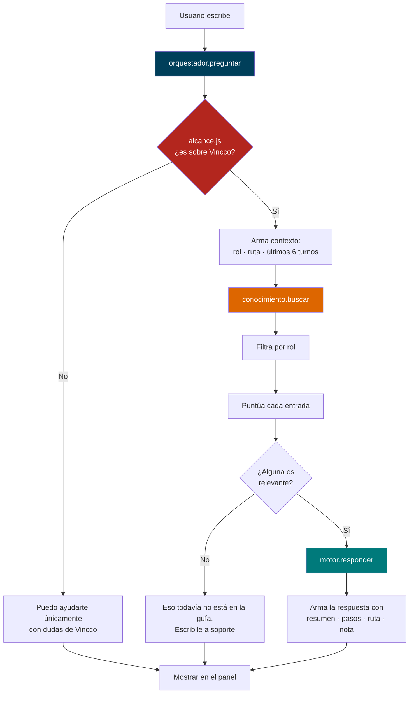

# Estructura del Proyecto Vincco Digital

> **Última actualización**: Fase 10 — Verificación KYC completa, módulo Proveedores↔Negocios bidireccional, consultas/cotizaciones de promociones, catálogo público por negocio, Socio Vincco y módulo Premios (construido, aún sin enrutar)
> Vincco Digital es una aplicación web móvil (React) que conecta **clientes**, **negocios** y **proveedores** mediante un sistema de puntos, recompensas, directorio comercial y paneles de administración.

> ⚠️ **Nota sobre el repositorio**: al momento de este documento hay una carpeta llena de cambios sin commitear y varias carpetas de respaldo en la raíz (`_originales-imagenes/`, `_respaldo-antes-flujo-compra/`, `_respaldo-antes-perfil/`, `_sin-usar/`, `_to_delete/`) que el propio autor dejó fuera de `src/`/`public/` a propósito, como backups manuales. **No son parte de la app** y no se documentan acá; se pueden borrar cuando se confirme que ya no hacen falta. Tampoco se documentan `src/pages/PerfilProveedor copy.jsx` y `PerfilProveedor copy 2.jsx` (copias viejas de respaldo dentro de `src/`).

---

## 1. Arbol de Carpetas

```
vincco-digital/
│
├── public/                              # Archivos estaticos que sirve el navegador directamente
│   ├── assets/
│   │   ├── images/
│   │   │   └── kiara.png                 # Avatar de la asistente Kiara
│   │   ├── icons/
│   │   │   └── socio-vincco.png          # Icono del item "Socio de Vincco" (Sidebar, solo cliente)
│   │   └── logos/
│   │       ├── vincco-logo.png           # Logo principal (sidebar, perfil, paneles)
│   │       └── vincco-logo-nav.png       # Logo de la barra del landing
│   ├── images/
│   │   ├── register-bg.jpg              # Fondo del registro
│   │   ├── register-negocio.jpg         # Paso visual para negocio
│   │   └── register-provedores.jpg      # Paso visual para proveedor
│   ├── .nojekyll                        # Evita que GitHub Pages procese el build con Jekyll
│   ├── favicon.ico                       # Icono de pestania
│   ├── guiausuario.md                    # Copia publicada de la guía (GENERADA por npm run guia)
│   ├── index.html                        # HTML base donde se monta React
│   ├── logo192.png                       # PWA icon 192x192
│   ├── logo512.png                       # PWA icon 512x512
│   ├── manifest.json                     # Configuracion PWA
│   └── robots.txt                        # Reglas para crawlers
│
├── src/                                  # Codigo fuente completo
│   ├── App.js                            # Punto de entrada: accesibilidad/lang y carga AppRouter
│   ├── App.css                           # Estilos globales + BottomNav + accesibilidad + hoja de promo (~4143)
│   ├── index.js                          # Arranca React en el navegador
│   ├── index.css                         # Directivas Tailwind + variables CSS (estilo shadcn)
│   ├── App.test.js                       # Smoke test basico
│   ├── reportWebVitals.js                # Medicion de rendimiento
│   ├── setupTests.js                     # Configuracion de tests
│   │
│   ├── components/                       # Componentes reutilizables
│   │   ├── AppRouter.jsx                 # Rutas con HashRouter, lazy loading, Shell + Suspense
│   │   ├── BottomNav.jsx                 # Barra inferior fija; tabs distintos por rol
│   │   ├── BotonVolver.jsx               # Boton "volver" unico y reutilizable (navigate(-1) o destino fijo)
│   │   ├── Navbar.jsx                    # Barra superior del nuevo landing (glassmorphism)
│   │   ├── Sidebar.jsx                   # Menu hamburger; items por rol; logo real en header
│   │   ├── HeroBanner.jsx                # Banner principal de Home (incluye Sidebar + DotGrid)
│   │   ├── HeroBannerRedes.jsx           # Hero de la pagina de Redes Sociales
│   │   ├── CarouselAnuncios.jsx          # Carrusel automatico de anuncios
│   │   ├── NegociosCarousel.jsx          # Carrusel chips + tarjeta (negocios asociados, cotizar)
│   │   ├── DotGridBackground.jsx         # Canvas animado de puntos (extraido de HeroBanner)
│   │   ├── Monto.jsx                     # Montos cordobas con translate="no" (usa utils/moneda)
│   │   ├── icons/
│   │   │   ├── Icon.jsx                  # Libreria SVG custom (~80 iconos, estilo Lucide)
│   │   │   └── IconRed.jsx               # Iconos de 6 redes (WhatsApp, FB, IG, TikTok, YT, Threads)
│   │   ├── panel/                        # Piezas internas de los paneles
│   │   │   ├── PublicacionesPanel.jsx    # CRUD de publicaciones POR SUCURSAL (localStorage)
│   │   │   ├── CotizacionesPanel.jsx     # Bandeja de cotizaciones RECIBIDAS (negocio)
│   │   │   ├── CotizacionesEnviadas.jsx  # Drawer de cotizaciones ENVIADAS (proveedor)
│   │   │   ├── FormularioCotizacion.jsx  # El proveedor cotiza a un negocio asociado
│   │   │   ├── PapeleriaPanel.jsx        # Papelera / reenviar codigo de verificacion
│   │   │   ├── ResenasPanel.jsx          # Reseñas y ranking (negocio)
│   │   │   ├── SucursalSelector.jsx      # Selector de sucursal activa (vive en el perfil)
│   │   │   ├── AvisoSucursal.jsx         # Banner: avisa que cada sucursal tiene inventario propio
│   │   │   └── SolicitarAsociacion.jsx   # Modal 3 pasos: solicitar asociarse a un negocio/proveedor
│   │   ├── promocion/                    # Detalle de una publicacion, compartido Home <-> pantalla propia
│   │   │   ├── DetallePromocion.jsx      # Vista completa: negocio, formulario de consulta/cotizar
│   │   │   └── HojaPromocion.jsx         # Bottom-sheet (portal + drag-to-close) que envuelve el detalle
│   │   ├── verificacion/                 # Solicitud, bloqueo y verificacion KYC de la cuenta
│   │   │   ├── AccionBloqueada.jsx       # Aviso generico de accion bloqueada
│   │   │   ├── ModalAccionBloqueada.jsx  # Modal: pide verificarse para publicar/cotizar
│   │   │   ├── FormularioRUC.jsx         # Captura de RUC al solicitar verificacion (flujo corto, legacy)
│   │   │   ├── VerificacionKYC.jsx       # Flujo KYC completo (multi-paso, se monta fuera de <Routes>)
│   │   │   ├── kyc/                      # Piezas del formulario KYC
│   │   │   │   ├── RoleSelector.jsx      # Elegir el rol a verificar
│   │   │   │   ├── FormStep.jsx          # Envoltorio de un paso del formulario
│   │   │   │   ├── ProgressBar.jsx       # Barra de progreso del flujo
│   │   │   │   ├── ValidationInput.jsx   # Input con validacion en linea
│   │   │   │   └── FileUploader.jsx      # Carga de documentos (comprime con utils/imagenes.js)
│   │   │   ├── kyc.css                   # Estilos del flujo KYC (~897)
│   │   │   └── verificacion.css          # Estilos de los avisos/bloqueos (prefijo .vf-*)
│   │   ├── config/
│   │   │   └── ConfigUI.jsx              # Piezas de /config (topbar, grupos, permisos vitrina)
│   │   ├── perfil/
│   │   │   └── PerfilUI.jsx              # Piezas de /perfil (ficha, secciones, privacidad)
│   │   └── ui/                           # Shadcn/Radix + piezas visuales adicionales
│   │       ├── event-manager.tsx         # El calendario completo; Calendario.jsx lo envuelve
│   │       ├── button.tsx, input.tsx, textarea.tsx, label.tsx, select.tsx
│   │       ├── dropdown-menu.tsx, dialog.tsx, badge.tsx, card.tsx
│   │       ├── avatar.tsx                # Avatar/AvatarImage/AvatarFallback (usado en Notificaciones)
│   │       ├── tabs.tsx                  # Tabs/TabsList/TabsTrigger/TabsContent (Notificaciones)
│   │       ├── carousel-cards.tsx        # CarruselProductos/GrillaProductos (usa InventarioNegocio.tsx)
│   │       ├── autoscroll-slider.tsx     # Carrusel con auto-scroll (Embla), usa DondeGanas.tsx (premios/)
│   │       ├── autoscroll-slider-utils/
│   │       │   └── carousel.tsx          # Primitivas Embla base del autoscroll-slider
│   │       ├── card-5.tsx                # HighlightCard, tarjeta de metrica — sin usar fuera de su demo
│   │       ├── card-5-demo.tsx           # Demo de HighlightCard, no forma parte del flujo real
│   │       └── demo.tsx, travel-connect-signin-1.tsx  # Artefactos de template, no se usan
│   │
│   ├── pages/                            # Pantallas completas
│   │   ├── Home.jsx                      # Pantalla principal autenticada (feed, ~1068)
│   │   ├── Landing.jsx                   # Login con canvas animado (Framer Motion)
│   │   ├── Register.jsx                  # Registro multi-paso (cliente 8 / socios 10; modo sucursal; ~1435)
│   │   ├── Bienvenida.jsx                # Pantalla breve tras registrarse
│   │   ├── Directorio.jsx                # Directorio de negocios y proveedores
│   │   ├── Mispuntos.jsx                 # Panel de puntos acumulados (ruta activa /puntos)
│   │   ├── Dashboard.jsx                 # Estadisticas del negocio (hardcodeado)
│   │   ├── Favoritos.tsx                 # Negocios favoritos (solo cliente) — reemplazo TS del Favoritos.jsx viejo
│   │   ├── InventarioNegocio.tsx         # Catalogo publico de UN negocio, en modo lectura (/negocio/:id/inventario)
│   │   ├── Promocion.jsx                 # Pantalla completa de una publicacion (/promocion/:id)
│   │   ├── PanelNegocio.jsx              # Panel del negocio (tabs, soporta ?tab=)
│   │   ├── PanelSocio.jsx                # Panel compartido; secciones filtradas por rol
│   │   ├── NegociosAsociados.jsx         # Proveedor: CRUD por carrusel + cotizaciones enviadas
│   │   ├── Proveedores.tsx               # Directorio bidireccional: negocio ve proveedores y viceversa
│   │   ├── ProveedoresAsociados.jsx      # Negocio: lista de SUS proveedores asociados (solo rol negocio)
│   │   ├── Ayuda.jsx                     # Centro de ayuda: FAQ, articulos, contacto
│   │   ├── Redes.jsx                     # Conexion de redes sociales del negocio
│   │   ├── Perfil.jsx                    # Enrutador: una ruta /perfil, tres pantallas segun rol
│   │   ├── PerfilUsuario.jsx             # Perfil del cliente (ficha, actividad, insignias)
│   │   ├── PerfilNegocio.jsx             # Perfil del negocio + SucursalSelector
│   │   ├── PerfilProveedor.jsx           # Perfil del proveedor + SucursalSelector
│   │   ├── Config.jsx                    # Configuraciones: una ruta, tres roles
│   │   ├── Notificaciones.tsx            # Centro de notificaciones con pestañas + modal de cotizar (reemplaza al .jsx viejo)
│   │   ├── Calendario.jsx                # Envoltorio (delega en ui/event-manager.tsx)
│   │   ├── SocioVincco.jsx               # Conversion cliente -> negocio/proveedor (/socio-vincco, solo cliente)
│   │   ├── SocioVincco.css               # Estilos de SocioVincco (prefijo .sv-*, ~665)
│   │   ├── *.css                         # Estilos por pantalla (Panel, Perfil, Register, Config,
│   │   │                                 #  Ayuda, Redes, NegociosAsociados, etc.)
│   │   ├── Premios.tsx                   # Contenedor del modulo de puntos/recompensas — CONSTRUIDO, SIN RUTA
│   │   ├── premios/                      # Piezas de Premios.tsx (aun no enlazado en AppRouter/nav)
│   │   │   ├── MisPremios.jsx            # (en .tsx) Cabecera: saldo, nivel, mostrar/ocultar saldo
│   │   │   ├── SubirNivel.tsx            # Anuncios/ofertas para subir de nivel
│   │   │   ├── CanjeaPuntos.tsx          # Grilla de recompensas canjeables
│   │   │   ├── DondeGanas.tsx            # Red de negocios afiliados (usa ui/autoscroll-slider.tsx)
│   │   │   └── ActividadReciente.tsx     # Lista de movimientos recientes de puntos
│   │   └── proveedores/                  # Submodulo de Proveedores.jsx / ProveedoresAsociados.jsx
│   │       ├── Header.tsx                # Cabecera: logo, volver, tabs de seccion
│   │       ├── Catalogo.tsx              # Grilla/lista filtrable (busqueda, categoria, tipo, ubicacion)
│   │       ├── TarjetaProveedor.tsx      # Tarjeta individual (grid/lista), avatar, disponibilidad
│   │       ├── ModalProveedor.tsx        # Detalle/perfil + formulario de contacto
│   │       ├── Solicitudes.tsx           # Bandeja de solicitudes de asociacion (enviadas/recibidas/historico)
│   │       ├── TrustRing.tsx             # Anillo SVG de "score de confianza"
│   │       ├── Toasts.tsx                # Sistema de notificaciones toast propio del modulo (contexto React)
│   │       └── data.ts                   # Mock de datos + tipos; persiste en localStorage propio (ver seccion 9)
│   │
│   ├── sections/                         # Secciones del Landing Page (marketing)
│   │   ├── HeroSection.jsx  BenefitsSection.jsx  HowItWorks.jsx  StatsSection.jsx
│   │   ├── DashboardPreview.jsx  TestimonialsSection.jsx  CTASection.jsx  FooterSection.jsx
│   │
│   ├── store/
│   │   └── puntos_usestore.js            # Estado global Zustand (~1375): perfiles, sucursales, KYC,
│   │                                     #  consultas de promocion, solicitudes de cotizacion, chat...
│   │
│   ├── data/                             # Datos de prueba + piso de persistencia
│   │   ├── data_falso.js                 # Perfiles, cotizaciones, asociados, ranking, etc.
│   │   ├── config_opciones.js            # Definicion declarativa de los ajustes de /config
│   │   ├── publicationTypes.js           # Tipos de publicacion (con storageKey)
│   │   ├── inventario.js                 # Helpers de inventario POR SUCURSAL (claveInventario)
│   │   ├── papelera.js                   # Papelera de publicaciones (localStorage)
│   │   ├── categoriasInventario.js       # Categorias de inventario (localStorage)
│   │   ├── catalogoNegocios.js           # Deriva el catalogo PUBLICO de un negocio desde su inventario real
│   │   ├── departamentos_ciudades.ts     # 15 departamentos + 2 regiones autonomas de Nicaragua (municipios)
│   │   ├── premios.ts                    # Tipos + mocks del modulo Premios (niveles, recompensas, afiliados)
│   │   └── kyc_options.js                # Opciones/catalogos del formulario de verificacion KYC
│   │
│   ├── Chatbot/                          # MODULO AISLADO del asistente Kiara (seccion 10)
│   │   ├── guiausuario.md                # LA FUENTE DE VERDAD: se escribe aca
│   │   ├── generar-guia.mjs              # Compila la guia a JS + copia publica
│   │   ├── conocimiento/
│   │   │   ├── guia_generada.js          # GENERADO — no editar a mano
│   │   │   ├── parsearGuia.mjs           # Markdown -> estructura (Node y navegador)
│   │   │   ├── index.js                  # buscar() — puerta al conocimiento (RAG futuro)
│   │   │   └── cargarGuia.js             # Incorporada + en vivo
│   │   ├── motores/
│   │   │   ├── tipos.js                  # CONTRATO que todo motor cumple
│   │   │   └── motorLocal.js             # Motor actual, sin IA
│   │   ├── orquestador/
│   │   │   ├── orquestador.js            # preguntar() — la unica entrada
│   │   │   ├── alcance.js                # ¿esto es de Vincco?
│   │   │   └── normalizar.js             # minusculas, tildes, palabras vacias
│   │   ├── ui/
│   │   │   ├── PanelChat.jsx  KiaraFlotante.jsx  Mensaje.jsx
│   │   │   └── Chat.css  KiaraFlotante.css
│   │   ├── pagina-guia/
│   │   │   ├── Guia.jsx                  # Pantalla /guia (el manual)
│   │   │   └── Guia.css
│   │   └── CLAUDE.md                     # Notas del modulo para agentes
│   │
│   ├── hooks/
│   │   └── useLikes.js                   # Likes de destacadas (localStorage)
│   │
│   ├── lib/
│   │   └── utils.ts                      # cn() merge de clases (shadcn)
│   │
│   ├── utils/                            # Helpers puros sin React
│   │   ├── moneda.js                     # cordobas: numero(), cordobas(), cordobasTexto(), TIPO_CAMBIO_USD
│   │   ├── filtroNotificaciones.js       # Config del usuario -> que notificacion se ve
│   │   ├── imagenes.js                   # comprimirImagen(): redimensiona/comprime a JPEG antes de guardar
│   │   └── promociones.js                # Traduce lo publicado (negocio/proveedor) a lo que ve el cliente
│   │
│   └── styles/
│       ├── home.css                      # Design System del landing (~1204, prefijo vc-*)
│       └── colores.js                    # Fuente unica de hex para JS (TOKENS, COLORES_HOME, COLORES_PUNTOS)
│
├── build/                                # Compilado de produccion (npm run build)
├── .gitignore
├── .claude/
│   └── settings.local.json
├── CLAUDE.md                             # Instrucciones del proyecto para agentes
├── ANALISIS-CHATBOT.md                   # Analisis del asistente
├── ESTRUCTURA.md                         # Este archivo
├── README.md
├── diseño-guia/
│   └── colores y botones.md              # Notas de diseno de la guia
├── Doctor                                # Archivo binario (artifact CRA)
├── cleanup.ps1                           # Script PowerShell para limpiar App.css
├── flujo de registro_1.sql              # Script SQL de referencia (definir backend)
├── package.json
├── package-lock.json
├── postcss.config.js
├── craco.config.js                       # CRACO: react-scripts + Tailwind
├── start.bat                             # Atajo: npm start
├── tailwind.config.js
└── tsconfig.json
```

### Nota sobre CSS: Sistema Dual (+ Tailwind puro en los modulos nuevos)

| Sistema | Archivo | Lineas | Estado |
|---|---|---|---|
| **Global** | `src/App.css` | ~4143 | Base, BottomNav, accesibilidad, `vincco--asistente-abierto`, y ahora tambien la hoja de detalle de promocion (`.vc-promo-*`) |
| **Design System** | `src/styles/home.css` | ~1204 | Landing page (prefijo `vc-*`) |
| **Por pagina** | `src/pages/*.css` | var | Estilos especificos con Tailwind |
| **KYC** | `src/components/verificacion/kyc.css` | ~897 | Flujo de verificacion (formulario multi-paso) |
| **JS** | `src/styles/colores.js` | ~101 | Hex desde JavaScript (Home, Mis Puntos) |

Prefijos de clases por pantalla: `.cfg-*` (Config), `.pf-*` (Perfil), `.ayu-*` (Ayuda), `.rds-*` (Redes), `.na-*` (Negocios Asociados, incl. `.na-cot-*` del drawer de cotizaciones), `.panel-*` (Panel.css, compartida por los dos paneles), `.rk-*` (Register), `.chat-*` (asistente), `.vf-*` (verificacion), `.sv-*` (Socio Vincco), `.vc-promo-*` (hoja/detalle de promocion, vive en `App.css`).

**Los modulos mas nuevos (`Proveedores.tsx`, `ProveedoresAsociados.jsx`, `InventarioNegocio.tsx`, `Premios.tsx` y todo `pages/premios/`, `pages/proveedores/`) no tienen `.css` propio**: estan escritos con clases utilitarias de Tailwind directo en el JSX/TSX, sin nombre de sistema propio. Es un cambio de convencion respecto al resto de la app — tenerlo en cuenta al tocarlos.

---

## 2. Design System — `src/styles/home.css`

El Design System es el corazon visual del proyecto rediseñado. Inspirado en Stripe, Linear y noCRM.

### Paleta de Colores

```css
:root {
  --navy-950: #001d2a;
  --navy-900: #002e43;
  --navy-800: #003f5a;
  --orange-500: #dd6600;
  --orange-600: #c05900;
  --gold-400: #feb862;
  --gold-500: #fea02f;
  --teal-500: #3f9c9c;
  --teal-600: #007a7b;
  --ink-900: #0b1b26;
  --surface: #ffffff;
  --surface-alt: #f4f8fb;
}
```

| Token | Valor | Uso |
|---|---|---|
| `--navy-900` | `#002e43` | Fondo principal oscuro |
| `--navy-800` | `#003f5a` | Fondo de barras y headers |
| `--orange-500` | `#dd6600` | Acento naranja (CTAs, badges) |
| `--gold-500` | `#fea02f` | Dorado (premium, recompensas) |
| `--teal-600` | `#007a7b` | Teal (exito, confirmacion) |
| `--ink-900` | `#0b1b26` | Texto principal |
| `--slate-600` | `#4d6273` | Texto secundario |

**Los mismos colores desde JavaScript** viven en `src/styles/colores.js` (`TOKENS`), con dos mapas derivados:
- `COLORES_HOME` — usado por `Home.jsx` (`orange: #c05900`)
- `COLORES_PUNTOS` — usado por `Mispuntos.jsx` (`orange: #dd6600`)

> ⚠️ Ojo: Home y Mis Puntos usan la misma palabra para colores distintos. Por eso se exportan dos mapas separados en vez de uno solo. No fusionarlos sin cambiar el aspecto de una pantalla.

### Arquitectura de home.css

```
home.css (~1204 lineas)
│
├── Custom Properties — Tokens de diseno (navy/orange/gold/teal palette)
├── vc-navbar — Barra de navegacion superior (glassmorphism + mobile menu)
├── vc-hero — Hero section del landing
├── Section Shared — Utilidades compartidas entre secciones
├── vc-benefits — Grid de beneficios
├── vc-how-it-works — Timeline/scrolling
├── vc-dashboard-preview — Mockup visual
├── vc-stats — Contadores animados
├── vc-testimonials — Carrusel de testimonios
├── vc-cta — Call to action
├── vc-footer — Footer completo
└── Animations — Keyframes y media queries responsive
```

### Convenciones de Clases CSS

| Convencion | Ejemplo | Uso |
|---|---|---|
| Prefijo `vc-` | `vc-hero`, `vc-navbar` | Identidad Vincco |
| Modificador BEM | `vc-navbar-btn--primary` | Variantes de boton |
| Estados | `--active`, `--open` | Estados de UI |
| Mobile menu | `vc-navbar-mobile-menu.open` | Menu responsivo |

### Reglas del Design System

- **Glassmorphism** en navbar: `backdrop-filter: blur(12px)`
- **Gradientes** y glows en hero section
- **Animaciones** con Framer Motion y keyframes CSS
- **Tipografia**: Inter + Sora (display)
- **Responsive**: 768px (tablet), 1024px (desktop)
- `!important` solo en overrides inline de componentes legacy

---

## 3. Conexiones y Dependencias entre Carpetas

### Flujo General de Datos

```
┌──────────────────────────────────────────────────────────────────┐
│                       FLUJO DE LA APLICACION                      │
│                                                                   │
│  index.js  ->  App.js  ->  AppRouter.jsx (HashRouter)            │
│                              |                                    │
│                  Define las rutas (URLs), el Shell con           │
│                  BottomNav y las cargas perezosas (lazy)         │
│                              |                                    │
│                   Carga la pagina correspondiente                 │
│                              |                                    │
│                  Las paginas leen y escriben el Store             │
│                  (Zustand) = estado global + persistencia        │
│                              |                                    │
│                  El Store persiste en localStorage               │
│                  (todavia no hay backend) — ver seccion 9        │
│                              |                                    │
│                  Los componentes reutilizables                    │
│                  (BottomNav, Sidebar, HeroBanner, panel/*,       │
│                   promocion/*, verificacion/*, verificacion/kyc/,│
│                   perfil/*) se insertan dentro de las paginas    │
│                              |                                    │
│                  Los estilos vienen de:                           │
│                  - App.css (global + hoja de promocion)          │
│                  - home.css (landing, prefijo vc-*)               │
│                  - pages/*.css (por pagina, salvo modulos nuevos)│
│                  - Tailwind directo (Proveedores, Premios,       │
│                    InventarioNegocio)                             │
│                  - styles/colores.js (colores inline en JS)       │
└──────────────────────────────────────────────────────────────────┘
```

### Diagrama de Dependencias por Carpeta

| Carpeta | De quien depende | Quien la usa |
|---|---|---|
| `src/index.js` | `App.js` | Nadie (punto de entrada) |
| `src/App.js` | `AppRouter`, `store/`, `App.css` | `index.js` |
| `src/App.css` | Ninguno (tokens en `:root`) | `App.js`, `promocion/*` |
| `src/styles/home.css` | Ninguno | Landing, `Navbar.jsx` |
| `src/styles/colores.js` | Ninguno | `Home.jsx`, `Mispuntos.jsx` |
| `src/utils/` | Ninguna (funciones puras) | Store, paneles, KYC, promociones |
| `src/components/` | `pages/`, `store/`, `App.css` | `AppRouter.jsx`, varias paginas |
| `src/sections/` | `home.css`, `components/icons/` | `Landing.jsx` |
| `src/pages/` | `components/`, `store/`, `data/`, `App.css`, `*.css` | `AppRouter.jsx` |
| `src/pages/premios/`, `src/pages/proveedores/` | `data/premios.ts`, `data/departamentos_ciudades.ts`, `components/ui/*` | `Premios.tsx` (sin ruta), `Proveedores.tsx`, `ProveedoresAsociados.jsx` |
| `src/store/` | `data/data_falso.js`, `utils/`, localStorage | Casi todas las paginas |
| `src/data/` | `utils/moneda.js`, localStorage | Paneles, Home, Perfil, Config, catalogo publico |
| `src/Chatbot/` | `data/` (guia), `store/` (chat), `utils/` | `AppRouter.jsx` (monta el panel) |
| `public/` | Ninguna | Referenciados por `/assets/...` |

### Flujo de Datos Especifico

```
Landing (/login) / Register  ->  Store (setLoggedIn, setUserType)  ->  Navega a Home
                                                                          |
Home.jsx  <-  HeroBanner (abre Sidebar)  <-  DotGridBackground (canvas)
   |            |                                  |
   |-- data/data_falso.js (categorias, promociones, recompensas, destacadas)
   |-- utils/promociones.js (normaliza publicaciones -> tarjetas)
   |-- store/puntos_usestore.js (usuario, puntos, rol, configuraciones)
   |-- hooks/useLikes.js (likes de destacadas, localStorage)
   |-- styles/colores.js (COLORES_HOME)
   |-- components/icons/Icon.jsx (iconos SVG)
   |-- click en una tarjeta -> components/promocion/HojaPromocion.jsx
             |                    -> components/promocion/DetallePromocion.jsx
             |                    -> store.enviarConsultaPromocion()
             |
BottomNav  <-  store/puntos_usestore.js (notificaciones para badge)
             |
Panel del negocio (PanelNegocio.jsx)
   |-- panel/PublicacionesPanel.jsx   (CRUD por sucursal)
   |-- panel/CotizacionesPanel.jsx    (cotizaciones recibidas)
   |-- panel/ResenasPanel.jsx         (reseñas y ranking)
   |-- panel/PapeleriaPanel.jsx       (papelera / reenviar codigo)
   |-- panel/AvisoSucursal.jsx        (banner al cambiar de sucursal)
   |-- data/inventario.js             (stock por sucursal)
Panel del socio (PanelSocio.jsx) — con secciones filtradas por rol
   |-- proveedor NO ve: Proveedores, Cotizaciones, Directorio
   |-- negocio ve todo
Perfil -> SucursalSelector  ->  cambiarSucursal() / agregarSucursal()
   |-- "Agregar sucursal" lleva a /register en modoSucursal (paso 5+)
   |-- pedir verificacion -> components/verificacion/VerificacionKYC.jsx (flujo multi-paso)
NegociosAsociados (proveedor) / ProveedoresAsociados (negocio)
   |-- NegociosCarousel  ->  FormularioCotizacion  ->  vn_cotizaciones_recibidas
   |-- CotizacionesEnviadas (drawer profesional de las enviadas)
   |-- panel/SolicitarAsociacion.jsx (modal 3 pasos: buscar -> perfil -> formulario)
Proveedores.jsx (directorio bidireccional)
   |-- pages/proveedores/Catalogo.jsx + Header + TarjetaProveedor + ModalProveedor
   |-- pages/proveedores/Solicitudes.jsx (localStorage propio, ver seccion 9)
   |-- data/departamentos_ciudades.ts (filtro geografico)
InventarioNegocio.jsx (cliente ve UN negocio, solo lectura)
   |-- data/catalogoNegocios.js (lee pn_inventario:<sucursalId> real, o cae a un ejemplo)
   |-- components/ui/carousel-cards.jsx
             |
Navega entre: /home, /favoritos, /puntos, /panel-negocio, /recompensas,
             /publicaciones, /calendario, /notificaciones, /negocios-asociados,
             /proveedores, /proveedores-asociados, /negocio/:id/inventario,
             /promocion/:id, /socio-vincco, /ayuda, /redes, /perfil, /config, /guia
```

---

## 4. Diagrama Mermaid

```mermaid
flowchart TD
    subgraph Entrada
        A[index.js] --> B[App.js]
        B --> C[AppRouter.jsx]
    end

    subgraph Navegacion
        C -->|"/login"| D[Landing.jsx]
        C -->|"/register"| E[Register.jsx]
        C -->|"/bienvenida"| BI[Bienvenida.jsx]
        C -->|"/home, /inicio, /"| F[Home.jsx]
        C -->|"/directorio"| G[Directorio.jsx]
        C -->|"/puntos"| H[Mispuntos.jsx]
        C -->|"/dashboard"| I[Dashboard.jsx]
        C -->|"/favoritos"| FAV[Favoritos.tsx]
        C -->|"/negocio/:id/inventario"| INVN[InventarioNegocio.tsx]
        C -->|"/promocion/:id"| PROMO[Promocion.jsx]
        C -->|"/panel-negocio"| J[PanelNegocio.jsx]
        C -->|"/recompensas, /publicaciones"| K[PanelSocio.jsx]
        C -->|"/negocios-asociados"| NA[NegociosAsociados.jsx]
        C -->|"/proveedores"| PROV[Proveedores.tsx]
        C -->|"/proveedores-asociados"| PROVA[ProveedoresAsociados.jsx]
        C -->|"/ayuda"| AYU[Ayuda.jsx]
        C -->|"/redes"| RDS[Redes.jsx]
        C -->|"/perfil"| PF[Perfil.jsx]
        C -->|"/config"| CF[Config.jsx]
        C -->|"/notificaciones"| L[Notificaciones.tsx]
        C -->|"/calendario"| M[Calendario.jsx]
        C -->|"/socio-vincco"| SV[SocioVincco.jsx]
        C -->|"/guia"| GUIA[Chatbot/pagina-guia/Guia.jsx]
        C -.->|"sin ruta todavia"| PREM[Premios.tsx]
    end

    subgraph Componentes
        F --> P[HeroBanner.jsx]
        F --> Q[CarouselAnuncios.jsx]
        F --> HP[promocion/HojaPromocion.jsx]
        HP --> DP[promocion/DetallePromocion.jsx]
        PROMO --> DP
        P --> R[Sidebar.jsx]
        P --> DG[DotGridBackground.jsx]
        NA --> NC[NegociosCarousel.jsx]
        NC --> FC[panel/FormularioCotizacion.jsx]
        NA --> CE[panel/CotizacionesEnviadas.jsx]
        NA --> SA[panel/SolicitarAsociacion.jsx]
        PROVA --> SA
        J --> PNP[panel/PublicacionesPanel.jsx]
        J --> COT[panel/CotizacionesPanel.jsx]
        J --> RSP[panel/ResenasPanel.jsx]
        J --> PPL[panel/PapeleriaPanel.jsx]
        J --> AVS[panel/AvisoSucursal.jsx]
        J --> INV[data/inventario.js]
        INVN --> CN[data/catalogoNegocios.js]
        INVN --> CC[ui/carousel-cards.tsx]
        PROV --> PCat[proveedores/Catalogo.tsx]
        PROV --> PSol[proveedores/Solicitudes.tsx]
        PF --> PE1[PerfilUsuario.jsx]
        PF --> PE2[PerfilNegocio.jsx]
        PF --> PE3[PerfilProveedor.jsx]
        PE2 --> SS[panel/SucursalSelector.jsx]
        PE3 --> SS
        PE1 --> VK[verificacion/VerificacionKYC.jsx]
        RDS --> HR[HeroBannerRedes.jsx]
        RDS --> DG
        D --> S[Navbar.jsx]
        D --> T[HeroSection.jsx]
        D --> U[BenefitsSection.jsx]
        D --> V[HowItWorks.jsx]
        D --> W[StatsSection.jsx]
        D --> X[DashboardPreview.jsx]
        D --> Y[TestimonialsSection.jsx]
        D --> Z[CTASection.jsx]
        D --> AA[FooterSection.jsx]
    end

    subgraph NavegacionInferior
        C --> AB[BottomNav.jsx]
        C --> BV[BotonVolver.jsx]
    end

    subgraph LibreriaIconos
        F --> AC[components/icons/Icon.jsx]
        E --> AC
        J --> AC
        K --> AC
        L --> AC
        M --> AC
        CF --> AC
        AYU --> AC
        RDS --> AC
        RDS --> ICR[components/icons/IconRed.jsx]
    end

    subgraph EstadoGlobal
        D --> AD[store/puntos_usestore.js]
        E --> AD
        F --> AD
        H --> AD
        J --> AD
        K --> AD
        L --> AD
        M --> AD
        NA --> AD
        PF --> AD
        CF --> AD
        RDS --> AD
        AB --> AD
        R --> AD
        DP --> AD
        VK --> AD
    end

    subgraph DatosMock
        F --> AE[data/data_falso.js]
        G --> AE
        J --> AE
        NA --> AE
        AYU --> AE
        RDS --> AE
        PF --> AE
        CF --> AF[data/config_opciones.js]
        J --> AG[data/publicationTypes.js]
        J --> INV2[data/inventario.js / papelera.js]
        PF --> CAM[data/data_falso.js camposPerfil]
        VK --> KYCO[data/kyc_options.js]
        PROV --> DEP[data/departamentos_ciudades.ts]
        PREM --> PREMD[data/premios.ts]
    end

    subgraph Utilidades
        AD --> U1[utils/filtroNotificaciones.js]
        L --> U1
        AD --> U2[utils/moneda.js]
        AE --> U2
        F --> LK[hooks/useLikes.js]
        VK --> IMG[utils/imagenes.js]
        F --> U3[utils/promociones.js]
        CN --> U3
    end

    subgraph DesignSystem
        D -.-> AS[styles/home.css]
        S -.-> AS
        F -.-> CO[styles/colores.js]
        H -.-> CO
        E -.-> AH[pages/Register.css]
        L -.-> AI[pages/Panel.css]
        M -.-> AJ[pages/Calendario.css]
        J -.-> AK[pages/Panel.css]
        K -.-> AK
        CF -.-> AL[pages/Config.css]
        PF -.-> AM[pages/Perfil.css]
        AYU -.-> AN[pages/Ayuda.css]
        RDS -.-> AO[pages/Redes.css]
        NA -.-> AQ[pages/NegociosAsociados.css]
        CE -.-> AQ
        SV -.-> SVC[pages/SocioVincco.css]
        VK -.-> KYCC[verificacion/kyc.css]
        HP -.-> AR[App.css: vc-promo-*]
        DP -.-> AR
        AB -.-> AR
        B -.-> AR
        PROV -.-> TW[Tailwind directo, sin .css propio]
        PROVA -.-> TW
        INVN -.-> TW
        PREM -.-> TW
    end

    subgraph AssetsEstaticos
        P --> AST[public/assets/]
        D --> ASI[public/images/]
        E --> ASI
        SV --> ASTI[public/assets/icons/socio-vincco.png]
    end

    style AD fill:#f59e0b,stroke:#d97706,color:#000
    style AE fill:#10b981,stroke:#059669,color:#fff
    style C fill:#2563EB,stroke:#1D4ED8,color:#fff
    style AS fill:#0D9488,stroke:#0F766E,color:#fff
    style AC fill:#8B5CF6,stroke:#7C3AED,color:#fff
    style PREM fill:#94a3b8,stroke:#64748b,color:#000
```



---

## 5. Descripcion Detallada por Carpeta

### `src/App.css` — Estilos Globales (~4143 lineas)

**Responsabilidad**: Hoja global de la app. Creció mucho en esta fase porque absorbió los estilos de la hoja de detalle de promocion.

**Secciones actuales**:
- Estilos base (`.page-shell`, `.route-fallback`, layout responsive)
- Bottom Navigation (`bottom-nav-*`)
- Carousel de Negocios Asociados (chips, tarjetas — prefijo `.ncar-*`)
- Detalle/hoja de promocion (`.vc-promo-*`): tarjeta del negocio, formulario de consulta, bottom-sheet
- Accesibilidad: `vincco--texto-grande`, `vincco--alto-contraste` (clases en `<body>` desde `App.js`)
- `vincco--asistente-abierto`: corre el contenido para dejar lugar al panel de Kiara en escritorio

### `src/styles/home.css` — Design System del Landing (~1204 lineas)

**Responsabilidad**: Design System del rediseño con paleta navy/orange/gold/teal. Clases `vc-*`.

**Secciones**: Custom Properties, Navbar, Hero, Section Shared, Benefits, How It Works, Dashboard Preview, Stats, Testimonials, CTA, Footer, Animations + responsive.

### `src/styles/colores.js` — Colores desde JavaScript (~101 lineas)

Fuente unica de los hex en estilos inline. Exporta `TOKENS`, `COLORES_HOME` y `COLORES_PUNTOS` (dos mapas porque Home y Puntos usan `orange` distinto).

### `src/pages/*.css` — Estilos por Pagina

| Archivo | Lineas | Pagina |
|---|---|---|
| `Panel.css` | ~4315 | `PanelNegocio.jsx`, `PanelSocio.jsx`, `PublicacionesPanel` y las piezas `panel/*` |
| `NegociosAsociados.css` | ~1804 | `NegociosAsociados.jsx` + drawer `CotizacionesEnviadas` (`.na-cot-*`) |
| `Perfil.css` | ~1492 | `Perfil.jsx`, `PerfilUsuario.jsx`, `PerfilNegocio.jsx`, `PerfilProveedor.jsx` |
| `Config.css` | ~1208 | `Config.jsx` |
| `Register.css` | ~987 | `Register.jsx` |
| `Ayuda.css` | ~717 | `Ayuda.jsx` |
| `SocioVincco.css` | ~665 | `SocioVincco.jsx` (prefijo `.sv-*`) |
| `Redes.css` | ~580 | `Redes.jsx` |
| `Calendario.css` | ~48 | `Calendario.jsx` (el grueso vive en `ui/event-manager.tsx`) |

> `Proveedores.tsx`, `ProveedoresAsociados.jsx`, `InventarioNegocio.tsx`, `Premios.tsx` y sus submódulos NO tienen `.css` propio — usan Tailwind directo. `Favoritos.tsx` y `Notificaciones.tsx` tampoco tienen `.css` propio nuevo: `Notificaciones.tsx` reutiliza clases de `NegociosAsociados.css` para su modal de cotizacion.

### `src/store/` — Estado Global (el "cerebro")

**Archivo**: `puntos_usestore.js` (~1375 lineas) — store con Zustand.

**Estado**:
- `usuario` (nombre, puntos, nivel) y `negocio` (nombre, categoria, telefono, direccion)
- `isLoggedIn`, `userType` (`usuario | negocio | proveedor`)
- `negociosAsociados[]`, `permisosVitrina[]`
- `configuraciones`: un bloque por rol en `localStorage` (`vincco:configuraciones`, ver seccion 9)
- `perfiles`: ficha editable por rol (usuario/negocio/proveedor), foto como dataURL
- `estadosVerificacion`: `sin_solicitar | pendiente | aprobada` por rol (`vincco:verificacion`)
- `kyc`: borrador del formulario de verificacion (`vincco:kyc`) — rol, paso, formulario; independiente de `estadosVerificacion`
- `sucursales` + `sucursalActiva`: por rol (`vincco:sucursales`, `vincco:sucursal-activa`)
- `notificaciones[]` y `eventosCalendario[]`
- `consultasPromocion[]`: consultas que un cliente manda sobre una publicacion del Home (`vincco:consultas-promocion`)
- `solicitudesCotizacion[]`: pedidos de precio que un negocio manda a un proveedor (`vincco:solicitudes-cotizacion`)
- `redesNegocio{}`, `codigoInvitacion`, `chat` (Kiara: abierto, mensajes, pensando — no persistido)

**Funciones**:
`agregarPuntos()` (frena si el usuario no está aprobado), `setLoggedIn()`, `setUserType()`, `setNegocio()`, `cambiarSucursal(rol, id)`, `agregarSucursal(rol, datos)`, `marcarNotificacionLeida()`, `marcarTodasLeidas()`, `eliminarNotificaciones(ids)`, `agregarNegocioAsociado()`, `editarNegocioAsociado()`, `guardarPerfil()`, `guardarFoto()` (dataURL), `quitarFoto()`, `solicitarVerificacion(rol, datos)`, `continuarSinVerificar(rol)`, `abrirKYC(rol)`, `cerrarKYC()`, `guardarPasoKYC(datos)`, `guardarRed()`, `quitarRed()`, `guardarConfig()`, `restablecerConfig()`, `responderPermisoVitrina()`, `enviarNotificacionCompra()`, `enviarConsultaPromocion({promocion, cantidad, mensaje})`, `responderConsultaPromocion(id, aceptar, respuesta)`, `enviarSolicitudCotizacion({publicacion, cantidad, unidad, mensaje})`, `marcarSolicitudCotizada(id, cotizacion)`, `rechazarSolicitudCotizacion(id)`, y las del chat: `alternarChat()`, `abrirChat()`, `cerrarChat()`, `agregarMensajeChat()`, `setChatPensando()`, `limpiarChat()`.

> **No están en el store**: el modulo `pages/proveedores/*` (favoritos y solicitudes de asociacion vistas desde `/proveedores`) guarda su propio estado en `localStorage` directo desde `pages/proveedores/data.ts` (`vincco:solicitudes`, `vincco:prov-favoritos`), fuera de Zustand. Y el modulo `Premios.tsx` lee `usuario.puntos` del store pero el resto de sus datos (niveles, recompensas, afiliados) son mocks estaticos de `data/premios.ts`, no estado persistido.

> Para el backend: todo lo que aquí se persiste con `escribir*()` (localStorage) pasará a ser una llamada a API. La pantalla no debería enterarse: el cambio se hace **dentro del store**.

### `src/data/` — Datos de Prueba + Piso de Persistencia

- `data_falso.js` — `usuario`, `negocios`, `proveedores`, `cotizacionesRecibidas`, `categorias`, `promociones`, `recompensas`, `niveles`, `consejosPuntos`, `pasos*`, `categoriasFavoritos`, `negociosFavoritos`, `promocionesLimitadas`, `categoriasNegocioAsociado`, `negociosAsociados`, `canalesSoporte`, `rolesAyuda`, `preguntasFrecuentes`, `articulosAyuda`, `redesVincco`, `tiposConsulta`, `destacadas`, `camposPerfil`, `RANKING_NEGOCIO`, `metricasPerfil`, `insigniasPerfil`, `actividadPerfil`, `horarioPerfil`, `favoritosPerfil`, `permisosVitrina`, `rankingNegocio`, `resenasPerfil`, `lineasProveedor`
- `config_opciones.js` — Ajustes de `/config` por rol (grupos y ajustes con `tipo`, `icono`, `depende`, `peligro`). Agregar un ajuste = agregarlo aquí, la pantalla se dibuja sola.
- `publicationTypes.js` — Tipos de publicacion (`promocion`, `producto`, `limitada`, `destacada`) con `storageKey`.
- `inventario.js` — `INVENTARIO_KEY` + `claveInventario(sucursalId)` (claves por sucursal: `pn_inventario:n1`), `agregarInventarioDesdePublicacion`, `eliminarInventarioDePublicacion`.
- `papelera.js` — Papelera de publicaciones eliminadas (`pn_papelera`).
- `categoriasInventario.js` — Categorias de inventario del negocio (`pn_categorias_inventario`).
- `catalogoNegocios.js` (~189) — `CATALOGO_EJEMPLO`, `getNegocioPublico(id)`, `getCatalogoNegocio(negocio)`: arma el catalogo PUBLICO de un negocio leyendo primero el inventario real guardado en `localStorage` por el panel, y si no existe cae a una vitrina de ejemplo.
- `departamentos_ciudades.ts` (~87) — `DepartamentoCiudad`, `DEPARTAMENTOS` (15 departamentos + 2 regiones autonomas de Nicaragua, ~153 municipios), `ciudadesDeDepartamento(nombre)`. Usado por los filtros geograficos del modulo Proveedores.
- `premios.ts` (~222) — Tipos y mocks del modulo Premios: `NIVELES`, `RECOMPENSAS`, `RECOMPENSAS_VISIBLES`, `ANUNCIOS_SUBIR_NIVEL`, `ACTIVIDAD_RECIENTE`, `NEGOCIOS_AFILIADOS`. Pensado como el "contrato" a reemplazar por API cuando el modulo se conecte.
- `kyc_options.js` (~478) — Catalogos/opciones que usa el formulario `verificacion/VerificacionKYC.jsx` (tipos de documento, listas desplegables del formulario, etc.).

### `src/utils/` — Helpers Puros

| Archivo | Funcion |
|---|---|
| `moneda.js` | `numero()`, `cordobas()` (C$), `cordobasTexto()` (palabra completa), `MONEDA`, `TIPO_CAMBIO_USD = 36.6` (solo para MOSTRAR en USD; todo se guarda en NIO). Helper `Monto/MontoTexto` en `components/Monto.jsx` envuelven esto con `translate="no"` |
| `filtroNotificaciones.js` | `notificacionPermitida()`, `filtrarPorConfig()` — reglas de visibilidad que el backend reusara para push |
| `imagenes.js` (~38) | `comprimirImagen(archivo, maxLado=900, calidad=0.72)`: redimensiona/comprime una imagen a JPEG vía `<canvas>` antes de guardarla en `localStorage`, para no reventar la cuota (~5MB). La usa `verificacion/kyc/FileUploader.jsx` |
| `promociones.js` (~481) | Capa de traduccion entre lo publicado por negocios/proveedores (`localStorage`: `pn_promociones`, `pn_productos`, `pn_destacadas`) y lo que ve el cliente: `leerPublicaciones`, normalizadores por tipo, `promocionesVisibles/productosVisibles/destacadasVisibles`, `buscarPublicacion`, y helpers de texto (`textoPuntos`, `textoPrecio`, `textoVigencia`, `linkWhatsApp`, `mensajeWhatsApp`) |

### `src/hooks/` — Hooks Personalizados

- `useLikes.js` — Likes de destacadas, persistidos en `pn_destacadas_likes`. Exponer `getLikes`, `isLikedByMe`, `toggleLike`.

### `src/components/icons/Icon.jsx` — Libreria SVG (~536 lineas)

Iconos SVG (estilo Lucide) en un solo objeto `PATHS`. El componente acepta `name`, `size`, `color`, `filled`, `className`, `style`.

### `src/components/icons/IconRed.jsx` — Iconos de Redes

Configuracion y SVG de 6 redes (`REDES`): WhatsApp, Facebook, Instagram, TikTok, YouTube y Threads, con `prefijo` de URL y color. Usado por `Redes.jsx` y `HeroBannerRedes.jsx`.

### `src/components/panel/` — Piezas de los Paneles (clave)

| Componente | Responsabilidad |
|---|---|
| **PublicacionesPanel.jsx** | CRUD de publicaciones POR SUCURSAL; clave `pn_<tipo>:<sucursalId>`; al publicar/eliminar sincroniza inventario |
| **CotizacionesPanel.jsx** | Bandeja "Mis Cotizaciones" del negocio: recibidas, estados (pendiente/aceptada/rechazada/vencida), aceptar/rechazar con motivo, `Monto` |
| **CotizacionesEnviadas.jsx** | Drawer del proveedor: cotizaciones que envio a negocios asociados, filtros por estado, detalle con productos/totales/WhatsApp |
| **FormularioCotizacion.jsx** | Formulario con el que el proveedor cotiza (productos, descuento, envio, condiciones). Guarda `negocio`/`negocioId` en la cotizacion |
| **PapeleriaPanel.jsx** | Papelera de publicaciones eliminadas + reenviar codigo de verificacion |
| **ResenasPanel.jsx** | Reseñas y ranking del negocio |
| **SucursalSelector.jsx** | Cambiar sucursal activa desde el perfil; "Agregar sucursal" navega a `/register` con `modoSucursal` en el state (arranca en el paso 5) |
| **AvisoSucursal.jsx** | Banner que avisa, al cambiar de sucursal en el panel, que cada sucursal tiene inventario/publicaciones independientes; se silencia por rol vía `localStorage` (`vincco:aviso-sucursal`) |
| **SolicitarAsociacion.jsx** | Modal de 3 pasos (buscar → ver perfil → formulario) para que un negocio o proveedor solicite asociarse a otro; generico vía prop `objetivo` (`'negocio'\|'proveedor'`) |

### `src/components/promocion/` — Detalle de una Publicacion

| Componente | Responsabilidad |
|---|---|
| **DetallePromocion.jsx** | Vista de detalle de una publicacion (promocion/producto/destacada), compartida entre la hoja del Home y la pantalla `/promocion/:id`; tarjeta del negocio, formulario de consulta/cotizacion y estado "enviado" |
| **HojaPromocion.jsx** | Bottom-sheet (portal sobre `document.body`, con drag-to-close) que envuelve `DetallePromocion`; se abre desde el Home sin perder el scroll del carrusel |

### `src/components/perfil/PerfilUI.jsx` — Piezas de Perfil

Ficha editable, secciones, insignias y privacidad de datos (`vincco:perfil:datos-ocultos`). Usada por los tres perfiles.

### `src/components/verificacion/` — Verificacion de Cuenta y KYC

| Componente | Responsabilidad |
|---|---|
| **AccionBloqueada.jsx** | Aviso generico cuando una accion exige verificacion |
| **ModalAccionBloqueada.jsx** | Modal que pide verificarse (usado en publicar, cotizar, agregar negocio) |
| **FormularioRUC.jsx** | Captura de RUC al solicitar verificacion (flujo corto, previo al KYC) |
| **VerificacionKYC.jsx** | Flujo de verificacion KYC completo (~337 lineas); se monta fuera de `<Routes>` en `AppRouter.jsx` (lazy con precarga en idle) y se abre/cierra vía `store.kyc` |
| **kyc/RoleSelector.jsx** | Elegir el rol que se va a verificar |
| **kyc/FormStep.jsx** | Envoltorio de un paso del formulario |
| **kyc/ProgressBar.jsx** | Barra de progreso del flujo |
| **kyc/ValidationInput.jsx** | Input con validacion en linea |
| **kyc/FileUploader.jsx** | Carga de documentos; comprime la imagen con `utils/imagenes.js` antes de guardarla |

`verificacion.css` (219 lineas, prefijo `.vf-*`) y `kyc.css` (~897 lineas) dan los estilos.

### `src/components/` — Componentes Reutilizables (navegacion)

| Componente | CSS | Relacion directa |
|---|---|---|
| **AppRouter.jsx** | `App.css` | HashRouter, lazy, Shell + `SHELL_ROUTES`, monta BottomNav, VerificacionKYC, PanelChat y KiaraFlotante |
| **BottomNav.jsx** | `App.css` | 5 tabs, distintos por rol (ver seccion 7) |
| **BotonVolver.jsx** | — | Boton "volver" unico; usa `history.state.idx` para elegir entre `navigate(-1)` y un `destino` fijo |
| **Sidebar.jsx** | `App.css` | Menu hamburger; header con logo real `vincco-logo.png` + chip de rol; items por rol (ver seccion 7) |
| **Navbar.jsx** | `home.css` | Nuevo landing, glassmorphism |
| **HeroBanner.jsx** | Inline + `App.css` | Banner de Home; incluye Sidebar y DotGridBackground |
| **HeroBannerRedes.jsx** | `Redes.css` | Hero de Redes con hilera infinita de logos |
| **CarouselAnuncios.jsx** | — | Carrusel automatico, recibe `slides` como prop |
| **NegociosCarousel.jsx** | `NegociosAsociados.css` | Chips + tarjeta grande; autoplay 4.5s; abre `FormularioCotizacion` |
| **DotGridBackground.jsx** | — | Canvas animado de puntos con interaccion de cursor |
| **Monto.jsx** | — | `Monto` y `MontoTexto` (`translate="no"`) |
| **Icon.jsx** | — | Iconos SVG |
| **IconRed.jsx** | — | 6 iconos de redes |

### `src/components/ui/` — Shadcn/Radix + Piezas Visuales Nuevas

`event-manager.tsx` es el calendario completo (categorias, tags, modo oscuro, CRUD de eventos en `vincco_calendario`). `button/input/textarea/label/select/dropdown-menu/dialog/badge/card` son primitivas Radix. `avatar.tsx` y `tabs.tsx` (nuevos) los usa `Notificaciones.tsx`. `carousel-cards.tsx` (nuevo) lo usa `InventarioNegocio.tsx`. `autoscroll-slider.tsx` + `autoscroll-slider-utils/carousel.tsx` (Embla, nuevos) los usa `pages/premios/DondeGanas.tsx`. `card-5.tsx`/`card-5-demo.tsx` y `demo.tsx`/`travel-connect-signin-1.tsx` son piezas de plantilla sin uso real en la app hoy.

### `src/sections/` — Secciones del Landing Page (8 componentes)

Sin cambios estructurales: `HeroSection.jsx`, `BenefitsSection.jsx`, `HowItWorks.jsx`, `StatsSection.jsx`, `DashboardPreview.jsx`, `TestimonialsSection.jsx`, `CTASection.jsx`, `FooterSection.jsx`.

### `src/pages/` — Pantallas Completas

#### `Home.jsx` (~1068 lineas) — Pantalla Principal
Feed completo: banner, busqueda, bienvenida, categorias, promociones, carrusel, recompensas, limitadas y destacadas con likes (`useLikes`). Las publicaciones de socios se leen POR SUCURSAL activa y se normalizan con `utils/promociones.js`. Al tocar una tarjeta abre `promocion/HojaPromocion.jsx`. Estilos: `COLORES_HOME` + `App.css`.

#### `Perfil.jsx` — Enrutador de Perfil
`PERFILES = { usuario: PerfilUsuario, negocio: PerfilNegocio, proveedor: PerfilProveedor }`.

#### `PerfilUsuario.jsx` / `PerfilNegocio.jsx` / `PerfilProveedor.jsx`
Ficha editable (`store.perfiles`), secciones por rol. Negocio y proveedor montan `SucursalSelector` en la esquina (`.pf-esquina`). El boton de verificar lleva al flujo `VerificacionKYC`. Estilos `Perfil.css`; usan `PerfilUI.jsx`, `guardarPerfil/guardarFoto/quitarFoto`.

#### `Register.jsx` (~1435 lineas) — Registro Multi-paso
8 pasos cliente / 10 pasos socio, con tarjetas animadas y validacion. **Modo sucursal** (`location.state.modoSucursal`): arranca en el paso 5, títulos "de la Sucursal", progreso "Paso X de 6", y al guardar llama `agregarSucursal` y vuelve a `/perfil`. `SocioVincco.jsx` tambien navega aca pasando el tipo de socio por `location.state`. Estilos `Register.css`.

#### `Bienvenida.jsx`
Pantalla breve tras el registro (`/bienvenida`), luego pasa a `/login` o `/`.

#### `SocioVincco.jsx` (~203 lineas, `.css` ~665) — Conversion a Negocio/Proveedor
Ruta `/socio-vincco`, solo visible para clientes (item de Sidebar). Todos se registran primero como cliente; esta pantalla ofrece dos tarjetas (Negocio/Proveedor) que llevan al `Register.jsx` real con el tipo de socio elegido.

#### `PanelNegocio.jsx` — Panel de Administracion del Negocio
Header con titulo + nombre de **sucursal activa** (subtitulo) y `AvisoSucursal`. Tabs: publicaciones, proveedores, inventario (por sucursal), resenas, cotizaciones, papeleria. Respeta `?tab=` de la URL. Estilos `Panel.css`.

#### `PanelSocio.jsx` — Panel Compartido (negocio y proveedor)
Una pantalla para ambos roles; `SECCIONES_BASE` se filtra por rol:
- **Proveedor ve**: publicaciones, reseñas y ranking, inventario, papeleria.
- **Negocio ve**: publicaciones, proveedores, cotizaciones, reseñas, directorio, inventario, papeleria.
El subtitulo del header muestra la sucursal activa. Estilos `Panel.css`.

#### `NegociosAsociados.jsx` — Negocios Asociados (proveedor)
Header con botones "+ Agregar negocio" (via `SolicitarAsociacion`) y "Cotizaciones enviadas" (abre el drawer `CotizacionesEnviadas`). Carrusel (`NegociosCarousel`) con busqueda, CRUD en modal, bloqueo por verificacion. Estilos `NegociosAsociados.css`.

#### `ProveedoresAsociados.jsx` (~97 lineas) — Proveedores del Negocio
Pantalla gemela de `NegociosAsociados` del lado del negocio: lista sus proveedores asociados (datos de `data_falso`), con acceso a "Buscar proveedores" hacia `/proveedores`. Solo accesible con `userType === 'negocio'` (redirige a `/home` si no).

#### `Proveedores.tsx` (~291 lineas) — Directorio Bidireccional
Ruta `/proveedores`: negocio ve proveedores, proveedor ve negocios (misma UI, cambia `MODOS`). Compone `proveedores/Header.tsx`, `proveedores/Catalogo.tsx`, `proveedores/Solicitudes.tsx`, `proveedores/ModalProveedor.tsx`; favoritos y solicitudes de asociacion se guardan en `localStorage` propio (`pages/proveedores/data.ts`), fuera del store Zustand. Filtro geografico con `data/departamentos_ciudades.ts`.

#### `InventarioNegocio.tsx` (~565 lineas) — Catalogo Publico de un Negocio
Ruta `/negocio/:id/inventario`: catalogo de UN negocio visto en modo lectura por el cliente (sin editar/borrar/stock interno). Usa `ui/carousel-cards.tsx` y `data/catalogoNegocios.js` (que lee el inventario real del panel si existe).

#### `Promocion.jsx` (~58 lineas) — Pantalla Completa de una Publicacion
Ruta `/promocion/:id`: busca la publicacion por id con `utils/promociones.js` y renderiza `promocion/DetallePromocion.jsx` en variante "pantalla" (equivalente a abrir la hoja del Home, pero como URL propia y compartible).

#### `Ayuda.jsx` — Centro de Ayuda
FAQ con buscador (ignora tildes), articulos por rol, canales de soporte, formulario de consulta.

#### `Redes.jsx` — Redes Sociales
El negocio conecta sus redes (`redesNegocio`); todos ven las de Vincco (`redesVincco`). Arma la URL final con `IconRed.REDES`.

#### `Config.jsx` — Configuraciones
Una ruta, tres roles. Dibuja `config_opciones.js` con buscador, grupos, restablecer, aviso de guardado y permisos de vitrina. Ajuste `moneda` (NIO/USD) por rol.

#### `Favoritos.tsx` (~428 lineas) — Favoritos
Reemplazo en TypeScript del viejo `Favoritos.jsx`: lista/carrusel de negocios favoritos con degradés de marca y boton "Ver inventario" que navega a `/negocio/:id/inventario`. Solo visible para cliente.

#### `Notificaciones.tsx` (~634 lineas) — Centro de Notificaciones
Reemplazo en TypeScript del viejo `Notificaciones.jsx`: ahora con pestañas (todas/no leidas/leidas), componentes shadcn (`Avatar`, `Badge`, `Tabs`, `Dialog`) y un modal de cotizacion integrado (reutiliza `FormularioCotizacion` y el CSS de `NegociosAsociados.css`). Filtro por config: `utils/filtroNotificaciones.js`.

#### `Calendario.jsx` — Calendario Inteligente
Envoltorio liviano: la UI real es `components/ui/event-manager.tsx`. Eventos en `vincco_calendario`, tema en `vincco_tema_calendario`.

#### `Landing.jsx` — Login Rediseñado
Canvas animado (Framer Motion), seleccion de rol. Navega a `/` al autenticar.

#### `Directorio.jsx` — Directorio Comercial
Busqueda y filtros por categoria. Usa `data_falso.js`.

#### `Mispuntos.jsx` — Panel de Puntos (ruta activa `/puntos`)
Hero con puntos, niveles, barra de progreso, recompensas, consejos. `COLORES_PUNTOS` + App.css. Es la pantalla que hoy resuelve el tab "Premios" del `BottomNav` del cliente.

#### `Dashboard.jsx` — Estadisticas
Stats grid, timeline, quick actions (datos hardcodeados).

#### `Premios.tsx` (~65 lineas) + `pages/premios/*` — Modulo Construido, Sin Enrutar
Pantalla contenedora que compone `MisPremios`, `SubirNivel`, `CanjeaPuntos`, `DondeGanas`, `ActividadReciente` (datos de `data/premios.ts`). **Existe en disco, compila, pero no está registrado en `AppRouter.jsx` ni enlazado desde `BottomNav`/`Sidebar`** — el tab "Premios" sigue apuntando a `Mispuntos.jsx`. Conviene decidir si se conecta como reemplazo de `/puntos` o se descarta antes de seguir invirtiendo ahí.

### `public/` — Recursos Estaticos

| Archivo | Usado por |
|---|---|
| `assets/logos/vincco-logo.png` | `Sidebar`, `HeroBanner`, `Landing`, `Register`, `Navbar` |
| `assets/logos/vincco-logo-nav.png` | `Navbar` |
| `assets/images/kiara.png` | Asistente Kiara (avatar) |
| `assets/icons/socio-vincco.png` | Item "Socio de Vincco" del `Sidebar` (solo cliente) |
| `images/register-bg.jpg`, `register-negocio.jpg`, `register-provedores.jpg` | `Register.jsx` |
| `guiausuario.md` | Copia publicada de la guia (GENERADA) |
| `.nojekyll` | Deploy en GitHub Pages |

> `public/hero.jpg` y `public/assets/images/home-fondohome.jpg` se borraron en esta fase; se confirmó que ningún componente de `src/` los sigue referenciando.

---

## 6. Tecnologias

| Tecnologia | Version | Proposito |
|---|---|---|
| React | ^19.2.6 | UI framework |
| react-router-dom | ^7.16.0 | Enrutamiento SPA (HashRouter) |
| zustand | ^5.0.14 | Estado global ligero |
| Tailwind CSS | ^3.4.19 | Framework CSS utility-first (y unico sistema de estilos de los modulos nuevos) |
| framer-motion | ^12.43.0 | Animaciones y transiciones |
| lucide-react | ^1.27.0 | Iconos en Landing.jsx |
| embla-carousel / embla-carousel-react / embla-carousel-auto-scroll | ^8.6.0 | Carrusel con auto-scroll (`ui/autoscroll-slider.tsx`, modulo Premios) |
| @craco/craco | ^7.1.0 | Build toolchain (react-scripts + config) |
| react-scripts | 5.0.1 | Build toolchain base (CRA) |
| @radix-ui/* | ^1.x | Primitivas de acceso (dialog, select, label, tabs, avatar...) |
| tailwind-merge | ^3.6.0 | Merge de clases (cn()) |
| autoprefixer / postcss | ^10.5.4 / ^8.5.25 | Prefijos y procesamiento CSS |
| tailwindcss-animate | ^1.0.7 | Plugin de animaciones Tailwind |
| TypeScript | ^4.9.5 | Tipado parcial (`.tsx`/`.ts` de `ui/`, `Favoritos`, `Notificaciones`, `InventarioNegocio`, `Premios`, `proveedores/*`, `premios/*`, `data/premios.ts`, `data/departamentos_ciudades.ts`) |

---

## 7. Si Necesito Modificar X, Donde Tengo que Ir?

### Agregar una Pantalla Nueva

1. **Crear el archivo** en `src/pages/NuevaPagina.jsx` (o `.tsx` si sigue la convencion de los modulos nuevos con Tailwind directo)
2. **Importarla** en `src/components/AppRouter.jsx` (con `lazy` si no es la pantalla de entrada; solo `Home` se importa directo)
3. **Agregar la ruta**: en `SHELL_ROUTES` si lleva barra inferior, o como `<Route>` suelto si no (login/bienvenida/register)
4. **Agregar estilos** en `src/pages/NuevaPagina.css` (prefijo corto propio) o usar Tailwind directo, segun el resto del modulo
5. *(Opcional)* Agregar un tab en `src/components/BottomNav.jsx` o un item en `src/components/Sidebar.jsx`

> Ejemplo pendiente real: `src/pages/Premios.tsx` está construido pero le falta el paso 2-3 (no está en `AppRouter.jsx`).

### Agregar un Icono Nuevo

1. Abrir `src/components/icons/Icon.jsx` y agregar el path al objeto `PATHS`
2. Usarlo como `<Icon name="mi-icono" size={24} />`
3. Si es de red social, agregarlo en `src/components/icons/IconRed.jsx` (con `prefijo` y `color`)

### Agregar un Ajuste Nuevo en Configuraciones

1. Abrir `src/data/config_opciones.js` y agregar el objeto al grupo/rol correspondiente (`tipo: switch | opciones | numero | enlace | accion | info`)
2. La pantalla `/config` lo dibuja solo
3. Colocar el valor por defecto en `CONFIG_INICIAL` de `src/store/puntos_usestore.js`

### Cambiar un Color Global

1. `src/styles/home.css` → `:root` (landing, sistema `vc-*`)
2. `src/styles/colores.js` → `TOKENS` (colores usados desde JS)
3. `src/App.css` → `:root` (lo global de la app)

### Cambiar la Logica de Negocio

| Logica | Donde modificar |
|---|---|
| Puntos del usuario | `store/puntos_usestore.js` → `agregarPuntos()` (requiere verificacion aprobada) |
| Tipos de usuario | `store/puntos_usestore.js` → `userType`, `setUserType()` |
| Datos del negocio | `store/puntos_usestore.js` → `negocio`, `setNegocio()` |
| Perfil del rol | `store/puntos_usestore.js` → `perfiles`, `guardarPerfil()`, `guardarFoto()`, `quitarFoto()` |
| Sucursales | `store/puntos_usestore.js` → `sucursales`, `sucursalActiva`, `cambiarSucursal()`, `agregarSucursal()` |
| Sucursal en el perfil | `components/panel/SucursalSelector.jsx` (vive montado en PerfilNegocio/PerfilProveedor) |
| Verificacion corta (RUC) | `store/puntos_usestore.js` → `estadosVerificacion`, `solicitarVerificacion()`, `continuarSinVerificar()`; UI en `components/verificacion/` |
| Verificacion KYC completa | `store/puntos_usestore.js` → `kyc`, `abrirKYC()`, `cerrarKYC()`, `guardarPasoKYC()`; UI en `components/verificacion/VerificacionKYC.jsx` + `verificacion/kyc/*`; catalogos en `data/kyc_options.js` |
| Configuraciones | `data/config_opciones.js` (definicion) + `store/puntos_usestore.js` (`configuraciones`, `guardarConfig()`, `restablecerConfig()`) |
| Moneda / montos | `utils/moneda.js` + `components/Monto.jsx` (TODO se guarda en NIO; USD solo se muestra) |
| Redes del negocio | `store/puntos_usestore.js` → `redesNegocio`, `guardarRed()`, `quitarRed()` |
| Notificaciones | `store/puntos_usestore.js` → `generarNotificaciones()` y acciones; `utils/filtroNotificaciones.js` → visibilidad; UI en `pages/Notificaciones.tsx` |
| Eventos del calendario | `components/ui/event-manager.tsx` (UI + datos `vincco_calendario`) |
| Negocios asociados | `store/puntos_usestore.js` (`negociosAsociados`, `agregarNegocioAsociado()`, `editarNegocioAsociado()`) + `pages/NegociosAsociados.jsx` |
| Solicitar asociacion (negocio<->proveedor) | `components/panel/SolicitarAsociacion.jsx` (modal generico) |
| Cotizaciones RECIBIDAS (negocio) | `components/panel/CotizacionesPanel.jsx` y `FormularioCotizacion.jsx` (misma clave de storage) |
| Cotizaciones ENVIADAS (proveedor) | `components/panel/CotizacionesEnviadas.jsx` + boton en `pages/NegociosAsociados.jsx` |
| Consultas sobre una promocion (cliente -> negocio) | `store/puntos_usestore.js` → `consultasPromocion`, `enviarConsultaPromocion()`, `responderConsultaPromocion()`; UI en `components/promocion/DetallePromocion.jsx` |
| Solicitudes de cotizacion (negocio -> proveedor) | `store/puntos_usestore.js` → `solicitudesCotizacion`, `enviarSolicitudCotizacion()`, `marcarSolicitudCotizada()`, `rechazarSolicitudCotizacion()` |
| Directorio de proveedores/negocios (`/proveedores`) | `pages/Proveedores.tsx` + `pages/proveedores/*` (favoritos/solicitudes en `localStorage` propio, ver seccion 9) |
| Catalogo publico de un negocio (`/negocio/:id/inventario`) | `data/catalogoNegocios.js` + `pages/InventarioNegocio.tsx` |
| Modulo Premios (aun sin ruta) | `data/premios.ts` + `pages/premios/*` + `pages/Premios.tsx`; para activarlo hay que sumarlo a `AppRouter.jsx` |
| Datos demo de cotizaciones | `data/data_falso.js` → `cotizacionesRecibidas` |
| Publicaciones | `components/panel/PublicacionesPanel.jsx` + `data/publicationTypes.js` (tipos) + `pages/Home.jsx` (tarjetas) + `utils/promociones.js` (normalizacion) |
| Inventario / stock | `data/inventario.js` (claves por sucursal) + seccion inventario de `PanelNegocio.jsx` |
| Papeleria / papelera | `components/panel/PapeleriaPanel.jsx` + `data/papelera.js` |
| Validacion de registro | `pages/Register.jsx` → funcion `validate()` |
| Conversion cliente -> socio | `pages/SocioVincco.jsx` (lleva a `Register.jsx` con el tipo elegido) |
| Secciones del panel por rol | `pages/PanelSocio.jsx` → `SECCIONES_BASE` / `SECCIONES_NEGOCIO` + filtro por rol |
| Asistente Kiara | Ver seccion 10: conocimiento en `Chatbot/guiausuario.md` (fuente de verdad) |
| Rutas / montaje global | `components/AppRouter.jsx` |

### Cambiar el Texto del Asistente (Kiara) o del Manual

1. Editar `src/Chatbot/guiausuario.md` (ES LA FUENTE — ver formato en seccion 10.2.1)
2. `npm run guia` (o `npm start` / `npm run build`, que lo hacen solos) para regenerar `guia_generada.js`
3. NUNCA editar `src/Chatbot/conocimiento/guia_generada.js` a mano: se pisa en la proxima compilacion

### Conectar el Backend (reglas generales)

1. **Todo lo que persiste hoy en `localStorage` tiene UN solo punto de escritura** (ver seccion 9). Reemplace esa función por un fetch y las pantallas no se tocan.
2. **El store (Zustand) es la frontera**: las paginas nunca leen localStorage directamente (excepto las piezas `panel/*`, `data/*` y `pages/proveedores/data.ts`, que tienen su propia funcion `leer/escribir`). Al conectar API, empiece por esas funciones privadas.
3. **Las fotos y documentos** se guardan como dataURL base64 (comprimidos con `utils/imagenes.js`); en backend seran URLs de archivo subido (el resto de la pantalla no cambia).
4. **Los montos SIEMPRE se guardan en cordobas (NIO)**: la conversion USD solo es de presentacion (`utils/moneda.js`).
5. **Las claves de localStorage ya nombran los futuros endpoints**; el mapa completo esta en la seccion 9.
6. **El modulo `pages/proveedores/*` guarda estado fuera del store** (`vincco:solicitudes`, `vincco:prov-favoritos`) — antes de conectar backend conviene decidir si se migra al store Zustand o se conecta directo, para no duplicar el patron de persistencia.

---
## 8. Tamano de Archivos (Lineas)

### Componentes y paginas JSX/JS/TSX

| Archivo | Lineas | Nota |
|---|---|---|
| **Register.jsx** | ~1435 | Pagina mas extensa (modo sucursal incluido) |
| **Home.jsx** | ~1068 | Pantalla principal |
| **Notificaciones.tsx** | ~634 | Con pestañas + modal de cotizar (reemplazo TS) |
| **InventarioNegocio.tsx** | ~565 | Catalogo publico de un negocio |
| **CotizacionesPanel.jsx** | ~599 | Bandeja de cotizaciones recibidas |
| **ConfigUI.jsx** | ~588 | Piezas UI de config |
| **PerfilUI.jsx** | ~590 | Piezas UI de perfil |
| **CotizacionesEnviadas.jsx** | ~477 | Drawer de cotizaciones enviadas |
| **Favoritos.tsx** | ~428 | Reemplazo TS del viejo `Favoritos.jsx` |
| **PublicacionesPanel.jsx** | ~426 | CRUD de publicaciones |
| **Mispuntos.jsx** | ~738 | Panel de puntos (ruta activa `/puntos`) |
| **VerificacionKYC.jsx** | ~337 | Flujo de verificacion completo |
| **DetallePromocion.jsx** | ~360 | Detalle compartido Home <-> `/promocion/:id` |
| **HeroBanner.jsx** | ~533 | Banner principal de Home |
| **Icon.jsx** | ~536 | Iconos SVG |
| **SolicitarAsociacion.jsx** | ~286 | Modal 3 pasos de asociacion |
| **Proveedores.tsx** | ~291 | Directorio bidireccional |
| **ModalProveedor.tsx** | ~388 | Detalle/perfil + contacto (proveedores/) |
| **data.ts (proveedores)** | ~605 | Mock + tipos del modulo proveedores |
| **Catalogo.tsx (proveedores)** | ~280 | Grilla/lista filtrable |
| **Solicitudes.tsx (proveedores)** | ~275 | Bandeja de solicitudes de asociacion |
| **TarjetaProveedor.tsx** | ~258 | Tarjeta de proveedor |
| **Ayuda.jsx** | ~396 | Centro de ayuda |
| **Config.jsx** | ~387 | Configuraciones |
| **Landing.jsx** | ~362 | Login rediseñado |
| **NegociosCarousel.jsx** | ~335 | Carrusel de negocios |
| **PanelSocio.jsx** | ~331 | Panel compartido (filtrado por rol) |
| **NegociosAsociados.jsx** | ~379 | Negocios asociados + drawer |
| **carousel-cards.tsx** | ~302 | CarruselProductos/GrillaProductos |
| **PanelNegocio.jsx** | ~701 | Panel del negocio |
| **puntos_usestore.js** | ~1375 | Store Zustand |
| **HeroBannerRedes.jsx** | ~276 | Hero de redes |
| **FormularioCotizacion.jsx** | ~274 | Cotizar a un negocio |
| **MisPremios.tsx** | ~232 | Cabecera de saldo/nivel (premios/) |
| **DotGridBackground.jsx** | ~251 | Canvas animado de puntos |
| **PapeleriaPanel.jsx** | ~211 | Papelera + reenviar codigo |
| **SocioVincco.jsx** | ~203 | Conversion cliente -> socio |
| **PerfilNegocio.jsx** | ~201 | Perfil de negocio |
| **PerfilProveedor.jsx** | ~171 | Perfil de proveedor |
| **Sidebar.jsx** | ~164 | Menu lateral |
| **PerfilUsuario.jsx** | ~160 | Perfil de usuario |
| **CarouselAnuncios.jsx** | ~130 | Carrusel de anuncios |
| **autoscroll-slider.tsx** | ~146 | Carrusel auto-scroll (Embla) |
| **autoscroll-slider-utils/carousel.tsx** | ~148 | Primitivas Embla base |
| **AppRouter.jsx** | ~182 | Router (Shell + SHELL_ROUTES, lazy) |
| **ProveedoresAsociados.jsx** | ~97 | Proveedores del negocio |
| **Calendario.jsx** | ~109 | Envoltorio (UI en ui/event-manager.tsx) |
| **card-5.tsx** | ~164 | HighlightCard (sin usar fuera de su demo) |
| **BottomNav.jsx** | ~100 | Navegacion inferior |
| **BotonVolver.jsx** | ~46 | Boton volver reutilizable |
| **IconRed.jsx** | ~94 | Iconos de redes |
| **Navbar.jsx** | ~105 | Barra superior (landing) |
| **ResenasPanel.jsx** | ~101 | Reseñas y ranking |
| **SucursalSelector.jsx** | ~94 | Selector de sucursal |
| **CanjeaPuntos.tsx** | ~150 | Grilla de recompensas (premios/) |
| **SubirNivel.tsx** | ~101 | Ofertas de nivel (premios/) |
| **AvisoSucursal.jsx** | ~67 | Banner de sucursal |
| **HojaPromocion.jsx** | ~99 | Bottom-sheet de promocion |
| **Header.tsx (proveedores)** | ~143 | Cabecera del modulo proveedores |
| **Toasts.tsx (proveedores)** | ~123 | Sistema de toast propio |
| **Premios.tsx** | ~65 | Contenedor sin ruta |
| **ActividadReciente.tsx** | ~71 | Movimientos de puntos (premios/) |
| **Promocion.jsx** | ~58 | Pantalla `/promocion/:id` |
| **TrustRing.tsx** | ~58 | Anillo de confianza (proveedores/) |
| **DondeGanas.tsx** | ~52 | Red de afiliados (premios/) |
| **Directorio.jsx** | ~75 | Directorio comercial |
| **Dashboard.jsx** | ~58 | Estadisticas |
| **Perfil.jsx** | ~24 | Enrutador de perfil |
| **Bienvenida.jsx** | ~29 | Post-registro |
| **ModalAccionBloqueada.jsx** | ~22 | Modal de bloqueo |
| **useLikes.js** | ~37 | Likes (localStorage) |
| **FileUploader.jsx (kyc)** | ~130 | Carga de documentos KYC |
| **ValidationInput.jsx (kyc)** | ~89 | Input con validacion |
| **RoleSelector.jsx (kyc)** | ~55 | Elegir rol a verificar |
| **ProgressBar.jsx (kyc)** | ~31 | Barra de progreso KYC |
| **FormStep.jsx (kyc)** | ~27 | Envoltorio de paso |
| | | |
| **HeroSection.jsx** | ~127 | Seccion hero del landing |
| **HowItWorks.jsx** | ~138 | Timeline con scroll |
| **TestimonialsSection.jsx** | ~137 | Carrusel de testimonios |
| **BenefitsSection.jsx** | ~106 | Grid de beneficios |
| **StatsSection.jsx** | ~101 | Contadores animados |
| **DashboardPreview.jsx** | ~94 | Mockup del dashboard |
| **FooterSection.jsx** / **CTASection.jsx** | ~80 / ~49 | Footer / CTA |

### Chatbot (Kiara)

| Archivo | Lineas | Nota |
|---|---|---|
| **parsearGuia.mjs** | ~328 | Parser Markdown -> estructura |
| **Guia.jsx** | ~207 | Pantalla /guia (manual) |
| **PanelChat.jsx** | ~238 | Panel del asistente |
| **KiaraFlotante.jsx** | ~169 | Burbuja flotante |
| **conocimiento/index.js** | ~147 | buscar() |
| **Mensaje.jsx** | ~125 | Burbuja de conversacion |
| **generar-guia.mjs** | ~152 | Compilador de la guia |
| **orquestador.js** | ~110 | preguntar() |
| **motorLocal.js** | ~107 | Motor actual |
| **alcance.js** | ~104 | Filtro de tema |
| **cargarGuia.js** | ~103 | Incorporada + en vivo |
| **normalizar.js** | ~42 | Normalizacion |

### CSS y datos

| Archivo | Lineas | Nota |
|---|---|---|
| **Panel.css** | ~4315 | Estilos de paneles (compartida) |
| **App.css** | ~4143 | Globales + BottomNav + accesibilidad + hoja de promocion |
| **NegociosAsociados.css** | ~1804 | Incluye `.na-cot-*` del drawer |
| **Perfil.css** | ~1492 | Estilos de perfiles |
| **Config.css** | ~1208 | Estilos de configuraciones |
| **home.css** | ~1204 | Design System landing (vc-*) |
| **Register.css** | ~987 | Estilos del registro |
| **kyc.css** | ~897 | Formulario de verificacion KYC |
| **Ayuda.css** | ~717 | Estilos del centro de ayuda |
| **SocioVincco.css** | ~665 | Estilos de Socio Vincco (`.sv-*`) |
| **Redes.css** | ~580 | Estilos de redes sociales |
| **Guia.css** | ~459 | Estilos del manual |
| **verificacion.css** | ~219 | Estilos de avisos/bloqueos |
| **Calendario.css** | ~48 | Envoltorio (UI en tsx) |
| | | |
| **kyc_options.js** | ~478 | Catalogos del formulario KYC |
| **promociones.js** | ~481 | Traduccion publicacion -> tarjeta cliente |
| **data_falso.js** | ~709 | Datos de prueba |
| **config_opciones.js** | ~625 | Definicion de ajustes |
| **premios.ts** | ~222 | Tipos + mocks de Premios |
| **catalogoNegocios.js** | ~189 | Catalogo publico por negocio |
| **inventario.js** | ~85 | Inventario por sucursal |
| **departamentos_ciudades.ts** | ~87 | Division politica de Nicaragua |
| **categoriasInventario.js** | ~41 | Categorias de inventario |
| **publicationTypes.js** | ~23 | Tipos de publicacion |
| **papelera.js** | ~27 | Papelera |
| **colores.js** | ~101 | Tokens hex desde JS |
| **index.css** | ~98 | Tailwind + variables shadcn |
| **imagenes.js** | ~38 | Comprimir imagenes antes de guardar |
| **moneda.js** | ~80 | Formato de cordobas |
| **filtroNotificaciones.js** | ~55 | Reglas de visibilidad |
| **Monto.jsx** | ~14 | Envoltorio translate="no" |

---

## 9. Mapa de Persistencia: localStorage → Futuro Backend

> **Lea esto antes de unir el backend.** Hoy la app no tiene servidor: todo lo que se escribe se guarda en `localStorage` del navegador. Cada fila indica dónde se escribe y qué endpoint va a reemplazarla. El truco: **casi todo se concentra en el store**, salvo el modulo `pages/proveedores/*`, que persiste por su cuenta (ver la última fila). Así, el frontend solo tiene que cambiar dentro de `puntos_usestore.js` y las funciones `leer/escribir*` de las piezas `panel/*`, `data/*` y `pages/proveedores/data.ts`.

| Clave (localStorage) | Que contiene | Quien la escribe | Futuro endpoint sugerido |
|---|---|---|---|
| `vincco:configuraciones` | Ajustes por rol (usuario/negocio/proveedor) | `store` → `guardarConfig()`, `restablecerConfig()` | `GET/PATCH /api/{rol}/configuracion` |
| `vincco:notificaciones` | Avisos generados por rol | `store` → marcar/eliminar/enviarNotificacionCompra | `GET /api/avisos` · `POST /api/avisos/{id}/leida` · `DELETE /api/avisos` |
| `vincco:sucursales` | Sucursales por rol (ej. Central, El Rama) | `store` → `agregarSucursal()` | `GET/POST /api/{rol}/sucursales` |
| `vincco:sucursal-activa` | Sucursal actual por rol (n1, p1...) | `store` → `cambiarSucursal()` | `PUT /api/{rol}/sucursal-activa` |
| `vincco:aviso-sucursal` | Si ya se mostró el banner de "sucursales independientes" por rol | `panel/AvisoSucursal.jsx` | Preferencia de sesion, no hace falta backend |
| `vincco:verificacion` | Estados `sin_solicitar/pendiente/aprobada` por rol | `store` → `solicitarVerificacion()`, `continuarSinVerificar()` | `POST /api/verificacion` (solicitar) · `GET /api/verificacion` |
| `vincco:kyc` | Borrador del formulario KYC (rol, paso, formulario) | `store` → `guardarPasoKYC()`, `abrirKYC()`/`cerrarKYC()` | `POST /api/verificacion/kyc` (enviar) · `GET /api/verificacion/kyc/borrador` |
| `vincco:perfil:datos-ocultos` | Privacidad del perfil (`0`/`1`) | `PerfilUI.jsx` | Campo de `PATCH /api/perfil/{rol}` |
| `vincco:consultas-promocion` | Consultas que un cliente manda sobre una publicacion | `store` → `enviarConsultaPromocion()`, `responderConsultaPromocion()` | `POST /api/consultas` · `PATCH /api/consultas/{id}` |
| `vincco:solicitudes-cotizacion` | Pedidos de precio de un negocio a un proveedor | `store` → `enviarSolicitudCotizacion()`, `marcarSolicitudCotizada()`, `rechazarSolicitudCotizacion()` | `POST /api/solicitudes-cotizacion` · `PATCH /api/solicitudes-cotizacion/{id}` |
| `pn_inventario:<sucursalId>` | Inventario de UNA sucursal (`claveInventario()`) | `data/inventario.js` + `PublicacionesPanel` (y leido por `data/catalogoNegocios.js` para el catalogo publico) | `GET/POST/PUT/DELETE /api/{rol}/sucursales/{id}/inventario` |
| `pn_promociones:<sucursalId>` | Publicaciones tipo promocion por sucursal | `PublicacionesPanel` + `Home`/`utils/promociones.js` (lectura) | `/api/{rol}/publicaciones?tipo=promocion` |
| `pn_productos:<sucursalId>` | Publicaciones tipo producto | ídem | `...?tipo=producto` |
| `pn_limitadas:<sucursalId>` | Publicaciones tipo limitada | ídem | `...?tipo=limitada` |
| `pn_destacadas:<sucursalId>` | Publicaciones tipo destacada | ídem | `...?tipo=destacada` |
| `pn_destacadas_likes` | Likes de destacadas | `hooks/useLikes.js` | `POST /api/publicaciones/{id}/like` |
| `pn_papelera` | Publicaciones eliminadas (papelera) | `data/papelera.js` + `PapeleriaPanel` | `GET/POST /api/{rol}/papelera` |
| `pn_categorias_inventario` | Categorias de inventario del negocio | `data/categoriasInventario.js` | `GET /api/{rol}/categorias-inventario` |
| `vn_cotizaciones_recibidas` | Cotizaciones (la MISMA lista para negocio y proveedor con `proveedor`/`negocio`/`negocioId`) | `FormularioCotizacion` (crea), `CotizacionesPanel` (estado), `CotizacionesEnviadas` (lee) | `POST /api/cotizaciones` · `GET /api/{rol}/cotizaciones` · `PATCH /api/cotizaciones/{id}/estado` |
| `vincco_calendario` | Eventos del calendario | `components/ui/event-manager.tsx` | `GET/POST/PUT/DELETE /api/calendario` |
| `vincco_tema_calendario` | Tema claro/oscuro del calendario | `Calendario.jsx` | Preferencia de sesion |
| `vincco:solicitudes` · `vincco:prov-favoritos` | Solicitudes de asociacion y favoritos del modulo `/proveedores` | `pages/proveedores/data.ts` (**fuera del store Zustand**, patron distinto al resto) | `GET/POST /api/{rol}/solicitudes-asociacion` · `GET/POST /api/{rol}/favoritos` |

**Reglas que no romper al conectar el backend:**
1. **Los montos viajan SIEMPRE en cordobas (NIO).** El backend no debe recibir ni devolver USD salvo que sea un campo aparte.
2. **`negociosAsociados` y `permisosVitrina` arrancan de `data_falso.js`** y hoy SOLO viven en memoria (se pierden al recargar). Con API pasan a `GET /api/proveedor/negocios-asociados` y `GET /api/negocio/permisos-vitrina`.
3. **La verificacion tiene dos capas hoy**: el flujo corto (`estadosVerificacion`: sin_solicitar/pendiente/aprobada) y el flujo KYC completo (`kyc`, con su propio borrador). El backend necesita un flujo que las apruebe (panel admin o revision manual) y decidir si conviven o se fusionan en uno solo.
4. **Las rutas "nombradas" existen en el codigo**: `useClaveSucursal('pn_promociones')` en `Home.jsx` lee las publicaciones de la sucursal activa; ese patron es el que reemplaza `GET /api/sucursal-activa/publicaciones`.
5. **Fotos y documentos = base64 comprimido** (`utils/imagenes.js`) hoy; con backend seran URLs (`guardarFoto` solo cambia el valor guardado).
6. **La hora/fecha de cotizaciones** se guarda ISO (`fecha`, `vence`); el calculo de "vencida" es del frontend (`esVencida` en CotizacionesPanel/CotizacionesEnviadas) y podra pasar al servidor.
7. **El modulo `pages/proveedores/*` no pasa por el store**: si se conecta backend antes de unificarlo con Zustand, hay que replicar el mismo cuidado (un solo punto de escritura) dentro de `data.ts`.
8. **`pages/Premios.tsx` y `data/premios.ts` son mocks desconectados de todo lo demas** (ni del store ni de `localStorage`): antes de darles API, hay que decidir si reemplazan a `Mispuntos.jsx` o si son features nuevas aparte.

---
## 10. Kiara — la asistente de IA de Vincco

> Esta sección explica **cómo está construido el asistente**, para que quien
> trabaje el backend sepa exactamente dónde se conecta y qué tiene que entregar.
> No hace falta leer las secciones anteriores para entender esta.

## 10.1 Qué es y qué NO es

El asistente **no es un chat de propósito general**. No responde cultura
general, no hace tareas y no conversa: explica cómo se usa Vincco.

| Sí hace | No hace |
|---|---|
| Explica cómo funcionan los puntos | Dice cuántos puntos tenés |
| Explica cómo cotizar | Consulta el estado de tu cotización |
| Dice qué hace cada pantalla | Ejecuta acciones por vos |
| Guía paso a paso | Responde nada ajeno a Vincco |

Si la pregunta se sale del tema, responde siempre lo mismo:
*"Puedo ayudarte únicamente con dudas relacionadas con la plataforma Vincco."*

**Hoy funciona 100% en el frontend, sin backend y sin llamar a ningún modelo
de IA.** Está construido para que enchufar un modelo real más adelante sea
cambiar una línea.

## 10.2 La idea central: la guía es la única fuente

Todo el conocimiento del asistente se escribe en **un solo documento**, en
Markdown:

```
src/Chatbot/guiausuario.md
```

Ese archivo NO se lee directamente. Al compilar, un script lo convierte:

```
              src/Chatbot/guiausuario.md
                 (esto es lo que se escribe)
                              │
                 npm run guia  (automático en
                 npm start y npm run build)
                              │
             ┌────────────────┴──────────────┐
             ▼                               ▼
 src/Chatbot/conocimiento/    public/guiausuario.md
 guia_generada.js             (copia publicada,
 (incorporada al bundle,       para leerla en vivo)
  funciona sin internet)              │
             │                        │
             ▼                        ▼
       Chatbot/pagina-guia/   Chatbot ◄─────────────┘
       Guia.jsx (el manual)  (el asistente — la
                             version en vivo gana
                             si el servidor responde)
```

**`src/Chatbot/conocimiento/guia_generada.js` es un archivo GENERADO.** Tiene un
encabezado que lo dice. Editarlo a mano no sirve: se pisa en la próxima
compilación. Lo que se edita es `src/Chatbot/guiausuario.md`.

Es a propósito. Si el manual y el asistente tuvieran contenidos separados, se
desincronizarían y el asistente terminaría enseñando pantallas que ya
cambiaron. Escribiendo una entrada nueva en la guía, **la pantalla la muestra
y el asistente la aprende en el mismo commit**.

**Regla que no se rompe:** si algo no está escrito en la guía, el asistente
responde que no lo sabe. Nunca inventa. Por eso hoy no puede alucinar: no
genera texto, solo presenta lo que ya está escrito.

> **Pendiente de revisión**: `guiausuario.md` ya menciona algunos de los
> modulos de esta fase, pero no se verificó entrada por entrada si cubre
> `/socio-vincco`, `/proveedores`, `/proveedores-asociados`,
> `/negocio/:id/inventario` y `/promocion/:id`. Como `Premios.tsx` todavía no
> tiene ruta, **no debería documentarse en la guía como disponible** hasta que
> se conecte en `AppRouter.jsx` — si ya hay una entrada sobre premios, revisar
> que no prometa una pantalla que hoy no existe por URL.

## 10.2.1 Cómo se escribe la guía

`guiausuario.md` se lee como un manual normal. Para que el asistente lo
entienda hace falta una convención liviana:

```markdown
## Puntos y recompensas
> Cómo se ganan, cómo se canjean y cómo subís de nivel
<!-- roles: usuario | icono: star -->

### ¿Cómo gano puntos?

Ganás puntos comprando en los negocios afiliados usando Vincco.

1. Comprá en cualquier negocio afiliado
2. Mostrá tu cuenta al momento de pagar

- Ir a: /puntos (Mis puntos)
- Buscar por: ganar puntos, acumular puntos, sumar puntos
- Nota: Cada negocio decide cuántos puntos da.
```

| Elemento | Qué hace |
|---|---|
| `##` | Abre una sección |
| `>` | Descripción de la sección |
| `<!-- roles: -->` | `usuario`, `negocio`, `proveedor` o `todos` |
| `<!-- icono: -->` | Ícono de la sección (de `Icon.jsx`) |
| `<!-- id: -->` | Fija el identificador en vez de derivarlo del título |
| `###` | Abre una pregunta |
| Primer párrafo | La respuesta corta que da el asistente |
| Lista `1. 2. 3.` | Los pasos |
| `- Ir a:` | Pantalla, con su nombre entre paréntesis |
| `- Buscar por:` | Sinónimos. **Es lo que más ayuda a encontrar la respuesta** |
| `- Nota:` | Aclaración o advertencia |
| `- Todavía no disponible` | La función está documentada pero aún no existe |

Todo lo que no siga esta forma —introducciones, párrafos sueltos, tablas— se
ignora sin romper nada. Por eso el documento se puede leer de corrido.

**Tolerancias del parser:** los pasos también se aceptan con guiones en vez de
números; `roles` acepta `cliente`/`clientes` como sinónimos de `usuario`; y una
entrada puede sobrescribir los roles de su sección poniendo su propio
`<!-- roles: -->`.

### Qué avisa al compilar

`npm run guia` no falla el build, pero avisa:

- entradas sin respuesta corta (el primer párrafo)
- entradas sin `Buscar por:` — se van a encontrar peor
- identificadores repetidos
- **rutas que no existen en `AppRouter.jsx`** — el error más caro, porque el
  asistente mandaría al usuario a una pantalla en blanco (por eso `/puntos`
  debe seguir siendo la ruta citada para "premios" hasta que `Premios.tsx`
  se conecte de verdad)

## 10.2.2 Los dos caminos de lectura

| | Incorporada | En vivo |
|---|---|---|
| De dónde sale | `src/Chatbot/conocimiento/guia_generada.js`, dentro del bundle | `public/guiausuario.md`, descargada |
| Cuándo se usa | Siempre disponible | Al abrir el chat, si el servidor responde |
| Sin internet | Funciona | No |
| Actualizar sin recompilar | No | Sí |

El asistente arranca con la incorporada y, al abrirse el panel, intenta bajar
la publicada. Si esa trae entradas, la reemplaza. Si falla —sin señal, archivo
borrado, formato roto, el servidor devolvió HTML en vez del archivo— sigue con
la incorporada y **el usuario ni se entera**. Nunca se queda mudo.

La descarga tiene 4 segundos de paciencia y se hace una sola vez por sesión.
Quien nunca abre el asistente no gasta esa descarga.

**Las dos leen con el MISMO parser** (`parsearGuia.mjs`). Si hubiera dos, el
asistente respondería distinto según de dónde leyó, y eso sería imposible de
depurar.

## 10.3 Arquitectura en cuatro capas

Cada capa **solo conoce a la de abajo**. Ninguna sabe cómo trabajan las otras.

```
┌─ 1. PRESENTACIÓN ─────────────────────────────────────────┐
│  React. Dibuja mensajes. No sabe de dónde salen.          │
│  PanelChat.jsx · KiaraFlotante.jsx · Mensaje.jsx          │
│  Chat.css · KiaraFlotante.css                             │
└────────────────────────┬──────────────────────────────────┘
                         │  preguntar(texto, contexto)
                         ▼
┌─ 2. ORQUESTADOR ──────────────────────────────────────────┐
│  Lógica pura, sin React. Decide si la pregunta es de      │
│  Vincco, arma el contexto y llama al motor activo.        │
│  orquestador.js · alcance.js · normalizar.js              │
└────────────┬────────────────────────────┬─────────────────┘
             │  buscar(texto, {rol})      │  responder(texto, ctx)
             ▼                            ▼
┌─ 3. CONOCIMIENTO ──────────┐  ┌─ 4. MOTOR ────────────────┐
│  Única puerta a la info.   │  │  Intercambiable.          │
│  Hoy: búsqueda por         │  │  Hoy: motorLocal          │
│  palabras clave sobre      │  │  Mañana: motorRemoto      │
│  guia_generada.js          │  │  (requiere backend)       │
│  Mañana: RAG vectorial     │  │                           │
└────────────────────────────┘  └───────────────────────────┘
```

## 10.4 Árbol de archivos del asistente

```
src/Chatbot/guiausuario.md                LA FUENTE DE VERDAD (se escribe acá)
src/Chatbot/generar-guia.mjs              La compila
public/guiausuario.md                     Copia publicada (generada)

src/Chatbot/
├── CLAUDE.md                             Notas del módulo para agentes
├── conocimiento/
│   ├── guia_generada.js                  GENERADO — no editar a mano
│   │                                     (SECCIONES[] + ENTRADAS[])
│   ├── parsearGuia.mjs                   Markdown -> estructura
│   │                                     (lo usan Node y el navegador)
│   ├── index.js                          buscar() — la puerta a RAG
│   └── cargarGuia.js                     incorporada + en vivo
├── orquestador/
│   ├── orquestador.js                    preguntar() — la única entrada
│   ├── alcance.js                        ¿esto es de Vincco?
│   └── normalizar.js                     minúsculas, tildes, palabras vacías
├── motores/
│   ├── tipos.js                          CONTRATO que todo motor cumple
│   └── motorLocal.js                     Motor actual, sin IA
├── pagina-guia/
│   ├── Guia.jsx                          Pantalla /guia (el manual)
│   └── Guia.css
└── ui/
    ├── PanelChat.jsx                     Panel lateral + pestaña
    ├── KiaraFlotante.jsx                 Burbuja flotante de apertura
    ├── Mensaje.jsx                       Burbuja de conversación
    └── Chat.css · KiaraFlotante.css      Estilos (prefijo chat-*)
```

**Por qué `Chatbot/` y no `components/`:** el chat no es un componente
suelto, es un subsistema con datos, lógica e interfaz propios. En una carpeta
aparte se puede borrar entero si se decide que no va.

## 10.5 Formato interno de una entrada

Esto es lo que produce el parser a partir del Markdown. **No se escribe a
mano**: se escribe el Markdown de 10.2.1 y el script genera esto.

```js
{
  id:        'ganar-puntos',           // único, minúsculas con guiones
  seccion:   'puntos',                 // id de una sección de SECCIONES
  roles:     ['usuario'],              // a quién le sirve
  titulo:    '¿Cómo gano puntos?',     // la pregunta como la haría el usuario
  resumen:   'Ganás puntos comprando…',// UNA frase: es lo que responde primero
  pasos:     ['...', '...'],           // opcional, en imperativo
  ruta:      '/puntos',                // opcional, debe existir en AppRouter
  rutaLabel: 'Mis puntos',             // cómo se llama esa pantalla
  claves:    ['ganar puntos', '...'],  // sinónimos, sin tilde y en minúscula
  nota:      '...',                    // opcional
  pendiente: false,                    // true = la función todavía no existe
}
```

- **`roles`** filtra el contenido: al cliente no se le muestra cómo editar
  inventario, porque no tiene inventario.
- **`claves`** es lo que más influye en que el asistente encuentre la entrada.
  Mientras más sinónimos reales, mejor.
- **`pendiente: true`** hace que el asistente diga claramente que la función
  todavía no está disponible, en vez de explicar pasos imposibles. Es el
  campo correcto para cualquier entrada que hable de `Premios.tsx` mientras
  esa pantalla siga sin ruta.

## 10.6 Cómo decide qué responder



### Cómo se puntúa

`conocimiento/index.js` compara la pregunta contra cada entrada:

| Coincidencia | Peso |
|---|---|
| Clave completa dentro de la pregunta | 6 |
| Una palabra de la pregunta está en `claves` | 3 |
| Está en el `titulo` | 2 |
| Está en el `resumen` | 1 |
| Está en el nombre de la `seccion` | 1 |

Además del puntaje se exige **cobertura**: la respuesta tiene que explicar al
menos la mitad de las palabras de la pregunta y haber tocado una palabra clave,
o bien explicarla entera.

Sin esa regla pasaba algo feo: un cliente preguntaba *"¿cómo edito mi
inventario?"* (que no tiene) y, como *"edito"* coincidía con *"¿Cómo edito mi
perfil?"*, el asistente contestaba del perfil. **Una respuesta que no es la
pregunta es peor que un "no lo sé".**

### Restricción de alcance en dos capas

1. **`alcance.js`** rechaza de entrada lo que claramente no es de Vincco
   (clima, chistes, tareas escolares, deportes, política…). Ni siquiera llega
   al motor.
2. **La base de conocimiento es cerrada.** Aunque algo pase el filtro, el
   motor no tiene de dónde sacar una respuesta sobre otro tema.

## 10.7 El contrato del motor — DONDE SE CONECTA EL BACKEND

Esta es la parte que le importa a quien trabaje el backend.

El orquestador **no llama al motor por su nombre**: lo llama por un contrato,
definido en `Chatbot/motores/tipos.js`.

```js
// Todo motor exporta esto y nada más:
export const nombre = 'local' | 'remoto'
export async function responder(pregunta, contexto) -> Respuesta
```

```js
contexto = {
  rol:        'usuario' | 'negocio' | 'proveedor',
  ruta:       '/panel-negocio',        // dónde está parado el usuario
  fragmentos: [{ entrada, puntaje }],  // lo que encontró la guía
  historial:  [...],                   // últimos 6 turnos
}

Respuesta = {
  texto:       string,     // respuesta principal, breve
  pasos:       string[],   // instrucciones, opcional
  ruta:        string,     // a qué pantalla llevar, opcional
  rutaLabel:   string,
  nota:        string,     // advertencia, opcional
  sugerencias: string[],   // qué más puede preguntar
  fuente:      string,     // id de la entrada de la guía que respondió
  seguro:      boolean,    // false = el motor no está confiado
}
```

**Para pasar del motor local al remoto se cambia UNA línea** en
`orquestador.js`:

```js
import motorLocal from '../motores/motorLocal'
const motor = motorLocal          // <-- solo esta línea cambia
```

Nada más en toda la aplicación se entera.

### Qué tiene que entregar el backend

Cuando exista el servidor, el `motorRemoto` va a llamar a **un endpoint** con
esta forma. Es lo único que hace falta acordar:

```
POST /api/asistente

Body:
{
  "pregunta": "¿cómo gano puntos?",
  "rol": "usuario",
  "fragmentos": [ { "titulo": "...", "resumen": "...", "pasos": [...] } ],
  "historial": [ { "autor": "usuario", "texto": "..." } ]
}

Respuesta:
{
  "texto": "...",
  "pasos": ["..."],
  "ruta": "/puntos",
  "rutaLabel": "Mis puntos",
  "fuente": "ganar-puntos"
}
```

**Requisitos del lado del servidor, no negociables:**

1. **La llave de la API vive en el backend.** Nunca en el frontend. Las
   variables `REACT_APP_*` de Create React App se compilan **dentro del
   bundle**: cualquiera las extrae abriendo las herramientas del navegador, y
   la facturación de esa llave robada la paga el dueño de la cuenta.
2. **Límite de uso por sesión.** Sin tope, un script puede generar miles de
   consultas y vaciar el saldo.
3. **El modelo solo puede usar los `fragmentos` recibidos.** Si la respuesta no
   se apoya en ellos, el backend debe devolver la respuesta de "no lo sé". Es
   la defensa contra que el asistente invente funciones que no existen.
4. **El motor local se queda como respaldo.** Si la API falla o el usuario está
   sin señal, el chat sigue respondiendo lo básico. Un asistente que a veces no
   funciona es peor que uno limitado que siempre responde.

## 10.8 Cómo se ve y dónde vive

El panel se monta **por encima del router**, en `AppRouter.jsx`, junto al
`BottomNav` y a `VerificacionKYC`. Aparece en todas las pantallas sin que
ninguna lo importe.

| Tamaño | Comportamiento |
|---|---|
| Escritorio ≥1280px | Columna fija a la derecha. El contenido de la app **se corre** para dejarle lugar, no lo tapa |
| Tablet y celular | Pestaña al costado que abre el panel encima, con capa oscura detrás |

El corrimiento en escritorio se hace con la clase `vincco--asistente-abierto`
en el `<body>`, para que la apliquen todas las pantallas a la vez sin que
ninguna tenga que saber del asistente.

**Se puede apagar del todo** desde Configuración → La app → *"Mostrar el
asistente"* (`mostrarAsistente` en el store, por rol). Si está apagado, el
componente no se descarga siquiera: entra con `lazy()`. La burbuja de apertura
es `KiaraFlotante.jsx`.

## 10.9 Escalar sin romper nada

**El conocimiento es dato, nunca código.** Agregar una respuesta es agregar un
objeto a `ENTRADAS[]`. Si hace falta tocar un `if`, el diseño falló.

**Una sola puerta a la información.** Todo pasa por `conocimiento.buscar()`.
Ese es el punto exacto donde se enchufa RAG el día que exista: la función
seguirá devolviendo `[{ entrada, puntaje }]` y ni el orquestador ni la interfaz
cambian.

**El motor detrás de un contrato.** Local, remoto o híbrido cumplen la misma
firma. Cambiar de motor es cambiar un import.

**El conocimiento se versiona junto al código.** Como vive en `src/`, un cambio
de pantalla y el cambio de su explicación entran en el mismo commit. Es la
única defensa real contra que el manual quede viejo.

**Registrar lo que no supo responder.** Es la métrica más valiosa: la lista de
preguntas sin respuesta es exactamente el orden en que hay que escribir la
documentación. Todavía no está implementado; el lugar natural es
`orquestador.js`, cuando `fragmentos` viene vacío.
