# Estructura del Proyecto Vincco Digital

> **Última actualización**: Fase 6 — Migración a Tailwind CSS + Nuevo Landing Page  
> Vincco Digital es una aplicación web móvil (React) que conecta **clientes**, **negocios** y **proveedores** mediante un sistema de puntos, recompensas, directorio comercial y paneles de administración.

---

## 1. Arbol de Carpetas

```
vincco-digital/
│
├── public/                              # Archivos estaticos que sirve el navegador directamente
│   ├── assets/
│   │   ├── images/
│   │   │   └── home-fondohome.jpg        # Imagen de fondo del HeroBanner
│   │   └── logos/
│   │       └── vincco-logo.png           # Logo principal de Vincco
│   ├── images/
│   │   ├── register-bg.jpg              # Fondo del registro
│   │   ├── register-negocio.jpg         # Paso visual para negocio
│   │   └── register-provedores.jpg      # Paso visual para proveedor
│   ├── favicon.ico                       # Icono de pestania
│   ├── hero.jpg                          # Imagen del hero (landing page)
│   ├── index.html                        # HTML base donde se monta React
│   ├── logo192.png                       # PWA icon 192x192
│   ├── logo512.png                       # PWA icon 512x512
│   ├── manifest.json                     # Configuracion PWA
│   └── robots.txt                        # Reglas para crawlers
│
├── src/                                  # Codigo fuente completo
│   ├── App.js                            # Punto de entrada de React, carga AppRouter
│   ├── App.css                           # Estilos base + BottomNav (~443 lineas)
│   ├── index.js                          # Arranca React en el navegador
│   ├── index.css                         # Reset y estilos globales base
│   ├── App.test.js                       # Smoke test basico
│   ├── reportWebVitals.js                # Medición de rendimiento
│   ├── setupTests.js                     # Configuracion de tests
│   │
│   ├── components/                       # Componentes reutilizables
│   │   ├── AppRouter.jsx                 # Define todas las rutas (URLs)
│   │   ├── BottomNav.jsx                 # Barra de navegación inferior fija (5 tabs)
│   │   ├── Navbar.jsx                    # Barra superior del nuevo landing (glassmorphism)
│   │   ├── Sidebar.jsx                   # Menu lateral deslizante (hamburger)
│   │   ├── HeroBanner.jsx                # Banner principal de Home (autenticado)
│   │   ├── CarouselAnuncios.jsx          # Carrusel automático de anuncios
│   │   ├── icons/
│   │   │   └── Icon.jsx                  # Libreria SVG custom (43 iconos, estilo Lucide)
│   │   └── ui/
│   │       ├── demo.tsx                  # Wrapper de demo para travel-connect-signin
│   │       └── travel-connect-signin-1.tsx  # Componente sign-in con Framer Motion
│   │
│   ├── pages/                            # Pantallas completas de la aplicación
│   │   ├── Home.jsx                      # Pantalla principal autenticada (feed completo)
│   │   ├── Landing.jsx                   # Login con canvas animado (Framer Motion)
│   │   ├── Register.jsx                  # Registro multi-paso (cliente/negocio/proveedor)
│   │   ├── Directorio.jsx                # Directorio de negocios y proveedores
│   │   ├── Mispuntos.jsx                 # Panel de puntos acumulados
│   │   ├── Dashboard.jsx                 # Estadisticas del negocio (hardcodeado)
│   │   ├── PanelNegocio.jsx              # Panel de admin para negocios (CRUD)
│   │   ├── PanelSocio.jsx                # Panel ampliado para socios
│   │   ├── Notificaciones.jsx            # Centro de notificaciones
│   │   ├── Calendario.jsx                # Calendario inteligente con eventos
│   │   ├── Calendario.css                # Estilos Tailwind del calendario
│   │   ├── Notificaciones.css            # Estilos Tailwind de notificaciones
│   │   ├── Panel.css                     # Estilos Tailwind unificados para paneles
│   │   └── Register.css                  # Estilos Tailwind del registro
│   │
│   ├── sections/                         # Secciones del nuevo Landing Page (marketing)
│   │   ├── HeroSection.jsx               # Hero full-screen con mockup animado
│   │   ├── BenefitsSection.jsx           # Grid de 6 beneficios
│   │   ├── HowItWorks.jsx                # Timeline con scroll progresivo
│   │   ├── StatsSection.jsx              # Contadores animados
│   │   ├── DashboardPreview.jsx          # Mockup visual del dashboard
│   │   ├── TestimonialsSection.jsx       # Carrusel automático de testimonios
│   │   ├── CTASection.jsx                # Call-to-action con botones de registro
│   │   └── FooterSection.jsx             # Footer completo con enlaces
│   │
│   ├── store/                            # Estado global (Zustand)
│   │   └── puntos_usestore.js            # Store: usuario, negocio, notificaciones, calendario, login
│   │
│   ├── data/                             # Datos de prueba (mock data)
│   │   ├── data_falso.js                 # Negocios, proveedores, categorías, promociones, recompensas
│   │   └── publicaciones_falso.js        # Publicaciones de ejemplo para el feed
│   │
│   ├── hooks/                            # Hooks personalizados (vacia, preparada)
│   │
│   └── styles/
│       └── home.css                      # Nuevo Design System Tailwind (~1114 lineas, prefijo vc-*)
│
├── build/                                # Version compilada para produccion (npm run build)
├── .gitignore                            # Reglas de git
├── .claude/
│   └── settings.local.json               # Config de Claude IDE
├── ESTRUCTURA.md                         # Este archivo
├── README.md                             # README por defecto de CRA
├── Doctor                                # Archivo binario (artifact CRA)
├── cleanup.ps1                           # Script PowerShell para limpiar App.css
├── flujo de registro_1.sql              # Script SQL de la base de datos
├── package.json                          # Dependencias y scripts
├── package-lock.json                     # Versiones bloqueadas
├── postcss.config.js                     # PostCSS: Tailwind + Autoprefixer
├── start.bat                             # Atajo: npm start
├── tailwind.config.js                    # Configuracion de Tailwind CSS v3
└── tsconfig.json                         # Configuracion de TypeScript
```

### Nota sobre CSS: Sistema Dual

El proyecto esta en **migración** de un CSS monolítico con variables (`App.css`) a un sistema basado en **Tailwind CSS** con archivos por pagina:

| Sistema | Archivo | Lineas | Estado |
|---|---|---|---|
| **Legacy** | `src/App.css` | ~443 | Solo estilos base + BottomNav |
| **Nuevo** | `src/styles/home.css` | ~1114 | Design System completo (prefijo `vc-*`) |
| **Por pagina** | `src/pages/*.css` | var | Estilos especificos con Tailwind |

Cada archivo CSS nuevo (`Calendario.css`, `Notificaciones.css`, `Panel.css`, `Register.css`) usa clases utilitarias de Tailwind ademas de clases con prefijo propio.

---

## 2. Design System — `src/styles/home.css`

El nuevo Design System es el corazón visual del proyecto rediseñado. Inspirado en Stripe, Linear y noCRM.

### Paleta de Colores

```css
:root {
  --navy-950: #001d2a;
  --navy-900: #002e43;
  --navy-800: #003f5a;
  --orange-500: #dd6600;
  --orange-600: #c05900;
  --gold-400: #feb862;
  --gold-500: #fea02f;
  --teal-500: #3f9c9c;
  --teal-600: #007a7b;
  --ink-900: #0b1b26;
  --surface: #ffffff;
  --surface-alt: #f4f8fb;
}
```

| Token | Valor | Uso |
|---|---|---|
| `--navy-900` | `#002e43` | Fondo principal oscuro |
| `--navy-800` | `#003f5a` | Fondo de barras y headers |
| `--orange-500` | `#dd6600` | Acento naranja (CTAs, badges) |
| `--gold-500` | `#fea02f` | Dorado (premium, recompensas) |
| `--teal-600` | `#007a7b` | Teal (exito, confirmacion) |
| `--ink-900` | `#0b1b26` | Texto principal |
| `--slate-600` | `#4d6273` | Texto secundario |

### Arquitectura de home.css

```
home.css (~1114 lineas)
│
├── :root — Tokens de diseño (navy/orange/gold/teal palette)
├── vc-hero — Hero section del landing
├── vc-navbar — Barra de navegación superior
├── vc-benefits — Grid de beneficios
├── vc-how-it-works — Timeline/scrolling
├── vc-stats — Contadores animados
├── vc-dashboard-preview — Mockup visual
├── vc-testimonials — Carrusel de testimonios
├── vc-cta — Call to action
├── vc-footer — Footer completo
└── vc-responsive — Media queries responsive
```

### Convenciones de Clases CSS (Nuevo Sistema)

| Convención | Ejemplo | Uso |
|---|---|---|
| Prefijo `vc-` | `vc-hero`, `vc-navbar` | Identidad Vincco |
| Modificador BEM | `vc-navbar-btn--primary` | Variantes de botón |
| Estados | `--active`, `--open` | Estados de UI |
| Mobile menu | `vc-navbar-mobile-menu.open` | Menu responsivo |

### Reglas del Nuevo Design System

- **Glassmorphism** en navbar: `backdrop-filter: blur(12px)`
- **Gradientes** y glows en hero section
- **Animaciones** con Framer Motion y keyframes CSS
- **Tipografia**: Inter + Sora (display)
- **Responsive**: 768px (tablet), 1024px (desktop)
- `!important` solo en overrides inline de componentes legacy

---

## 3. Conexiones y Dependencias entre Carpetas

### Flujo General de Datos

```
┌──────────────────────────────────────────────────────────────────┐
│                       FLUJO DE LA APLICACION                      │
│                                                                   │
│  Usuario abre la app                                             │
│       |                                                           │
│  index.js  ->  App.js  ->  AppRouter.jsx                         │
│                              |                                    │
│                    Define las rutas (URLs)                        │
│                              |                                    │
│                   Carga la pagina correspondiente                 │
│                              |                                    │
│                  Las paginas usan el Store (Zustand)              │
│                  para leer/escribir datos globales                │
│                              |                                    │
│                  Las paginas usan data/ para                      │
│                  mostrar informacion de prueba                    │
│                              |                                    │
│                  Los componentes reutilizables                    │
│                  (BottomNav, Navbar, Sidebar, etc.) se            │
│                  insertan dentro de las paginas                   │
│                              |                                    │
│                  Los estilos vienen de:                           │
│                  - App.css (base + BottomNav)                     │
│                  - home.css (landing page, prefijo vc-*)          │
│                  - pages/*.css (Tailwind por pagina)              │
└──────────────────────────────────────────────────────────────────┘
```

### Diagrama de Dependencias por Carpeta

| Carpeta | De quien depende | Quien la usa |
|---|---|---|
| `src/index.js` | `App.js` | Nadie (punto de entrada) |
| `src/App.js` | `AppRouter` | `index.js` |
| `src/App.css` | Ninguno (tokens en `:root`) | `App.js` (solo base + BottomNav) |
| `src/styles/home.css` | Ninguno | Landing pages, `Navbar.jsx` |
| `src/pages/*.css` | Tailwind + home.css | Su pagina respectiva |
| `src/components/` | `pages/`, `store/`, `App.css`, `home.css` | `AppRouter.jsx`, varias paginas |
| `src/sections/` | `home.css`, `components/icons/` | `Landing.jsx` (nuevo landing) |
| `src/pages/` | `components/`, `store/`, `data/`, `App.css`, `*.css` | `AppRouter.jsx` |
| `src/store/` | Ninguna (fuente de verdad) | Casi todas las paginas y componentes |
| `src/data/` | Ninguna (datos estaticos) | Home, Directorio, Paneles |
| `public/` | Ninguna | Referenciados por rutas `/assets/...` |

### Flujo de Datos Especifico

```
Landing (nuevo) / Login (legacy)  ->  Store (setLoggedIn, setUserType)  ->  Navega a Home
                                                                                |
Home.jsx  <-  HeroBanner (abre Sidebar)  <-  CarouselAnuncios (muestra slides)
   |            |                                    |
   |-- data/data_falso.js (categorias, promociones, recompensas, pasos)
   |-- store/puntos_usestore.js (usuario, puntos, tipo de usuario)
   |-- components/icons/Icon.jsx (iconos SVG)
             |
BottomNav  <-  store/puntos_usestore.js (notificaciones no leidas para badge)
             |
Navega entre: /home, /favoritos, /panel-negocio, /publicaciones, /calendario, /notificaciones
```

---

## 4. Diagrama Mermaid

```mermaid
flowchart TD
    subgraph Entrada
        A[index.js] --> B[App.js]
        B --> C[AppRouter.jsx]
    end

    subgraph Navegacion
        C -->|"/login"| D[Landing.jsx]
        C -->|"/register"| E[Register.jsx]
        C -->|"/home, /inicio, /"| F[Home.jsx]
        C -->|"/directorio"| G[Directorio.jsx]
        C -->|"/puntos"| H[Mispuntos.jsx]
        C -->|"/dashboard"| I[Dashboard.jsx]
        C -->|"/panel-negocio"| J[PanelNegocio.jsx]
        C -->|"/recompensas, /publicaciones"| K[PanelSocio.jsx]
        C -->|"/notificaciones"| L[Notificaciones.jsx]
        C -->|"/calendario"| M[Calendario.jsx]
        C -->|"/favoritos"| N[Placeholder]
        C -->|"/_demo-travel-signin"| O[DemoAiAssistatBasic]
    end

    subgraph Componentes
        F --> P[HeroBanner.jsx]
        F --> Q[CarouselAnuncios.jsx]
        P --> R[Sidebar.jsx]
        D --> S[Navbar.jsx]
        D --> T[HeroSection.jsx]
        D --> U[BenefitsSection.jsx]
        D --> V[HowItWorks.jsx]
        D --> W[StatsSection.jsx]
        D --> X[DashboardPreview.jsx]
        D --> Y[TestimonialsSection.jsx]
        D --> Z[CTASection.jsx]
        D --> AA[FooterSection.jsx]
    end

    subgraph NavegacionInferior
        C --> AB[BottomNav.jsx]
    end

    subgraph LibreriaIconos
        F --> AC[components/icons/Icon.jsx]
        E --> AC
        J --> AC
        K --> AC
        L --> AC
        M --> AC
    end

    subgraph EstadoGlobal
        D --> AD[store/puntos_usestore.js]
        E --> AD
        F --> AD
        H --> AD
        J --> AD
        K --> AD
        L --> AD
        M --> AD
        AB --> AD
        R --> AD
    end

    subgraph DatosMock
        F --> AE[data/data_falso.js]
        G --> AE
        J --> AE
        K --> AF[data/publicaciones_falso.js]
    end

    subgraph DesignSystem
        D -.-> AG[styles/home.css]
        S -.-> AG
        T -.-> AG
        U -.-> AG
        V -.-> AG
        W -.-> AG
        X -.-> AG
        Y -.-> AG
        Z -.-> AG
        AA -.-> AG
        E -.-> AH[pages/Register.css]
        L -.-> AI[pages/Notificaciones.css]
        M -.-> AJ[pages/Calendario.css]
        J -.-> AK[pages/Panel.css]
        K -.-> AK
        AB -.-> AL[App.css]
    end

    subgraph AssetsEstaticos
        P --> AM[public/assets/]
        D --> AN[public/images/]
        E --> AN
    end

    style AD fill:#f59e0b,stroke:#d97706,color:#000
    style AE fill:#10b981,stroke:#059669,color:#fff
    style AF fill:#10b981,stroke:#059669,color:#fff
    style C fill:#2563EB,stroke:#1D4ED8,color:#fff
    style AG fill:#0D9488,stroke:#0F766E,color:#fff
    style AC fill:#8B5CF6,stroke:#7C3AED,color:#fff
```



---

## 5. Descripcion Detallada por Carpeta

### `src/App.css` — Estilos Base (~443 lineas)

**Responsabilidad**: Contiene solo los estilos base globales y el componente BottomNav. Ya no es el Design System principal.

**Secciones actuales**:
- `:root` — Tokens de la nueva paleta (navy, orange, gold, teal)
- Reset y estilos base (box-sizing, body, tipografia)
- Clases utilitarias (`.btn`, `.btn-primary`, `.hero-card`, etc.)
- Estilos del BottomNav (`bottom-nav-*`)
- Media queries responsive (767px, 1024px)

**Nota**: Los estilos de las paginas antiguas (Sidebar, HeroBanner, Home, Calendario, Notificaciones, Paneles, Directorio, Mis Puntos, Dashboard, Landing, Register) **fueron removidos** de `App.css` y reemplazados por:
- `src/styles/home.css` — Nuevo Design System (prefijo `vc-*`)
- `src/pages/*.css` — Estilos por pagina con Tailwind

### `src/styles/home.css` — Nuevo Design System (~1114 lineas)

**Responsabilidad**: Design System completo del rediseño con paleta navy/orange/gold/teal. Usa clases con prefijo `vc-*`.

**Secciones**: Hero, Navbar, Benefits, HowItWorks, Stats, DashboardPreview, Testimonials, CTA, Footer + responsive.

### `src/pages/*.css` — Estilos por Pagina (Tailwind)

| Archivo | Lineas | Pagina |
|---|---|---|
| `Panel.css` | ~1418 | `PanelNegocio.jsx` y `PanelSocio.jsx` |
| `Register.css` | ~791 | `Register.jsx` |
| `Calendario.css` | ~419 | `Calendario.jsx` |
| `Notificaciones.css` | ~197 | `Notificaciones.jsx` |

### `src/store/` — Estado Global (el "cerebro")

**Archivo**: `puntos_usestore.js` (136 lineas)
- Store con Zustand
- Contiene: `usuario` (nombre, puntos, nivel), `negocio` (nombre, categoria, telefono, direccion), `isLoggedIn`, `userType`, `notificaciones[]` (29), `eventosCalendario[]` (29)
- Funciones: `agregarPuntos()`, `setLoggedIn()`, `setUserType()`, `setNegocio()`, `marcarNotificacionLeida()`, `marcarTodasLeidas()`

### `src/data/` — Datos de Prueba

- `data_falso.js` (56 lineas) — Exporta: `usuario`, `negocios[]`, `proveedores[]`, `categorias[]`, `promociones[]`, `recompensas[]`, `pasosComoFunciona[]`, `pasosNegocios[]`, `pasosProveedores[]`, `promocionesLimitadas[]`
- `publicaciones_falso.js` (40 lineas) — Exporta: `publicaciones[]` (3 publicaciones)

### `src/components/icons/Icon.jsx` — Libreria SVG (~371 lineas)

43 iconos SVG definidos manualmente (estilo Lucide): `home`, `search`, `shopping-bag`, `heart`, `star`, `bell`, `calendar`, `mail`, `package`, `truck`, `dollar-sign`, `gift`, `award`, `map-pin`, `clock`, `check-circle`, `file-text`, `edit-3`, `trash-2`, `plus`, `x`, `menu`, `arrow-left`, `arrow-right`, `chevron-down`, `chevron-left`, `chevron-right`, `chevron-up`, `user`, `users`, `settings`, `log-out`, `bar-chart-2`, `trending-up`, `party-popper`, `handshake`, `store`, `tool`, `inbox`, `phone`, `map-pin`, `tag`, `eye`, `eye-off`, `info`, `alert-triangle`, `refresh-cw`, `more-horizontal`

### `src/components/` — Componentes Reutilizables

| Componente | Lineas | CSS | Relacion directa |
|---|---|---|---|
| **AppRouter.jsx** | 95 | — | Define 13 rutas, conecta todas las paginas |
| **BottomNav.jsx** | 91 | `App.css` | Usa `store/` para badge de notificaciones |
| **Navbar.jsx** | 73 | `home.css` (`vc-navbar-*`) | Nuevo landing, glassmorphism, mobile menu |
| **Sidebar.jsx** | 173 | Inline + `App.css` | Menu lateral, usa `store/` para login/logout |
| **HeroBanner.jsx** | 178 | Inline + `App.css` | Banner principal de Home, incluye Sidebar |
| **CarouselAnuncios.jsx** | 77 | — | Carrusel automatico, recibe `slides` como prop |
| **Icon.jsx** | 371 | — | 43 iconos SVG, props: `name`, `size`, `color` |

### `src/sections/` — Secciones del Landing Page (8 componentes)

| Componente | Lineas | Descripción |
|---|---|---|
| **HeroSection.jsx** | 127 | Hero full-screen con cuadricula animada, glows y mockup |
| **BenefitsSection.jsx** | 101 | Grid de 6 tarjetas de beneficios con iconos |
| **HowItWorks.jsx** | 127 | Timeline con barra de progreso que avanza con scroll |
| **StatsSection.jsx** | 94 | 4 contadores animados (0 → N) con IntersectionObserver |
| **DashboardPreview.jsx** | 90 | Mockup visual del dashboard con tarjetas de datos |
| **TestimonialsSection.jsx** | 130 | Carrusel automatico de 6 testimonios con rotación |
| **CTASection.jsx** | 47 | Call-to-action con botones "Empieza gratis" |
| **FooterSection.jsx** | 74 | Footer con enlaces, copyright y redes sociales |

### `src/pages/` — Pantallas Completas

#### `Landing.jsx` (323 lineas) — Inicio de Sesion Rediseñado
- **Responsabilidad**: Login con canvas interactivo animado (Framer Motion), mapa de puntos SVG animados, selección de tipo de usuario
- **Novedad**: `DotMap` con rutas animadas que dibujan la red Vincco en canvas
- **Estilos**: `home.css` (clases `vc-*`)
- **Relacion**: Usa `store/` (setLoggedIn, setUserType), navega a `/` al autenticar

#### `Register.jsx` (1211 lineas) — Registro Multi-paso
- **Responsabilidad**: Flujo de registro con 8 pasos (cliente) o 10 pasos (negocio/proveedor)
- **Estilos**: `Register.css` (~791 lineas, Tailwind)
- **Relacion**: Usa `store/` (setUserType), `Icon.jsx`, navega a `/login`

#### `Home.jsx` (565 lineas) — Pantalla Principal
- **Responsabilidad**: Feed completo: banner, búsqueda, bienvenida, categorías, promociones, carrusel, recompensas, promociones limitadas
- **Estilos**: Inline con objeto `C` (constantes de color) + clases en `App.css`
- **Relacion**: Usa `HeroBanner`, `CarouselAnuncios`, `Icon.jsx`, `store/`, `data/data_falso`

#### `Directorio.jsx` (69 lineas) — Directorio Comercial
- Busqueda y filtros por categoría
- Usa `data/data_falso.js`

#### `Mispuntos.jsx` (74 lineas) — Panel de Puntos
- Hero card con puntos totales, barra de progreso, grid de recompensas
- Usa `store/`

#### `Dashboard.jsx` (53 lineas) — Estadisticas
- Stats grid, timeline, quick actions (datos hardcodeados)

#### `PanelNegocio.jsx` (719 lineas) — Panel de Administración
- CRUD de publicaciones, listado de proveedores, inventario con alertas de stock
- Estilos: `Panel.css`
- Usa `store/`, `data/data_falso.js`, `Icon.jsx`

#### `PanelSocio.jsx` (477 lineas) — Panel de Socio
- Publicaciones, inventario, cotizaciones, reseñas, directorio
- Estilos: `Panel.css`
- Usa `store/`, `data/publicaciones_falso.js`, `Icon.jsx`

#### `Notificaciones.jsx` (109 lineas) — Centro de Notificaciones
- Lista filtrable (todas/no leídas/leídas), marcado masivo
- Estilos: `Notificaciones.css`
- Usa `store/`, `Icon.jsx`

#### `Calendario.jsx` (246 lineas) — Calendario Inteligente
- Calendario mensual con eventos categorizados por colores, filtros, navegación entre meses
- Estilos: `Calendario.css`
- Usa `store/`, `Icon.jsx`

### `public/` — Recursos Estaticos

| Archivo | Usado por |
|---|---|
| `assets/logos/vincco-logo.png` | `HeroBanner`, `Landing`, `Register`, `Navbar` |
| `assets/images/home-fondohome.jpg` | `HeroBanner` |
| `images/register-bg.jpg` | `Register.jsx` |
| `images/register-negocio.jpg` | `Register.jsx` |
| `images/register-provedores.jpg` | `Register.jsx` |
| `hero.jpg` | `HeroSection.jsx` (nuevo landing) |

---

## 6. Tecnologias

| Tecnologia | Version | Proposito |
|---|---|---|
| React | ^19.2.6 | UI framework |
| react-router-dom | ^7.16.0 | Enrutamiento SPA |
| zustand | ^5.0.14 | Estado global ligero |
| Tailwind CSS | ^3.4.19 | Framework CSS utility-first |
| framer-motion | ^12.43.0 | Animaciones y transiciones |
| lucide-react | ^1.27.0 | Iconos en Landing.jsx |
| autoprefixer | ^10.5.4 | Prefijos CSS |
| postcss | ^8.5.25 | Procesamiento CSS |
| tailwindcss-animate | ^1.0.7 | Plugin de animaciones Tailwind |
| TypeScript | ^4.9.5 | Tipado parcial (.tsx) |
| react-scripts | 5.0.1 | Build toolchain (CRA) |

---

## 7. Si Necesito Modificar X, Donde Tengo que Ir?

### Agregar una Pantalla Nueva

1. **Crear el archivo** en `src/pages/NuevaPagina.jsx`
2. **Importarla** en `src/components/AppRouter.jsx`
3. **Agregar la ruta** dentro de `<Routes>` en AppRouter:
   ```jsx
   <Route path="/mi-ruta" element={<NuevaPagina />} />
   ```
4. **Agregar estilos** en `src/pages/NuevaPagina.css` (con Tailwind) o en `src/styles/home.css` (con prefijo `vc-*`)
5. *(Opcional)* Agregar un tab en `src/components/BottomNav.jsx`

### Agregar un Icono Nuevo

1. Abrir `src/components/icons/Icon.jsx`
2. Agregar el nuevo SVG path en el objeto `ICONS`
3. Usarlo como `<Icon name="mi-icono" size={24} />`

### Cambiar un Color Global

1. Opcion A: Modificar `src/styles/home.css` → seccion `:root` (nuevo sistema)
2. Opcion B: Modificar `src/App.css` → seccion `:root` (solo BottomNav)

### Cambiar estilos del Landing

1. `src/styles/home.css` — clases con prefijo `vc-*`
2. Componentes en `src/sections/`

### Cambiar estilos de una Pagina (nuevo sistema)

1. Abrir `src/pages/[Pagina].css` — archivo CSS especifico
2. O usar clases Tailwind directamente en el JSX

### Cambiar la Logica de Negocio

| Logica | Donde modificar |
|---|---|
| Puntos del usuario | `src/store/puntos_usestore.js` → `agregarPuntos()` |
| Tipos de usuario | `src/store/puntos_usestore.js` → `userType`, `setUserType()` |
| Datos del negocio | `src/store/puntos_usestore.js` → `negocio`, `setNegocio()` |
| Notificaciones | `src/store/puntos_usestore.js` → funciones de notificaciones |
| Eventos del calendario | `src/store/puntos_usestore.js` → `generarEventosCalendario()` |
| Validacion de registro | `src/pages/Register.jsx` → funcion `validate()` |
| CRUD de publicaciones | `src/pages/PanelNegocio.jsx` o `src/pages/PanelSocio.jsx` |
| Inventario/stock | `src/pages/PanelNegocio.jsx` → `InventarioSection` |

---

## 8. Tamano de Archivos (Lineas)

| Archivo | Lineas | Nota |
|---|---|---|
| **Register.jsx** | 1211 | Pagina mas extensa |
| **PanelNegocio.jsx** | 719 | Panel de negocio |
| **Home.jsx** | 565 | Pantalla principal |
| **PanelSocio.jsx** | 477 | Panel de socio |
| **Landing.jsx** | 323 | Login rediseñado |
| **Calendario.jsx** | 246 | Calendario inteligente |
| **HeroBanner.jsx** | 178 | Banner principal |
| **Sidebar.jsx** | 173 | Menu lateral |
| **Notificaciones.jsx** | 109 | Centro de notificaciones |
| **AppRouter.jsx** | 95 | Router principal |
| **BottomNav.jsx** | 91 | Navegacion inferior |
| **Navbar.jsx** | 73 | Barra superior (nuevo landing) |
| **CarouselAnuncios.jsx** | 77 | Carrusel de anuncios |
| **Directorio.jsx** | 69 | Directorio comercial |
| **Mispuntos.jsx** | 74 | Panel de puntos |
| **Dashboard.jsx** | 53 | Estadisticas |
| **Icon.jsx** | 371 | 43 iconos SVG |
| **HeroSection.jsx** | 127 | Seccion hero del landing |
| **HowItWorks.jsx** | 127 | Timeline con scroll |
| **TestimonialsSection.jsx** | 130 | Carrusel de testimonios |
| **BenefitsSection.jsx** | 101 | Grid de beneficios |
| **StatsSection.jsx** | 94 | Contadores animados |
| **DashboardPreview.jsx** | 90 | Mockup del dashboard |
| **FooterSection.jsx** | 74 | Footer completo |
| **CTASection.jsx** | 47 | Call to action |
| | | |
| **home.css** | 1114 | Design System nuevo (vc-*) |
| **Panel.css** | 1418 | Estilos de paneles (Tailwind) |
| **Register.css** | 791 | Estilos del registro (Tailwind) |
| **Calendario.css** | 419 | Estilos del calendario (Tailwind) |
| **App.css** | 443 | Estilos base + BottomNav |
| **Notificaciones.css** | 197 | Estilos de notificaciones (Tailwind) |
| | | |
| **puntos_usestore.js** | 136 | Store Zustand |
| **data_falso.js** | 56 | Datos de prueba |
| **publicaciones_falso.js** | 40 | Publicaciones de prueba |
