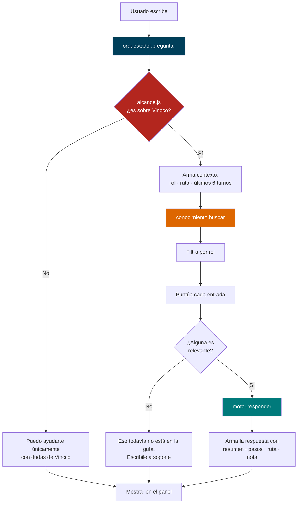

# Estructura del Proyecto Vincco Digital

> **Última actualización**: Fase 8 — Asistente de IA + Guía de usuario
> Vincco Digital es una aplicación web móvil (React) que conecta **clientes**, **negocios** y **proveedores** mediante un sistema de puntos, recompensas, directorio comercial y paneles de administración.

---

## 1. Arbol de Carpetas

```
vincco-digital/
│
├── public/                              # Archivos estaticos que sirve el navegador directamente
│   ├── assets/
│   │   ├── images/
│   │   │   └── home-fondohome.jpg        # Imagen de fondo del HeroBanner
│   │   └── logos/
│   │       └── vincco-logo.png           # Logo principal de Vincco
│   ├── images/
│   │   ├── register-bg.jpg              # Fondo del registro
│   │   ├── register-negocio.jpg         # Paso visual para negocio
│   │   └── register-provedores.jpg      # Paso visual para proveedor
│   ├── .nojekyll                        # Evita que GitHub Pages procese el build con Jekyll
│   ├── favicon.ico                       # Icono de pestania
│   ├── hero.jpg                          # Imagen del hero (landing page)
│   ├── index.html                        # HTML base donde se monta React
│   ├── logo192.png                       # PWA icon 192x192
│   ├── logo512.png                       # PWA icon 512x512
│   ├── manifest.json                     # Configuracion PWA
│   └── robots.txt                        # Reglas para crawlers
│
├── src/                                  # Codigo fuente completo
│   ├── App.js                            # Punto de entrada: aplica accesibilidad/lang y carga AppRouter
│   ├── App.css                           # Estilos globales + BottomNav + carrusel + accesibilidad (~1240)
│   ├── index.js                          # Arranca React en el navegador
│   ├── index.css                         # Directivas Tailwind + variables CSS (estilo shadcn)
│   ├── App.test.js                       # Smoke test basico
│   ├── reportWebVitals.js                # Medicion de rendimiento
│   ├── setupTests.js                     # Configuracion de tests
│   ├── logo.svg                          # Logo por defecto de CRA
│   │
│   ├── components/                       # Componentes reutilizables
│   │   ├── AppRouter.jsx                 # 18 rutas con HashRouter, lazy loading y Suspense
│   │   ├── BottomNav.jsx                 # Barra de navegacion inferior fija (tabs segun rol)
│   │   ├── Navbar.jsx                    # Barra superior del nuevo landing (glassmorphism)
│   │   ├── Sidebar.jsx                   # Menu lateral deslizante (hamburger), items por rol
│   │   ├── HeroBanner.jsx                # Banner principal de Home (incluye DotGridBackground)
│   │   ├── HeroBannerRedes.jsx           # Hero de la pagina de Redes Sociales
│   │   ├── CarouselAnuncios.jsx          # Carrusel automatico de anuncios
│   │   ├── NegociosCarousel.jsx          # Carrusel de chips + tarjeta (Negocios Asociados)
│   │   ├── DotGridBackground.jsx         # Canvas animado de puntos (extraido de HeroBanner)
│   │   ├── icons/
│   │   │   ├── Icon.jsx                  # Libreria SVG custom (52 iconos, estilo Lucide)
│   │   │   └── IconRed.jsx               # Iconos de 6 redes sociales (WhatsApp, FB, IG, TikTok, YT, Threads)
│   │   ├── panel/
│   │   │   └── PublicacionesPanel.jsx    # CRUD de publicaciones con persistencia en localStorage
│   │   ├── config/
│   │   │   └── ConfigUI.jsx              # Piezas visuales de /config (topbar, grupos, permisos de vitrina)
│   │   ├── perfil/
│   │   │   └── PerfilUI.jsx              # Piezas visuales compartidas de /perfil
│   │   └── ui/
│   │       ├── demo.tsx                  # Wrapper de demo para travel-connect-signin
│   │       └── travel-connect-signin-1.tsx  # Componente sign-in con Framer Motion
│   │
│   ├── pages/                            # Pantallas completas de la aplicacion
│   │   ├── Home.jsx                      # Pantalla principal autenticada (feed completo, ~931)
│   │   ├── Landing.jsx                   # Login con canvas animado (Framer Motion)
│   │   ├── Register.jsx                  # Registro multi-paso (cliente/negocio/proveedor)
│   │   ├── Directorio.jsx                # Directorio de negocios y proveedores
│   │   ├── Mispuntos.jsx                 # Panel de puntos acumulados (~738)
│   │   ├── Dashboard.jsx                 # Estadisticas del negocio (hardcodeado)
│   │   ├── Favoritos.jsx                 # Negocios guardados como favoritos (busqueda + categorias)
│   │   ├── PanelNegocio.jsx              # Panel de admin para negocios (CRUD)
│   │   ├── PanelSocio.jsx                # Panel ampliado para socios
│   │   ├── NegociosAsociados.jsx         # Gestion de negocios asociados (CRUD + carrusel)
│   │   ├── Ayuda.jsx                     # Centro de ayuda: FAQ, articulos, contacto
│   │   ├── Redes.jsx                     # Conexion de redes sociales del negocio
│   │   ├── Perfil.jsx                    # Enrutador de perfil segun rol (usuario/negocio/proveedor)
│   │   ├── PerfilUsuario.jsx             # Perfil del cliente (ficha, actividad, insignias)
│   │   ├── PerfilNegocio.jsx             # Perfil del negocio (ficha, horario, favoritos, reseñas)
│   │   ├── PerfilProveedor.jsx           # Perfil del proveedor (ficha, lineas, reseñas)
│   │   ├── Config.jsx                    # Configuraciones: una ruta, tres roles (busqueda + grupos)
│   │   ├── Notificaciones.jsx            # Centro de notificaciones
│   │   ├── Calendario.jsx                # Calendario inteligente con eventos
│   │   ├── Calendario.css                # Estilos Tailwind del calendario
│   │   ├── Notificaciones.css            # Estilos Tailwind de notificaciones
│   │   ├── Panel.css                     # Estilos Tailwind unificados para paneles
│   │   ├── Register.css                  # Estilos Tailwind del registro
│   │   ├── Config.css                    # Estilos de configuraciones
│   │   ├── Perfil.css                    # Estilos de los tres perfiles
│   │   ├── Ayuda.css                     # Estilos del centro de ayuda
│   │   ├── Redes.css                     # Estilos de redes sociales
│   │   ├── Favoritos.css                 # Estilos de favoritos
│   │   └── NegociosAsociados.css         # Estilos de negocios asociados
│   │
│   ├── sections/                         # Secciones del nuevo Landing Page (marketing)
│   │   ├── HeroSection.jsx               # Hero full-screen con mockup animado
│   │   ├── BenefitsSection.jsx           # Grid de 6 beneficios
│   │   ├── HowItWorks.jsx                # Timeline con scroll progresivo
│   │   ├── StatsSection.jsx              # Contadores animados
│   │   ├── DashboardPreview.jsx          # Mockup visual del dashboard
│   │   ├── TestimonialsSection.jsx       # Carrusel automatico de testimonios
│   │   ├── CTASection.jsx                # Call-to-action con botones de registro
│   │   └── FooterSection.jsx             # Footer completo con enlaces
│   │
│   ├── store/                            # Estado global (Zustand)
│   │   └── puntos_usestore.js            # Store: usuario, negocio, perfiles, config, redes, notificaciones...
│   │
│   ├── data/                             # Datos de prueba (mock data)
│   │   ├── data_falso.js                 # Negocios, proveedores, categorias, perfiles, ayudas, redes...
│   │   ├── config_opciones.js            # Definicion declarativa de los ajustes de /config
│   │   └── publicationTypes.js           # Registro central de tipos de publicacion (con storageKey)
│   │
│   ├── hooks/                            # Hooks personalizados
│   │   └── useLikes.js                   # Likes de publicaciones destacadas (persistidos en localStorage)
│   │
│   ├── utils/                            # Helpers puros sin dependencias de React
│   │   ├── moneda.js                     # Formato de montos en cordobas (NIO, C$)
│   │   └── filtroNotificaciones.js       # Traduce la config del usuario a "que notificacion se ve"
│   │
│   └── styles/
│       ├── home.css                      # Design System del landing (~1287 lineas, prefijo vc-*)
│       └── colores.js                    # Fuente unica de hex para JS (TOKENS, COLORES_HOME, COLORES_PUNTOS)
│
├── build/                                # Version compilada para produccion (npm run build)
├── .gitignore                            # Reglas de git
├── .claude/
│   └── settings.local.json               # Config de Claude IDE
├── ESTRUCTURA.md                         # Este archivo
├── README.md                             # README por defecto de CRA
├── Doctor                                # Archivo binario (artifact CRA)
├── cleanup.ps1                           # Script PowerShell para limpiar App.css
├── flujo de registro_1.sql              # Script SQL de la base de datos
├── package.json                          # Dependencias y scripts
├── package-lock.json                     # Versiones bloqueadas
├── postcss.config.js                     # PostCSS: Tailwind + Autoprefixer
├── start.bat                             # Atajo: npm start
├── tailwind.config.js                    # Configuracion de Tailwind CSS v3
└── tsconfig.json                         # Configuracion de TypeScript
```

### Nota sobre CSS: Sistema Dual

El proyecto usa una hoja global (`App.css`) para lo comun y archivos por pagina con Tailwind:

| Sistema | Archivo | Lineas | Estado |
|---|---|---|---|
| **Global** | `src/App.css` | ~1240 | Base, BottomNav, carrusel de negocios, accesibilidad (`vincco--texto-grande`, `vincco--alto-contraste`) |
| **Design System** | `src/styles/home.css` | ~1287 | Landing page (prefijo `vc-*`) |
| **Por pagina** | `src/pages/*.css` | var | Estilos especificos con Tailwind |
| **JS** | `src/styles/colores.js` | 101 | Hex desde JavaScript (Home, Mis Puntos) |

Los nuevos archivos de pagina (`Config.css`, `Perfil.css`, `Ayuda.css`, `Redes.css`, `Favoritos.css`, `NegociosAsociados.css`) usan clases propias con prefijo corto (`.cfg-*`, `.pf-*`, `.ayu-*`, `.rds-*`, `.fav-*`, `.naso-*`).

---

## 2. Design System — `src/styles/home.css`

El nuevo Design System es el corazon visual del proyecto rediseñado. Inspirado en Stripe, Linear y noCRM.

### Paleta de Colores

```css
:root {
  --navy-950: #001d2a;
  --navy-900: #002e43;
  --navy-800: #003f5a;
  --orange-500: #dd6600;
  --orange-600: #c05900;
  --gold-400: #feb862;
  --gold-500: #fea02f;
  --teal-500: #3f9c9c;
  --teal-600: #007a7b;
  --ink-900: #0b1b26;
  --surface: #ffffff;
  --surface-alt: #f4f8fb;
}
```

| Token | Valor | Uso |
|---|---|---|
| `--navy-900` | `#002e43` | Fondo principal oscuro |
| `--navy-800` | `#003f5a` | Fondo de barras y headers |
| `--orange-500` | `#dd6600` | Acento naranja (CTAs, badges) |
| `--gold-500` | `#fea02f` | Dorado (premium, recompensas) |
| `--teal-600` | `#007a7b` | Teal (exito, confirmacion) |
| `--ink-900` | `#0b1b26` | Texto principal |
| `--slate-600` | `#4d6273` | Texto secundario |

**Los mismos colores desde JavaScript** viven en `src/styles/colores.js` (`TOKENS`), con dos mapas derivados:
- `COLORES_HOME` — usado por `Home.jsx` (`orange: #c05900`)
- `COLORES_PUNTOS` — usado por `Mispuntos.jsx` (`orange: #dd6600`)

> ⚠️ Ojo: Home y Mis Puntos usan la misma palabra para colores distintos. Por eso se exportan dos mapas separados en vez de uno solo. No fusionarlos sin cambiar el aspecto de una pantalla.

### Arquitectura de home.css

```
home.css (~1287 lineas)
│
├── Custom Properties — Tokens de diseno (navy/orange/gold/teal palette)
├── vc-navbar — Barra de navegacion superior (glassmorphism + mobile menu)
├── vc-hero — Hero section del landing
├── Section Shared — Utilidades compartidas entre secciones
├── vc-benefits — Grid de beneficios
├── vc-how-it-works — Timeline/scrolling
├── vc-dashboard-preview — Mockup visual
├── vc-stats — Contadores animados
├── vc-testimonials — Carrusel de testimonios
├── vc-cta — Call to action
├── vc-footer — Footer completo
└── Animations — Keyframes y media queries responsive
```

### Convenciones de Clases CSS (Nuevo Sistema)

| Convencion | Ejemplo | Uso |
|---|---|---|
| Prefijo `vc-` | `vc-hero`, `vc-navbar` | Identidad Vincco |
| Modificador BEM | `vc-navbar-btn--primary` | Variantes de boton |
| Estados | `--active`, `--open` | Estados de UI |
| Mobile menu | `vc-navbar-mobile-menu.open` | Menu responsivo |

### Reglas del Nuevo Design System

- **Glassmorphism** en navbar: `backdrop-filter: blur(12px)`
- **Gradientes** y glows en hero section
- **Animaciones** con Framer Motion y keyframes CSS
- **Tipografia**: Inter + Sora (display)
- **Responsive**: 768px (tablet), 1024px (desktop)
- `!important` solo en overrides inline de componentes legacy

---

## 3. Conexiones y Dependencias entre Carpetas

### Flujo General de Datos

```
┌──────────────────────────────────────────────────────────────────┐
│                       FLUJO DE LA APLICACION                      │
│                                                                   │
│  Usuario abre la app                                             │
│       |                                                           │
│  index.js  ->  App.js  ->  AppRouter.jsx (HashRouter)            │
│                              |                                    │
│                  Define las rutas (URLs) y las cargas            │
│                  de forma perezosa (lazy + Suspense)             │
│                              |                                    │
│                   Carga la pagina correspondiente                 │
│                              |                                    │
│                  Las paginas usan el Store (Zustand)              │
│                  para leer/escribir datos globales                │
│                              |                                    │
│                  Las paginas usan data/ para                      │
│                  mostrar informacion de prueba                    │
│                              |                                    │
│                  Los componentes reutilizables                    │
│                  (BottomNav, Sidebar, HeroBanner, etc.) se        │
│                  insertan dentro de las paginas                   │
│                              |                                    │
│                  Los estilos vienen de:                           │
│                  - App.css (base + BottomNav + accesibilidad)     │
│                  - home.css (landing page, prefijo vc-*)          │
│                  - pages/*.css (por pagina)                       │
│                  - styles/colores.js (colores inline en JS)       │
└──────────────────────────────────────────────────────────────────┘
```

### Diagrama de Dependencias por Carpeta

| Carpeta | De quien depende | Quien la usa |
|---|---|---|
| `src/index.js` | `App.js` | Nadie (punto de entrada) |
| `src/App.js` | `AppRouter`, `store/`, `App.css` | `index.js` |
| `src/App.css` | Ninguno (tokens en `:root`) | `App.js` |
| `src/styles/home.css` | Ninguno | Landing pages, `Navbar.jsx` |
| `src/styles/colores.js` | Ninguno | `Home.jsx`, `Mispuntos.jsx` |
| `src/utils/` | Ninguna (funciones puras) | Store, paneles, Notificaciones |
| `src/components/` | `pages/`, `store/`, `App.css`, `home.css` | `AppRouter.jsx`, varias paginas |
| `src/sections/` | `home.css`, `components/icons/` | `Landing.jsx` (nuevo landing) |
| `src/pages/` | `components/`, `store/`, `data/`, `App.css`, `*.css` | `AppRouter.jsx` |
| `src/store/` | `data/data_falso.js`, `utils/` | Casi todas las paginas y componentes |
| `src/data/` | `utils/moneda.js` | Home, Directorio, Perfil, Config, Ayuda, Redes |
| `public/` | Ninguna | Referenciados por rutas `/assets/...` |

### Flujo de Datos Especifico

```
Landing (nuevo) / Login (legacy)  ->  Store (setLoggedIn, setUserType)  ->  Navega a Home
                                                                                |
Home.jsx  <-  HeroBanner (abre Sidebar)  <-  DotGridBackground (canvas)
   |            |                                  |
   |-- data/data_falso.js (categorias, promociones, recompensas, destacadas)
   |-- store/puntos_usestore.js (usuario, puntos, tipo de usuario)
   |-- hooks/useLikes.js (likes de destacadas, localStorage)
   |-- styles/colores.js (COLORES_HOME)
   |-- components/icons/Icon.jsx (iconos SVG)
             |
BottomNav  <-  store/puntos_usestore.js (notificaciones no leidas para badge)
             |
Navega entre: /home, /favoritos, /puntos, /recompensas, /panel-negocio,
             /publicaciones, /calendario, /notificaciones, /negocios-asociados,
             /ayuda, /redes, /perfil, /config
```

---

## 4. Diagrama Mermaid

```mermaid
flowchart TD
    subgraph Entrada
        A[index.js] --> B[App.js]
        B --> C[AppRouter.jsx]
    end

    subgraph Navegacion
        C -->|"/login"| D[Landing.jsx]
        C -->|"/register"| E[Register.jsx]
        C -->|"/home, /inicio, /"| F[Home.jsx]
        C -->|"/directorio"| G[Directorio.jsx]
        C -->|"/puntos"| H[Mispuntos.jsx]
        C -->|"/dashboard"| I[Dashboard.jsx]
        C -->|"/favoritos"| FAV[Favoritos.jsx]
        C -->|"/panel-negocio"| J[PanelNegocio.jsx]
        C -->|"/recompensas, /publicaciones"| K[PanelSocio.jsx]
        C -->|"/negocios-asociados"| NA[NegociosAsociados.jsx]
        C -->|"/ayuda"| AYU[Ayuda.jsx]
        C -->|"/redes"| RDS[Redes.jsx]
        C -->|"/perfil"| PF[Perfil.jsx]
        C -->|"/config"| CF[Config.jsx]
        C -->|"/notificaciones"| L[Notificaciones.jsx]
        C -->|"/calendario"| M[Calendario.jsx]
    end

    subgraph Componentes
        F --> P[HeroBanner.jsx]
        F --> Q[CarouselAnuncios.jsx]
        P --> R[Sidebar.jsx]
        P --> DG[DotGridBackground.jsx]
        NA --> NC[NegociosCarousel.jsx]
        RDS --> HR[HeroBannerRedes.jsx]
        RDS --> DG
        D --> S[Navbar.jsx]
        D --> T[HeroSection.jsx]
        D --> U[BenefitsSection.jsx]
        D --> V[HowItWorks.jsx]
        D --> W[StatsSection.jsx]
        D --> X[DashboardPreview.jsx]
        D --> Y[TestimonialsSection.jsx]
        D --> Z[CTASection.jsx]
        D --> AA[FooterSection.jsx]
    end

    subgraph NavegacionInferior
        C --> AB[BottomNav.jsx]
    end

    subgraph LibreriaIconos
        F --> AC[components/icons/Icon.jsx]
        E --> AC
        J --> AC
        K --> AC
        L --> AC
        M --> AC
        CF --> AC
        AYU --> AC
        RDS --> AC
        RDS --> ICR[components/icons/IconRed.jsx]
    end

    subgraph EstadoGlobal
        D --> AD[store/puntos_usestore.js]
        E --> AD
        F --> AD
        H --> AD
        J --> AD
        K --> AD
        L --> AD
        M --> AD
        NA --> AD
        PF --> AD
        CF --> AD
        RDS --> AD
        AB --> AD
        R --> AD
    end

    subgraph DatosMock
        F --> AE[data/data_falso.js]
        G --> AE
        J --> AE
        NA --> AE
        AYU --> AE
        RDS --> AE
        PF --> AE
        CF --> AF[data/config_opciones.js]
        J --> AG[data/publicationTypes.js]
        J --> PNP[components/panel/PublicacionesPanel.jsx]
        PF --> CAM[data/data_falso.js camposPerfil]
    end

    subgraph Utilidades
        AD --> U1[utils/filtroNotificaciones.js]
        L --> U1
        AD --> U2[utils/moneda.js]
        AE --> U2
        F --> LK[hooks/useLikes.js]
    end

    subgraph DesignSystem
        D -.-> AS[styles/home.css]
        S -.-> AS
        F -.-> CO[styles/colores.js]
        H -.-> CO
        E -.-> AH[pages/Register.css]
        L -.-> AI[pages/Notificaciones.css]
        M -.-> AJ[pages/Calendario.css]
        J -.-> AK[pages/Panel.css]
        K -.-> AK
        CF -.-> AL[pages/Config.css]
        PF -.-> AM[pages/Perfil.css]
        AYU -.-> AN[pages/Ayuda.css]
        RDS -.-> AO[pages/Redes.css]
        FAV -.-> AP[pages/Favoritos.css]
        NA -.-> AQ[pages/NegociosAsociados.css]
        AB -.-> AR[App.css]
        B -.-> AR
    end

    subgraph AssetsEstaticos
        P --> AST[public/assets/]
        D --> ASI[public/images/]
        E --> ASI
    end

    style AD fill:#f59e0b,stroke:#d97706,color:#000
    style AE fill:#10b981,stroke:#059669,color:#fff
    style C fill:#2563EB,stroke:#1D4ED8,color:#fff
    style AS fill:#0D9488,stroke:#0F766E,color:#fff
    style AC fill:#8B5CF6,stroke:#7C3AED,color:#fff
```



---

## 5. Descripcion Detallada por Carpeta

### `src/App.css` — Estilos Globales (~1240 lineas)

**Responsabilidad**: Hoja global de la app. Ya no es el Design System del landing (eso vive en `home.css`), pero si concentra lo comun a todas las paginas.

**Secciones actuales**:
- Estilos base (`.page-shell`, `.route-fallback`, layout responsive)
- Bottom Navigation (`bottom-nav-*`)
- Carrusel de Negocios Asociados (chips, tarjetas, paneles)
- Accesibilidad: texto grande y alto contraste (`vincco--texto-grande`, `vincco--alto-contraste`) aplicados desde `App.js` como clases en `<body>`

### `src/styles/home.css` — Design System del Landing (~1287 lineas)

**Responsabilidad**: Design System completo del rediseño con paleta navy/orange/gold/teal. Usa clases con prefijo `vc-*` (~121 clases).

**Secciones**: Custom Properties, Navbar, Hero, Section Shared, Benefits, How It Works, Dashboard Preview, Stats, Testimonials, CTA, Footer, Animations + responsive.

### `src/styles/colores.js` — Colores desde JavaScript (101 lineas)

**Responsabilidad**: Fuente unica de los hex que se usan en estilos inline (Home y Mis Puntos). Exporta `TOKENS`, `COLORES_HOME` y `COLORES_PUNTOS` (dos mapas porque Home y Puntos usan `orange` distinto).

### `src/pages/*.css` — Estilos por Pagina (Tailwind)

| Archivo | Lineas | Pagina |
|---|---|---|
| `Panel.css` | ~2130 | `PanelNegocio.jsx`, `PanelSocio.jsx`, `PublicacionesPanel.jsx` |
| `Perfil.css` | ~1408 | `Perfil.jsx`, `PerfilUsuario.jsx`, `PerfilNegocio.jsx`, `PerfilProveedor.jsx` |
| `Config.css` | ~1208 | `Config.jsx` |
| `Register.css` | ~941 | `Register.jsx` |
| `Ayuda.css` | ~717 | `Ayuda.jsx` |
| `Redes.css` | ~580 | `Redes.jsx` |
| `Calendario.css` | ~535 | `Calendario.jsx` |
| `NegociosAsociados.css` | ~372 | `NegociosAsociados.jsx` |
| `Favoritos.css` | ~366 | `Favoritos.jsx` |
| `Notificaciones.css` | ~252 | `Notificaciones.jsx` |

### `src/store/` — Estado Global (el "cerebro")

**Archivo**: `puntos_usestore.js` (412 lineas)
- Store con Zustand
- **Estado**: `usuario`, `negocio`, `isLoggedIn`, `userType`, `negociosAsociados[]`, `configuraciones` (persistidas en `localStorage` bajo `vincco:configuraciones`, un bloque por rol), `permisosVitrina[]`, `redesNegocio{}`, `codigoInvitacion`, `perfiles` (ficha editable de usuario/negocio/proveedor), `notificaciones[]` (29 generadas por rol), `eventosCalendario[]` (29)
- **Funciones**: `agregarPuntos()`, `setLoggedIn()`, `setUserType()`, `setNegocio()`, `marcarNotificacionLeida()`, `marcarTodasLeidas()`, `agregarNegocioAsociado()`, `editarNegocioAsociado()`, `guardarPerfil()`, `guardarFoto()` (dataURL base64), `quitarFoto()`, `guardarRed()`, `quitarRed()`, `guardarConfig()` (guarda al vuelo), `restablecerConfig()`, `responderPermisoVitrina()`, `enviarNotificacionCompra()`

### `src/data/` — Datos de Prueba

- `data_falso.js` (526 lineas) — Exporta: `usuario`, `negocios`, `proveedores`, `categorias`, `promociones`, `recompensas`, `niveles`, `consejosPuntos`, `pasosComoFunciona`, `pasosNegocios`, `pasosProveedores`, `categoriasFavoritos`, `negociosFavoritos`, `promocionesLimitadas`, `categoriasNegocioAsociado`, `negociosAsociados`, `canalesSoporte`, `rolesAyuda`, `preguntasFrecuentes`, `articulosAyuda`, `redesVincco`, `tiposConsulta`, `destacadas`, `camposPerfil`, `metricasPerfil`, `insigniasPerfil`, `actividadPerfil`, `horarioPerfil`, `favoritosPerfil`, `permisosVitrina`, `resenasPerfil`, `lineasProveedor`
- `config_opciones.js` (617 lineas) — Definicion declarativa de los ajustes de `/config` por rol (grupos y ajustes con `tipo`, `icono`, `depende`, `peligro`). La pantalla solo recorre esta lista para dibujarse.
- `publicationTypes.js` (41 lineas) — Registro central de tipos de publicacion (`promocion`, `producto`, `limitada`, `destacada`) con su `storageKey` en localStorage, color e icono. Agregar un tipo nuevo aqui + su tarjeta en Home.jsx es todo lo necesario.

### `src/utils/` — Helpers Puros

| Archivo | Funcion |
|---|---|
| `moneda.js` | Formato de montos en cordobas: `numero()`, `cordobas()` (C$), `cordobasTexto()` (palabra completa). Helper `MONEDA` con `icono: 'wallet'` para no usar `dollar-sign` |
| `filtroNotificaciones.js` | Traduce la config del usuario a "que notificacion se muestra": `notificacionPermitida()`, `filtrarPorConfig()`. Comparte las reglas que el backend usara cuando exista push |

### `src/hooks/` — Hooks Personalizados

- `useLikes.js` (37 lineas) — Likes de publicaciones destacadas, persistidos en `localStorage` (`pn_destacadas_likes`). Expone `getLikes`, `isLikedByMe`, `toggleLike`.

### `src/components/icons/Icon.jsx` — Libreria SVG (494 lineas)

52 iconos SVG definidos manualmente (estilo Lucide): `award`, `bell`, `box`, `calendar`, `camera`, `check`, `clock`, `coffee`, `crown`, `droplet`, `eye`, `film`, `flame`, `gift`, `globe`, `handshake`, `headphones`, `heart`, `home`, `image`, `inbox`, `info`, `key`, `laptop`, `lock`, `mail`, `medal`, `megaphone`, `package`, `pause`, `percent`, `phone`, `play`, `search`, `settings`, `shield`, `shirt`, `sliders`, `smartphone`, `star`, `store`, `tag`, `target`, `ticket`, `tool`, `truck`, `user`, `users`, `utensils`, `wallet`, `x`, `zap`

### `src/components/icons/IconRed.jsx` — Iconos de Redes (94 lineas)

Iconos y configuracion de 6 redes sociales (`REDES`): WhatsApp, Facebook, Instagram, TikTok, YouTube y Threads, con su `prefijo` de URL y color. Usado por `Redes.jsx` y `HeroBannerRedes.jsx`.

### `src/components/` — Componentes Reutilizables

| Componente | Lineas | CSS | Relacion directa |
|---|---|---|---|
| **AppRouter.jsx** | 89 | `App.css` | HashRouter, lazy loading, 18 rutas, `Shell` con BottomNav |
| **BottomNav.jsx** | 104 | `App.css` | 6 tabs (Inicio, Favoritos, Panel/Premios, Publicar, Calendario, Avisos); "Publicar" solo para socios |
| **Navbar.jsx** | 80 | `home.css` (`vc-navbar-*`) | Nuevo landing, glassmorphism, mobile menu |
| **Sidebar.jsx** | 211 | Inline + `App.css` | Menu lateral; items segun rol (Perfil, Inicio, Negocios Asociados / Mi Negocio, Ayuda, Config, Redes) |
| **HeroBanner.jsx** | 527 | Inline + `App.css` | Banner de Home; incluye Sidebar y DotGridBackground |
| **HeroBannerRedes.jsx** | 276 | `Redes.css` | Hero de Redes con hilera infinita de logos |
| **CarouselAnuncios.jsx** | 125 | — | Carrusel automatico, recibe `slides` como prop |
| **NegociosCarousel.jsx** | 307 | `App.css` / `NegociosAsociados.css` | Chips rotativos + tarjeta grande; autoplay 4.5s |
| **DotGridBackground.jsx** | 251 | — | Canvas animado de puntos con interaccion de cursor (extraido de HeroBanner) |
| **Icon.jsx** | 494 | — | 52 iconos SVG, props: `name`, `size`, `color` |
| **IconRed.jsx** | 94 | — | 6 iconos de redes sociales |
| **PublicacionesPanel.jsx** | 412 | `Panel.css` | CRUD de publicaciones con persistencia en localStorage (`pn_promociones`, `pn_productos`, `pn_limitadas`, `pn_destacadas`) |
| **ConfigUI.jsx** | 588 | `Config.css` | Piezas de `/config`: topbar, encabezado, nav, grupos, aviso guardado, confirmacion, permisos de vitrina |
| **PerfilUI.jsx** | 522 | `Perfil.css` | Piezas compartidas de `/perfil`: ficha, secciones, insignias |

### `src/sections/` — Secciones del Landing Page (8 componentes)

| Componente | Lineas | Descripcion |
|---|---|---|
| **HeroSection.jsx** | 127 | Hero full-screen con cuadricula animada, glows y mockup |
| **BenefitsSection.jsx** | 106 | Grid de 6 tarjetas de beneficios con iconos |
| **HowItWorks.jsx** | 138 | Timeline con barra de progreso que avanza con scroll |
| **StatsSection.jsx** | 101 | 4 contadores animados (0 → N) con IntersectionObserver |
| **DashboardPreview.jsx** | 94 | Mockup visual del dashboard con tarjetas de datos |
| **TestimonialsSection.jsx** | 137 | Carrusel automatico de 6 testimonios con rotacion |
| **CTASection.jsx** | 49 | Call-to-action con botones "Empieza gratis" |
| **FooterSection.jsx** | 80 | Footer con enlaces, copyright y redes sociales |

### `src/pages/` — Pantallas Completas

#### `Home.jsx` (~931 lineas) — Pantalla Principal
- **Responsabilidad**: Feed completo: banner, busqueda, bienvenida, categorias, promociones, carrusel, recompensas, promociones limitadas y **destacadas con likes** (persistidos por `useLikes`)
- **Estilos**: Inline con `COLORES_HOME` (de `styles/colores.js`) + `App.css`
- **Relacion**: Usa `HeroBanner`, `CarouselAnuncios`, `Icon.jsx`, `useLikes`, `store/`, `data/data_falso`

#### `Perfil.jsx` (23 lineas) — Enrutador de Perfil
- **Responsabilidad**: Una sola ruta `/perfil` que decide que pantalla mostrar segun `userType`
- **Relacion**: `PERFILES = { usuario: PerfilUsuario, negocio: PerfilNegocio, proveedor: PerfilProveedor }`

#### `PerfilUsuario.jsx` (150) / `PerfilNegocio.jsx` (181) / `PerfilProveedor.jsx` (152)
- **Responsabilidad**: Ficha editable del rol (datos en `store.perfiles`), secciones especificas por rol
- **Estilos**: `Perfil.css`
- **Relacion**: Usan `PerfilUI.jsx`, `store/` (`guardarPerfil`, `guardarFoto`, `quitarFoto`), `data/data_falso`

#### `Config.jsx` (~387 lineas) — Configuraciones
- **Responsabilidad**: Una ruta `/config` para los tres roles. Dibuja la lista de ajustes desde `config_opciones.js`, con buscador (ignora tildes), grupos, botones de restablecer, aviso de guardado y la seccion especial de **permisos de vitrina**
- **Estilos**: `Config.css`
- **Relacion**: Usa `ConfigUI.jsx`, `store/` (`configuraciones`, `guardarConfig`, `restablecerConfig`, `permisosVitrina`, `responderPermisoVitrina`), `Icon.jsx`

#### `Redes.jsx` (~353 lineas) — Redes Sociales
- **Responsabilidad**: El negocio conecta sus redes (`store.redesNegocio`); todos ven las redes de Vincco (`data_falso.redesVincco`). Arma la URL final desde el valor que escribe el usuario
- **Estilos**: `Redes.css`
- **Relacion**: Usa `IconRed.jsx` (`REDES`), `HeroBannerRedes.jsx`, `store/` (`guardarRed`, `quitarRed`)

#### `Ayuda.jsx` (~396 lineas) — Centro de Ayuda
- **Responsabilidad**: Buscador de FAQ con acordeon (ignora tildes), articulos por rol, canales de soporte y formulario de consulta
- **Estilos**: `Ayuda.css`
- **Relacion**: Usa `data/data_falso` (`canalesSoporte`, `rolesAyuda`, `preguntasFrecuentes`, `articulosAyuda`, `tiposConsulta`), `Icon.jsx`

#### `NegociosAsociados.jsx` (292 lineas) — Negocios Asociados
- **Responsabilidad**: Gestion de los negocios que abastece el proveedor: busqueda, carrusel (`NegociosCarousel`), CRUD con modal, notificacion de compra, enlace de WhatsApp
- **Estilos**: `NegociosAsociados.css`
- **Relacion**: Usa `NegociosCarousel`, `store/` (`negociosAsociados`, `agregarNegocioAsociado`, `editarNegocioAsociado`, `enviarNotificacionCompra`)

#### `Favoritos.jsx` (128 lineas) — Favoritos
- **Responsabilidad**: Negocios guardados con busqueda y filtro por categoria; permite quitar favoritos
- **Estilos**: `Favoritos.css`
- **Relacion**: Usa `data/data_falso` (`categoriasFavoritos`, `negociosFavoritos`), `Icon.jsx`

#### `Landing.jsx` (362 lineas) — Inicio de Sesion Rediseñado
- **Responsabilidad**: Login con canvas interactivo animado (Framer Motion), mapa de puntos SVG animados, seleccion de tipo de usuario
- **Estilos**: `home.css` (clases `vc-*`)
- **Relacion**: Usa `store/` (setLoggedIn, setUserType), navega a `/` al autenticar

#### `Register.jsx` (1262 lineas) — Registro Multi-paso
- **Responsabilidad**: Flujo de registro con 8 pasos (cliente) o 10 pasos (negocio/proveedor)
- **Estilos**: `Register.css` (~941 lineas, Tailwind)
- **Relacion**: Usa `store/` (setUserType), `Icon.jsx`, navega a `/login`

#### `Directorio.jsx` (75 lineas) — Directorio Comercial
- Busqueda y filtros por categoria. Usa `data/data_falso.js`

#### `Mispuntos.jsx` (~738 lineas) — Panel de Puntos
- Hero card con puntos, niveles, barra de progreso, grid de recompensas, consejos
- Estilos: inline con `COLORES_PUNTOS` + `App.css`. Usa `store/`, `data/data_falso`

#### `Dashboard.jsx` (58 lineas) — Estadisticas
- Stats grid, timeline, quick actions (datos hardcodeados)

#### `PanelNegocio.jsx` (477 lineas) — Panel de Administracion
- CRUD de publicaciones (usa `PublicacionesPanel`), listado de proveedores, inventario con alertas de stock
- Estilos: `Panel.css`. Usa `store/`, `data/data_falso.js`, `data/publicationTypes.js`, `Icon.jsx`

#### `PanelSocio.jsx` (286 lineas) — Panel de Socio
- Publicaciones, inventario, cotizaciones, reseñas, directorio
- Estilos: `Panel.css`. Usa `store/`, `data/data_falso.js`, `Icon.jsx`

#### `Notificaciones.jsx` (140 lineas) — Centro de Notificaciones
- Lista filtrable (todas/no leidas/leidas), marcado masivo, **filtro por config del usuario** (`filtroNotificaciones.js`)
- Estilos: `Notificaciones.css`. Usa `store/`, `Icon.jsx`

#### `Calendario.jsx` (273 lineas) — Calendario Inteligente
- Calendario mensual con eventos categorizados por colores, filtros, navegacion entre meses
- Estilos: `Calendario.css`. Usa `store/`, `Icon.jsx`

### `public/` — Recursos Estaticos

| Archivo | Usado por |
|---|---|
| `assets/logos/vincco-logo.png` | `HeroBanner`, `Landing`, `Register`, `Navbar`, `HeroBannerRedes` |
| `assets/images/home-fondohome.jpg` | `HeroBanner` |
| `images/register-bg.jpg` | `Register.jsx` |
| `images/register-negocio.jpg` | `Register.jsx` |
| `images/register-provedores.jpg` | `Register.jsx` |
| `hero.jpg` | `HeroSection.jsx` (nuevo landing) |
| `.nojekyll` | Deploy en GitHub Pages |

---

## 6. Tecnologias

| Tecnologia | Version | Proposito |
|---|---|---|
| React | ^19.2.6 | UI framework |
| react-router-dom | ^7.16.0 | Enrutamiento SPA (HashRouter) |
| zustand | ^5.0.14 | Estado global ligero |
| Tailwind CSS | ^3.4.19 | Framework CSS utility-first |
| framer-motion | ^12.43.0 | Animaciones y transiciones |
| lucide-react | ^1.27.0 | Iconos en Landing.jsx |
| autoprefixer | ^10.5.4 | Prefijos CSS |
| postcss | ^8.5.25 | Procesamiento CSS |
| tailwindcss-animate | ^1.0.7 | Plugin de animaciones Tailwind |
| TypeScript | ^4.9.5 | Tipado parcial (.tsx) |
| react-scripts | 5.0.1 | Build toolchain (CRA) |

---

## 7. Si Necesito Modificar X, Donde Tengo que Ir?

### Agregar una Pantalla Nueva

1. **Crear el archivo** en `src/pages/NuevaPagina.jsx`
2. **Importarla** en `src/components/AppRouter.jsx` (con `lazy` si no es la pantalla de entrada)
3. **Agregar la ruta**: en `SHELL_ROUTES` si lleva barra inferior, o como `<Route>` suelto si no
   ```jsx
   { path: '/mi-ruta', element: <NuevaPagina /> },
   ```
4. **Agregar estilos** en `src/pages/NuevaPagina.css` (con Tailwind)
5. *(Opcional)* Agregar un tab en `src/components/BottomNav.jsx` o un item en `src/components/Sidebar.jsx`

### Agregar un Icono Nuevo

1. Abrir `src/components/icons/Icon.jsx`
2. Agregar el nuevo SVG path en el objeto de iconos
3. Usarlo como `<Icon name="mi-icono" size={24} />`
4. Si es un icono de red social, agregarlo en `src/components/icons/IconRed.jsx` (con `prefijo` y `color`)

### Agregar un Ajuste Nuevo en Configuraciones

1. Abrir `src/data/config_opciones.js` y agregar el objeto al grupo/rol correspondiente (`tipo: switch | opciones | numero | enlace | accion | info`)
2. La pantalla `/config` lo dibuja solo: no hay que tocar componentes
3. *(Opcional)* Si el ajuste afecta el valor por defecto, actualizar `CONFIG_INICIAL` en `src/store/puntos_usestore.js`

### Cambiar un Color Global

1. Opcion A: Modificar `src/styles/home.css` → seccion `:root` (landing, sistema `vc-*`)
2. Opcion B: Modificar `src/styles/colores.js` → `TOKENS` (colores usados desde JS)
3. Opcion C: Modificar `src/App.css` → seccion `:root` (lo global de la app)

### Cambiar estilos del Landing

1. `src/styles/home.css` — clases con prefijo `vc-*`
2. Componentes en `src/sections/`

### Cambiar estilos de una Pagina (nuevo sistema)

1. Abrir `src/pages/[Pagina].css` — archivo CSS especifico
2. O usar clases Tailwind directamente en el JSX

### Cambiar la Logica de Negocio

| Logica | Donde modificar |
|---|---|
| Puntos del usuario | `src/store/puntos_usestore.js` → `agregarPuntos()` |
| Tipos de usuario | `src/store/puntos_usestore.js` → `userType`, `setUserType()` |
| Datos del negocio | `src/store/puntos_usestore.js` → `negocio`, `setNegocio()` |
| Perfil del rol | `src/store/puntos_usestore.js` → `perfiles`, `guardarPerfil()`, `guardarFoto()`, `quitarFoto()` |
| Configuraciones | `src/data/config_opciones.js` (definicion) + `src/store/puntos_usestore.js` → `configuraciones`, `guardarConfig()`, `restablecerConfig()` |
| Redes del negocio | `src/store/puntos_usestore.js` → `redesNegocio`, `guardarRed()`, `quitarRed()` |
| Notificaciones | `src/store/puntos_usestore.js` → `generarNotificaciones()` y funciones; `src/utils/filtroNotificaciones.js` → reglas de visibilidad |
| Eventos del calendario | `src/store/puntos_usestore.js` → `generarEventosCalendario()` |
| Negocios asociados | `src/store/puntos_usestore.js` → `negociosAsociados`, `agregarNegocioAsociado()`, `editarNegocioAsociado()` |
| Validacion de registro | `src/pages/Register.jsx` → funcion `validate()` |
| Tipos de publicacion | `src/data/publicationTypes.js` → agregar tipo nuevo (y su tarjeta en Home.jsx) |
| CRUD de publicaciones | `src/components/panel/PublicacionesPanel.jsx` (persistencia en localStorage) |
| Inventario/stock | `src/pages/PanelNegocio.jsx` → `InventarioSection` |
| Moneda / formato de montos | `src/utils/moneda.js` |

---

## 8. Tamano de Archivos (Lineas)

### Componentes y paginas JSX/JS

| Archivo | Lineas | Nota |
|---|---|---|
| **Register.jsx** | 1262 | Pagina mas extensa |
| **Home.jsx** | 931 | Pantalla principal |
| **Mispuntos.jsx** | 738 | Panel de puntos |
| **HeroBanner.jsx** | 527 | Banner principal de Home |
| **Icon.jsx** | 494 | 52 iconos SVG |
| **PanelNegocio.jsx** | 477 | Panel de negocio |
| **PerfilUI.jsx** | 522 | Piezas UI de perfil |
| **ConfigUI.jsx** | 588 | Piezas UI de config |
| **Ayuda.jsx** | 396 | Centro de ayuda |
| **Config.jsx** | 387 | Configuraciones |
| **Landing.jsx** | 362 | Login rediseñado |
| **Redes.jsx** | 353 | Redes sociales |
| **NegociosCarousel.jsx** | 307 | Carrusel de negocios |
| **NegociosAsociados.jsx** | 292 | Negocios asociados |
| **HeroBannerRedes.jsx** | 276 | Hero de redes |
| **PanelSocio.jsx** | 286 | Panel de socio |
| **Calendario.jsx** | 273 | Calendario inteligente |
| **DotGridBackground.jsx** | 251 | Canvas animado de puntos |
| **Sidebar.jsx** | 211 | Menu lateral |
| **PerfilNegocio.jsx** | 181 | Perfil de negocio |
| **PerfilProveedor.jsx** | 152 | Perfil de proveedor |
| **PerfilUsuario.jsx** | 150 | Perfil de usuario |
| **Notificaciones.jsx** | 140 | Centro de notificaciones |
| **Favoritos.jsx** | 128 | Favoritos |
| **CarouselAnuncios.jsx** | 125 | Carrusel de anuncios |
| **BottomNav.jsx** | 104 | Navegacion inferior |
| **IconRed.jsx** | 94 | Iconos de redes |
| **AppRouter.jsx** | 89 | Router principal (18 rutas, lazy) |
| **Navbar.jsx** | 80 | Barra superior (nuevo landing) |
| **Directorio.jsx** | 75 | Directorio comercial |
| **Dashboard.jsx** | 58 | Estadisticas |
| **Perfil.jsx** | 23 | Enrutador de perfil |
| **useLikes.js** | 37 | Likes (localStorage) |
| | | |
| **HeroSection.jsx** | 127 | Seccion hero del landing |
| **HowItWorks.jsx** | 138 | Timeline con scroll |
| **TestimonialsSection.jsx** | 137 | Carrusel de testimonios |
| **BenefitsSection.jsx** | 106 | Grid de beneficios |
| **StatsSection.jsx** | 101 | Contadores animados |
| **DashboardPreview.jsx** | 94 | Mockup del dashboard |
| **FooterSection.jsx** | 80 | Footer completo |
| **CTASection.jsx** | 49 | Call to action |
| | | |
| **puntos_usestore.js** | 412 | Store Zustand |
| **PublicacionesPanel.jsx** | 412 | CRUD de publicaciones |

### CSS y datos

| Archivo | Lineas | Nota |
|---|---|---|
| **Panel.css** | 2130 | Estilos de paneles (Tailwind) |
| **Perfil.css** | 1408 | Estilos de perfiles |
| **home.css** | 1287 | Design System landing (vc-*) |
| **App.css** | 1240 | Globales + BottomNav + accesibilidad |
| **Config.css** | 1208 | Estilos de configuraciones |
| **Register.css** | 941 | Estilos del registro (Tailwind) |
| **Ayuda.css** | 717 | Estilos del centro de ayuda |
| **Redes.css** | 580 | Estilos de redes sociales |
| **Calendario.css** | 535 | Estilos del calendario |
| **NegociosAsociados.css** | 372 | Estilos de negocios asociados |
| **Favoritos.css** | 366 | Estilos de favoritos |
| **Notificaciones.css** | 252 | Estilos de notificaciones |
| | | |
| **config_opciones.js** | 617 | Definicion de ajustes |
| **data_falso.js** | 526 | Datos de prueba |
| **colores.js** | 101 | Tokens hex desde JS |
| **index.css** | 98 | Tailwind + variables shadcn |
| **moneda.js** | 55 | Formato de cordobas |
| **filtroNotificaciones.js** | 55 | Reglas de visibilidad |
| **publicationTypes.js** | 41 | Tipos de publicacion |

---

# 9. Kiara — la asistente de IA de Vincco (Fase 8)

> Esta sección explica **cómo está construido el asistente**, para que quien
> trabaje el backend sepa exactamente dónde se conecta y qué tiene que entregar.
> No hace falta leer las secciones anteriores para entender esta.

## 9.1 Qué es y qué NO es

El asistente **no es un chat de propósito general**. No responde cultura
general, no hace tareas y no conversa: explica cómo se usa Vincco.

| Sí hace | No hace |
|---|---|
| Explica cómo funcionan los puntos | Dice cuántos puntos tenés |
| Explica cómo cotizar | Consulta el estado de tu cotización |
| Dice qué hace cada pantalla | Ejecuta acciones por vos |
| Guía paso a paso | Responde nada ajeno a Vincco |

Si la pregunta se sale del tema, responde siempre lo mismo:
*"Puedo ayudarte únicamente con dudas relacionadas con la plataforma Vincco."*

**Hoy funciona 100% en el frontend, sin backend y sin llamar a ningún modelo
de IA.** Está construido para que enchufar un modelo real más adelante sea
cambiar una línea.

## 9.2 La idea central: la guía es la única fuente

Todo el conocimiento del asistente se escribe en **un solo documento**, en
Markdown, en la raíz del proyecto:

```
guiausuario.md
```

Ese archivo NO se lee directamente. Al compilar, un script lo convierte:

```
                        guiausuario.md
                   (esto es lo que se escribe)
                             │
                   npm run guia  (automático en
                   npm start y npm run build)
                             │
              ┌──────────────┴──────────────┐
              ▼                             ▼
   src/Chatbot/conocimiento/guia_generada.js         public/guiausuario.md
   (incorporada al bundle,          (copia publicada, para
    funciona sin internet)           leerla en vivo)
              │                             │
      ┌───────┴────────┐                    │
      ▼                ▼                    ▼
 Chatbot/pagina-guia/Guia.jsx   Chatbot  ◄──────────┘
 (el manual)      (el asistente)     si el servidor responde,
                                     esta versión gana
```

**`src/Chatbot/conocimiento/guia_generada.js` es un archivo GENERADO.** Tiene un encabezado que
lo dice. Editarlo a mano no sirve: se pisa en la próxima compilación. Lo que
se edita es `guiausuario.md`.

Es a propósito. Si el manual y el asistente tuvieran contenidos separados, se
desincronizarían y el asistente terminaría enseñando pantallas que ya
cambiaron. Escribiendo una entrada nueva en la guía, **la pantalla la muestra
y el asistente la aprende en el mismo commit**.

**Regla que no se rompe:** si algo no está escrito en la guía, el asistente
responde que no lo sabe. Nunca inventa. Por eso hoy no puede alucinar: no
genera texto, solo presenta lo que ya está escrito.

## 9.2.1 Cómo se escribe la guía

`guiausuario.md` se lee como un manual normal. Para que el asistente lo
entienda hace falta una convención liviana:

```markdown
## Puntos y recompensas
> Cómo se ganan, cómo se canjean y cómo subís de nivel
<!-- roles: usuario | icono: star -->

### ¿Cómo gano puntos?

Ganás puntos comprando en los negocios afiliados usando Vincco.

1. Comprá en cualquier negocio afiliado
2. Mostrá tu cuenta al momento de pagar

- Ir a: /puntos (Mis puntos)
- Buscar por: ganar puntos, acumular puntos, sumar puntos
- Nota: Cada negocio decide cuántos puntos da.
```

| Elemento | Qué hace |
|---|---|
| `##` | Abre una sección |
| `>` | Descripción de la sección |
| `<!-- roles: -->` | `usuario`, `negocio`, `proveedor` o `todos` |
| `<!-- icono: -->` | Ícono de la sección (de `Icon.jsx`) |
| `<!-- id: -->` | Fija el identificador en vez de derivarlo del título |
| `###` | Abre una pregunta |
| Primer párrafo | La respuesta corta que da el asistente |
| Lista `1. 2. 3.` | Los pasos |
| `- Ir a:` | Pantalla, con su nombre entre paréntesis |
| `- Buscar por:` | Sinónimos. **Es lo que más ayuda a encontrar la respuesta** |
| `- Nota:` | Aclaración o advertencia |
| `- Todavía no disponible` | La función está documentada pero aún no existe |

Todo lo que no siga esta forma —introducciones, párrafos sueltos, tablas— se
ignora sin romper nada. Por eso el documento se puede leer de corrido.

**Tolerancias del parser:** los pasos también se aceptan con guiones en vez de
números; `roles` acepta `cliente`/`clientes` como sinónimos de `usuario`; y una
entrada puede sobrescribir los roles de su sección poniendo su propio
`<!-- roles: -->`.

### Qué avisa al compilar

`npm run guia` no falla el build, pero avisa:

- entradas sin respuesta corta (el primer párrafo)
- entradas sin `Buscar por:` — se van a encontrar peor
- identificadores repetidos
- **rutas que no existen en `AppRouter.jsx`** — el error más caro, porque el
  asistente mandaría al usuario a una pantalla en blanco

## 9.2.2 Los dos caminos de lectura

| | Incorporada | En vivo |
|---|---|---|
| De dónde sale | `src/Chatbot/conocimiento/guia_generada.js`, dentro del bundle | `public/guiausuario.md`, descargada |
| Cuándo se usa | Siempre disponible | Al abrir el chat, si el servidor responde |
| Sin internet | Funciona | No |
| Actualizar sin recompilar | No | Sí |

El asistente arranca con la incorporada y, al abrirse el panel, intenta bajar
la publicada. Si esa trae entradas, la reemplaza. Si falla —sin señal, archivo
borrado, formato roto, el servidor devolvió HTML en vez del archivo— sigue con
la incorporada y **el usuario ni se entera**. Nunca se queda mudo.

La descarga tiene 4 segundos de paciencia y se hace una sola vez por sesión.
Quien nunca abre el asistente no gasta esa descarga.

**Las dos leen con el MISMO parser** (`parsearGuia.mjs`). Si hubiera dos, el
asistente respondería distinto según de dónde leyó, y eso sería imposible de
depurar.

## 9.3 Arquitectura en cuatro capas

Cada capa **solo conoce a la de abajo**. Ninguna sabe cómo trabajan las otras.

```
┌─ 1. PRESENTACIÓN ─────────────────────────────────────────┐
│  React. Dibuja mensajes. No sabe de dónde salen.          │
│  PanelChat.jsx · Mensaje.jsx · Chat.css                   │
└────────────────────────┬──────────────────────────────────┘
                         │  preguntar(texto, contexto)
                         ▼
┌─ 2. ORQUESTADOR ──────────────────────────────────────────┐
│  Lógica pura, sin React. Decide si la pregunta es de      │
│  Vincco, arma el contexto y llama al motor activo.        │
│  orquestador.js · alcance.js · normalizar.js              │
└────────────┬────────────────────────────┬─────────────────┘
             │  buscar(texto, {rol})      │  responder(texto, ctx)
             ▼                            ▼
┌─ 3. CONOCIMIENTO ──────────┐  ┌─ 4. MOTOR ────────────────┐
│  Única puerta a la info.   │  │  Intercambiable.          │
│  Hoy: búsqueda por         │  │  Hoy: motorLocal          │
│  palabras clave sobre      │  │  Mañana: motorRemoto      │
│  guia_usuario.js           │  │  (requiere backend)       │
│  Mañana: RAG vectorial     │  │                           │
└────────────────────────────┘  └───────────────────────────┘
```

## 9.4 Árbol de archivos del asistente

```
guiausuario.md                       LA FUENTE DE VERDAD (se escribe acá)
src/Chatbot/generar-guia.mjs             La compila
public/guiausuario.md                Copia publicada (generada)

src/
├── data/
│   └── guia_usuario.js              GENERADO — no editar a mano
│                                    SECCIONES[] + ENTRADAS[]
│
├── pages/
│   ├── Guia.jsx                     Pantalla /guia (el manual)
│   └── Guia.css
│
└── Chatbot/                   Módulo aislado del asistente
    │
    ├── ui/
    │   ├── PanelChat.jsx            Panel lateral + pestaña
    │   ├── Mensaje.jsx              Burbuja de conversación
    │   └── Chat.css                 Estilos (prefijo chat-*)
    │
    ├── orquestador/
    │   ├── orquestador.js           preguntar() — la única entrada
    │   ├── alcance.js               ¿esto es de Vincco?
    │   └── normalizar.js            minúsculas, tildes, palabras vacías
    │
    ├── conocimiento/
    │   ├── index.js                 buscar() — la puerta a RAG
    │   ├── cargarGuia.js            incorporada + en vivo
    │   └── parsearGuia.mjs          Markdown -> estructura
    │                                (lo usan Node y el navegador)
    │
    └── motores/
        ├── tipos.js                 CONTRATO que todo motor cumple
        └── motorLocal.js            Motor actual, sin IA
```

**Por qué `features/` y no `components/`:** el chat no es un componente
suelto, es un subsistema con datos, lógica e interfaz propios. En una carpeta
aparte se puede borrar entero si se decide que no va.

## 9.5 Formato interno de una entrada

Esto es lo que produce el parser a partir del Markdown. **No se escribe a
mano**: se escribe el Markdown de 9.2.1 y el script genera esto.

```js
{
  id:        'ganar-puntos',           // único, minúsculas con guiones
  seccion:   'puntos',                 // id de una sección de SECCIONES
  roles:     ['usuario'],              // a quién le sirve
  titulo:    '¿Cómo gano puntos?',     // la pregunta como la haría el usuario
  resumen:   'Ganás puntos comprando…',// UNA frase: es lo que responde primero
  pasos:     ['...', '...'],           // opcional, en imperativo
  ruta:      '/puntos',                // opcional, debe existir en AppRouter
  rutaLabel: 'Mis puntos',             // cómo se llama esa pantalla
  claves:    ['ganar puntos', '...'],  // sinónimos, sin tilde y en minúscula
  nota:      '...',                    // opcional
  pendiente: false,                    // true = la función todavía no existe
}
```

- **`roles`** filtra el contenido: al cliente no se le muestra cómo editar
  inventario, porque no tiene inventario.
- **`claves`** es lo que más influye en que el asistente encuentre la entrada.
  Mientras más sinónimos reales, mejor.
- **`pendiente: true`** hace que el asistente diga claramente que la función
  todavía no está disponible, en vez de explicar pasos imposibles.

## 9.6 Cómo decide qué responder



### Cómo se puntúa

`conocimiento/index.js` compara la pregunta contra cada entrada:

| Coincidencia | Peso |
|---|---|
| Clave completa dentro de la pregunta | 6 |
| Una palabra de la pregunta está en `claves` | 3 |
| Está en el `titulo` | 2 |
| Está en el `resumen` | 1 |
| Está en el nombre de la `seccion` | 1 |

Además del puntaje se exige **cobertura**: la respuesta tiene que explicar al
menos la mitad de las palabras de la pregunta y haber tocado una palabra clave,
o bien explicarla entera.

Sin esa regla pasaba algo feo: un cliente preguntaba *"¿cómo edito mi
inventario?"* (que no tiene) y, como *"edito"* coincidía con *"¿Cómo edito mi
perfil?"*, el asistente contestaba del perfil. **Una respuesta que no es la
pregunta es peor que un "no lo sé".**

### Restricción de alcance en dos capas

1. **`alcance.js`** rechaza de entrada lo que claramente no es de Vincco
   (clima, chistes, tareas escolares, deportes, política…). Ni siquiera llega
   al motor.
2. **La base de conocimiento es cerrada.** Aunque algo pase el filtro, el
   motor no tiene de dónde sacar una respuesta sobre otro tema.

## 9.7 El contrato del motor — DONDE SE CONECTA EL BACKEND

Esta es la parte que le importa a quien trabaje el backend.

El orquestador **no llama al motor por su nombre**: lo llama por un contrato,
definido en `Chatbot/motores/tipos.js`.

```js
// Todo motor exporta esto y nada más:
export const nombre = 'local' | 'remoto'
export async function responder(pregunta, contexto) -> Respuesta
```

```js
contexto = {
  rol:        'usuario' | 'negocio' | 'proveedor',
  ruta:       '/panel-negocio',        // dónde está parado el usuario
  fragmentos: [{ entrada, puntaje }],  // lo que encontró la guía
  historial:  [...],                   // últimos 6 turnos
}

Respuesta = {
  texto:       string,     // respuesta principal, breve
  pasos:       string[],   // instrucciones, opcional
  ruta:        string,     // a qué pantalla llevar, opcional
  rutaLabel:   string,
  nota:        string,     // advertencia, opcional
  sugerencias: string[],   // qué más puede preguntar
  fuente:      string,     // id de la entrada de la guía que respondió
  seguro:      boolean,    // false = el motor no está confiado
}
```

**Para pasar del motor local al remoto se cambia UNA línea** en
`orquestador.js`:

```js
import motorLocal from '../motores/motorLocal'
const motor = motorLocal          // <-- solo esta línea cambia
```

Nada más en toda la aplicación se entera.

### Qué tiene que entregar el backend

Cuando exista el servidor, el `motorRemoto` va a llamar a **un endpoint** con
esta forma. Es lo único que hace falta acordar:

```
POST /api/asistente

Body:
{
  "pregunta": "¿cómo gano puntos?",
  "rol": "usuario",
  "fragmentos": [ { "titulo": "...", "resumen": "...", "pasos": [...] } ],
  "historial": [ { "autor": "usuario", "texto": "..." } ]
}

Respuesta:
{
  "texto": "...",
  "pasos": ["..."],
  "ruta": "/puntos",
  "rutaLabel": "Mis puntos",
  "fuente": "ganar-puntos"
}
```

**Requisitos del lado del servidor, no negociables:**

1. **La llave de la API vive en el backend.** Nunca en el frontend. Las
   variables `REACT_APP_*` de Create React App se compilan **dentro del
   bundle**: cualquiera las extrae abriendo las herramientas del navegador, y
   la facturación de esa llave robada la paga el dueño de la cuenta.
2. **Límite de uso por sesión.** Sin tope, un script puede generar miles de
   consultas y vaciar el saldo.
3. **El modelo solo puede usar los `fragmentos` recibidos.** Si la respuesta no
   se apoya en ellos, el backend debe devolver la respuesta de "no lo sé". Es
   la defensa contra que el asistente invente funciones que no existen.
4. **El motor local se queda como respaldo.** Si la API falla o el usuario está
   sin señal, el chat sigue respondiendo lo básico. Un asistente que a veces no
   funciona es peor que uno limitado que siempre responde.

## 9.8 Cómo se ve y dónde vive

El panel se monta **por encima del router**, en `AppRouter.jsx`, junto al
`BottomNav`. Aparece en todas las pantallas sin que ninguna lo importe.

| Tamaño | Comportamiento |
|---|---|
| Escritorio ≥1280px | Columna fija a la derecha. El contenido de la app **se corre** para dejarle lugar, no lo tapa |
| Tablet y celular | Pestaña al costado que abre el panel encima, con capa oscura detrás |

El corrimiento en escritorio se hace con la clase `vincco--asistente-abierto`
en el `<body>`, para que la apliquen todas las pantallas a la vez sin que
ninguna tenga que saber del asistente.

**Se puede apagar del todo** desde Configuración → La app → *"Mostrar el
asistente"* (`mostrarAsistente` en el store). Si está apagado, el componente
no se descarga siquiera: entra con `lazy()`.

## 9.9 Cambios que trajo esta fase

### Comandos

| Comando | Qué hace |
|---|---|
| `npm run guia` | Compila `guiausuario.md` a mano |
| `npm start` | Compila la guía y arranca (vía `prestart`) |
| `npm run build` | Compila la guía y construye (vía `prebuild`) |

### Archivos nuevos

| Archivo | Qué hace |
|---|---|
| `data/guia_usuario.js` | Fuente de verdad: secciones + entradas |
| `Chatbot/pagina-guia/Guia.jsx` + `.css` | Pantalla `/guia`, el manual |
| `Chatbot/ui/PanelChat.jsx` | Panel lateral del asistente |
| `Chatbot/ui/Mensaje.jsx` | Burbuja de conversación |
| `Chatbot/ui/Chat.css` | Estilos del módulo |
| `Chatbot/orquestador/orquestador.js` | `preguntar()` |
| `Chatbot/orquestador/alcance.js` | Filtro de tema |
| `Chatbot/orquestador/normalizar.js` | Normalización de texto |
| `Chatbot/conocimiento/index.js` | `buscar()` |
| `Chatbot/motores/tipos.js` | Contrato de motores |
| `Chatbot/motores/motorLocal.js` | Motor actual |

### Archivos modificados

| Archivo | Cambio |
|---|---|
| `components/AppRouter.jsx` | Ruta `/guia` + montaje del panel + clase en `<body>` |
| `components/Sidebar.jsx` | Ítem "Guía de Usuario" y **arreglo de dos rutas rotas** |
| `store/puntos_usestore.js` | Bloque `chat` + acciones + `mostrarAsistente` |
| `data/config_opciones.js` | Ajuste "Mostrar el asistente" |

### Rutas rotas que se arreglaron

El menú lateral ofrecía dos opciones que **no existían en el router** y
llevaban a pantalla en blanco:

| Antes | Ahora |
|---|---|
| `Mi Negocio` → `/mi-negocio` (inexistente) | `/panel-negocio` |
| `Proveedores Guardados` → `/proveedores` (inexistente) | `Proveedores` → `/directorio` |

Se arreglaron porque el asistente guía hacia estas pantallas: si le dice a
alguien *"andá a Mi Negocio"* y llega a una pantalla vacía, esa persona
concluye que la app está rota.

## 9.10 Cómo escalar sin romper nada

**El conocimiento es dato, nunca código.** Agregar una respuesta es agregar un
objeto a `ENTRADAS[]`. Si hace falta tocar un `if`, el diseño falló.

**Una sola puerta a la información.** Todo pasa por `conocimiento.buscar()`.
Ese es el punto exacto donde se enchufa RAG el día que exista: la función
seguirá devolviendo `[{ entrada, puntaje }]` y ni el orquestador ni la interfaz
cambian.

**El motor detrás de un contrato.** Local, remoto o híbrido cumplen la misma
firma. Cambiar de motor es cambiar un import.

**El conocimiento se versiona junto al código.** Como vive en `src/`, un cambio
de pantalla y el cambio de su explicación entran en el mismo commit. Es la
única defensa real contra que el manual quede viejo.

**Registrar lo que no supo responder.** Es la métrica más valiosa: la lista de
preguntas sin respuesta es exactamente el orden en que hay que escribir la
documentación. Todavía no está implementado; el lugar natural es
`orquestador.js`, cuando `fragmentos` viene vacío.
